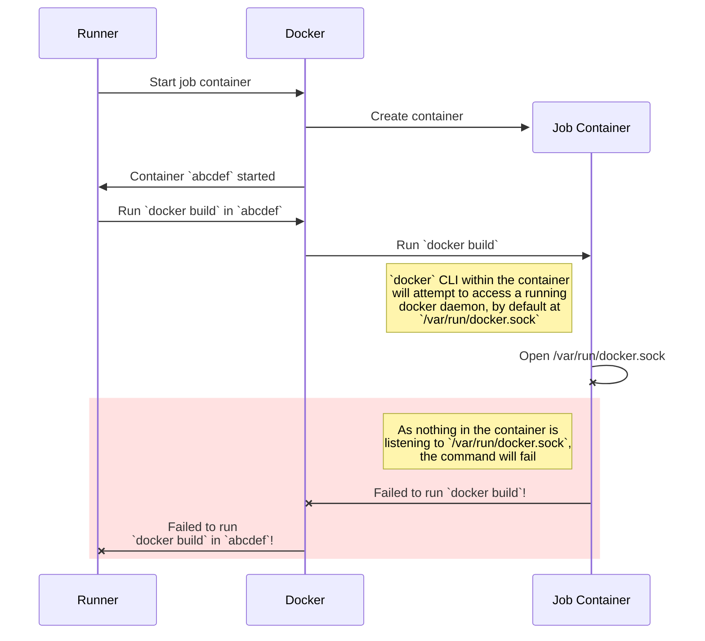
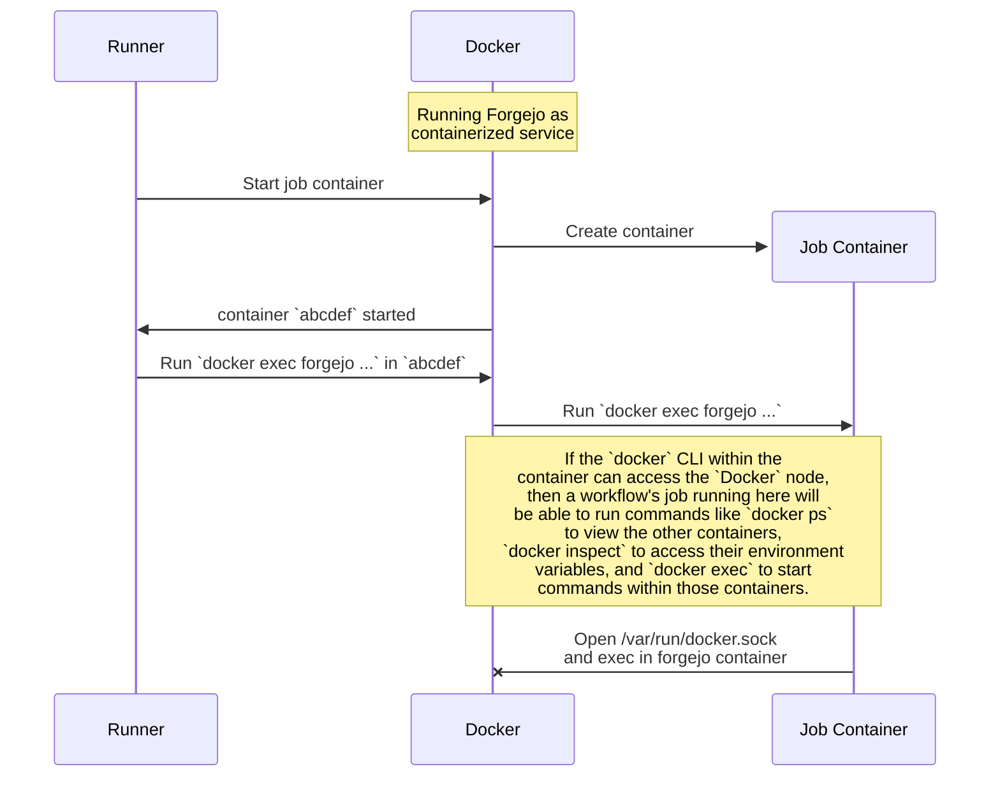
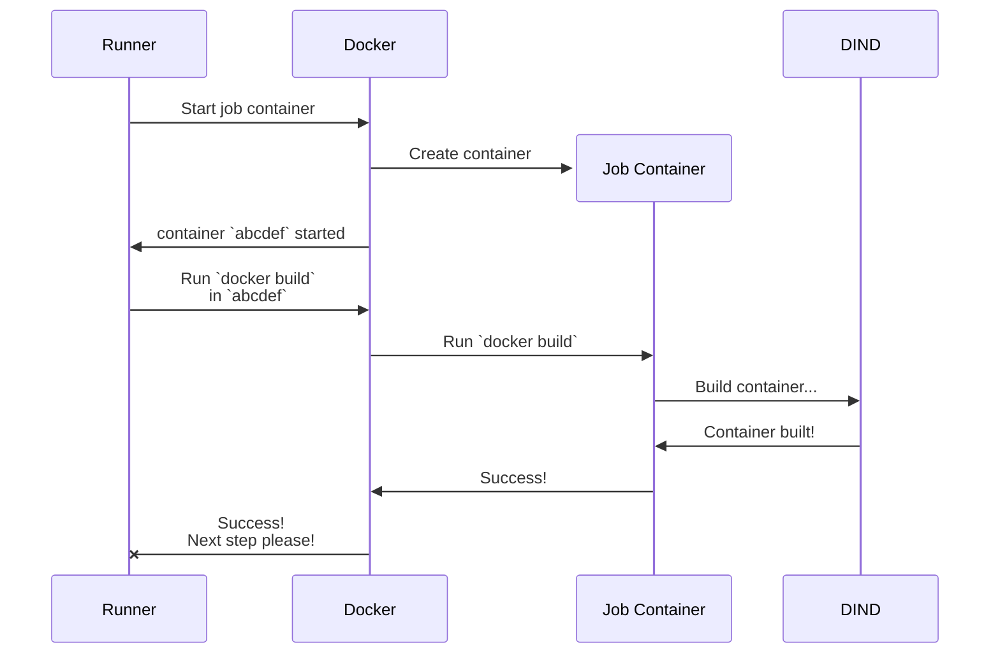
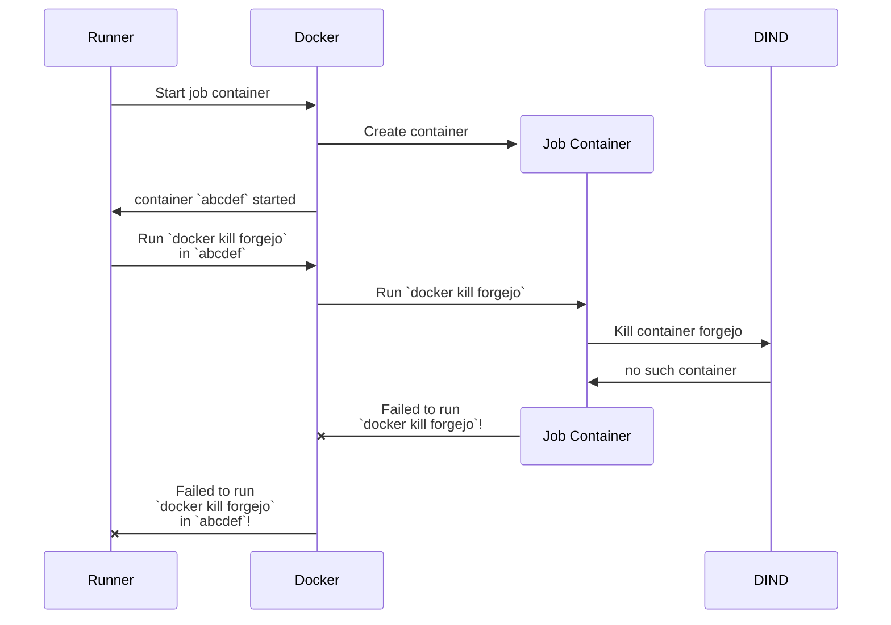
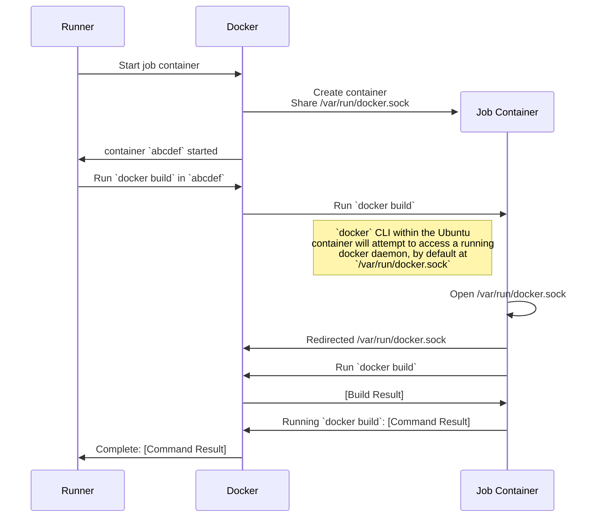
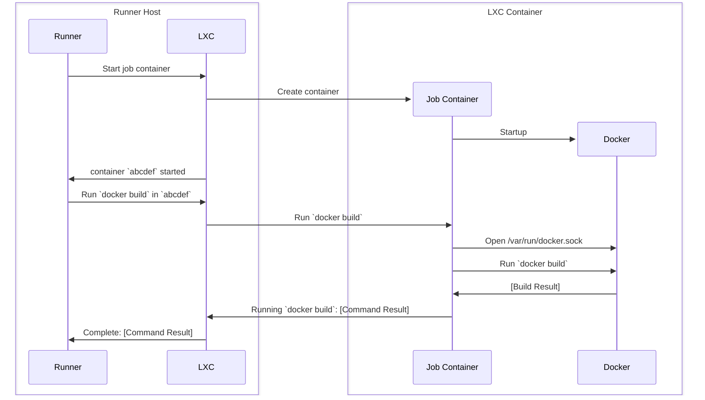

```mermaid
sequenceDiagram
    Runner->>Docker: Start job container
    create participant Ubuntu as Job Container
    Docker->>Ubuntu: Create container
    Docker->>Runner: Container `abcdef` started
    Runner->>Docker: Run `docker build` in `abcdef`
    Docker->>Ubuntu: Run `docker build`
    Note left of Ubuntu: `docker` CLI within the container<br/>will attempt to access a running<br/>docker daemon, by default at <br/>`/var/run/docker.sock`
    Ubuntu-xUbuntu: Open /var/run/docker.sock
    rect rgb(255, 225, 225)
    Note left of Ubuntu: As nothing in the container is<br/>listening to `/var/run/docker.sock`,<br/>the command will fail
    Ubuntu-xDocker: Failed to run `docker build`!
    Docker-xRunner: Failed to run<br/>`docker build` in `abcdef`!
    end
```

```mermaid
sequenceDiagram
    create participant Runner
    create participant Docker
    Note over Docker: Running Forgejo as<br/>containerized service
    Runner->>Docker: Start job container
    create participant Ubuntu as Job Container
    Docker->>Ubuntu: Create container
    Docker->>Runner: container `abcdef` started
    Runner->>Docker: Run `docker exec forgejo ...` in `abcdef`
    Docker->>Ubuntu: Run `docker exec forgejo ...`
    Note over Docker,Ubuntu: If the `docker` CLI within the<br/>container can access the `Docker` node,<br/>then a workflow's job running here will<br/>be able to run commands like `docker ps`<br/>to view the other containers,<br/>`docker inspect` to access their environment<br/>variables, and `docker exec` to start<br/>commands within those containers.
    Ubuntu-xDocker: Open /var/run/docker.sock<br/>and exec in forgejo container
```

```mermaid
sequenceDiagram
    Runner->>Docker: Start job container
    create participant Ubuntu as Job Container
    Docker->>Ubuntu: Create container
    Docker->>Runner: container `abcdef` started
    Runner->>Docker: Run `docker build`<br/>in `abcdef`
    Docker->>Ubuntu: Run `docker build`
    Ubuntu->>DIND: Build container...
    DIND->>Ubuntu: Container built!
    Ubuntu->>Docker: Success!
    Docker-xRunner: Success!<br/>Next step please!
```

```mermaid
sequenceDiagram
    Runner->>Docker: Start job container
    create participant Ubuntu as Job Container
    Docker->>Ubuntu: Create container
    Docker->>Runner: container `abcdef` started
    Runner->>Docker: Run `docker kill forgejo`<br/>in `abcdef`
    Docker->>Ubuntu: Run `docker kill forgejo`
    Ubuntu->>DIND: Kill container forgejo
    DIND->>Ubuntu: no such container
    destroy Ubuntu
    Ubuntu-xDocker: Failed to run<br/>`docker kill forgejo`!
    Docker-xRunner: Failed to run<br/>`docker kill forgejo`<br/>in `abcdef`!
```

```mermaid
sequenceDiagram
    Runner->>Docker: Start job container
    create participant Ubuntu as Job Container
    Docker->>Ubuntu: Create container<br/>Share /var/run/docker.sock
    Docker->>Runner: container `abcdef` started
    Runner->>Docker: Run `docker build` in `abcdef`
    Docker->>Ubuntu: Run `docker build`
    Note left of Ubuntu: `docker` CLI within the Ubuntu<br/>container will attempt to access a running<br/>docker daemon, by default at <br/>`/var/run/docker.sock`
    Ubuntu->>Ubuntu: Open /var/run/docker.sock
    Ubuntu->>Docker: Redirected /var/run/docker.sock
    Ubuntu->>Docker: Run `docker build`
    Docker->>Ubuntu: [Build Result]
    Ubuntu->>Docker: Running `docker build`: [Command Result]
    Docker->>Runner: Complete: [Command Result]
```

```mermaid
sequenceDiagram
    box Runner Host
    participant Runner
    participant LXC
    end
    Runner->>LXC: Start job container
    create participant Debian as Job Container
    LXC->>Debian: Create container
    create participant Docker
    Debian->>Docker: Startup
    LXC->>Runner: container `abcdef` started
    Runner->>LXC: Run `docker build` in `abcdef`
    LXC->>Debian: Run `docker build`
    Debian->>Docker: Open /var/run/docker.sock
    Debian->>Docker: Run `docker build`
    Docker->>Debian: [Build Result]
    Debian->>LXC: Running `docker build`: [Command Result]
    LXC->>Runner: Complete: [Command Result]
    box LXC Container
    participant Debian
    participant Docker
    end
```
