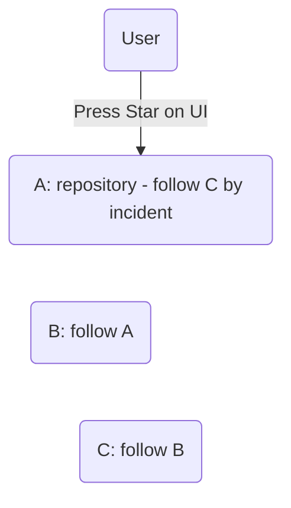
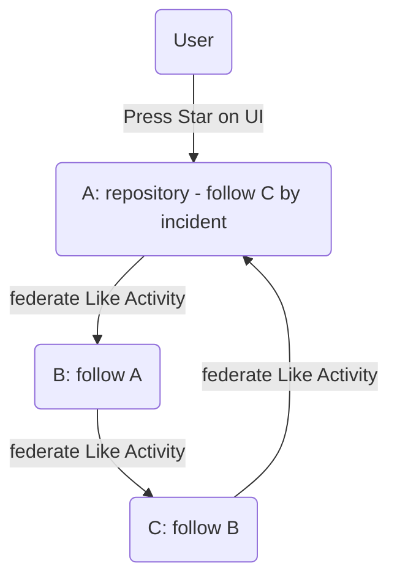
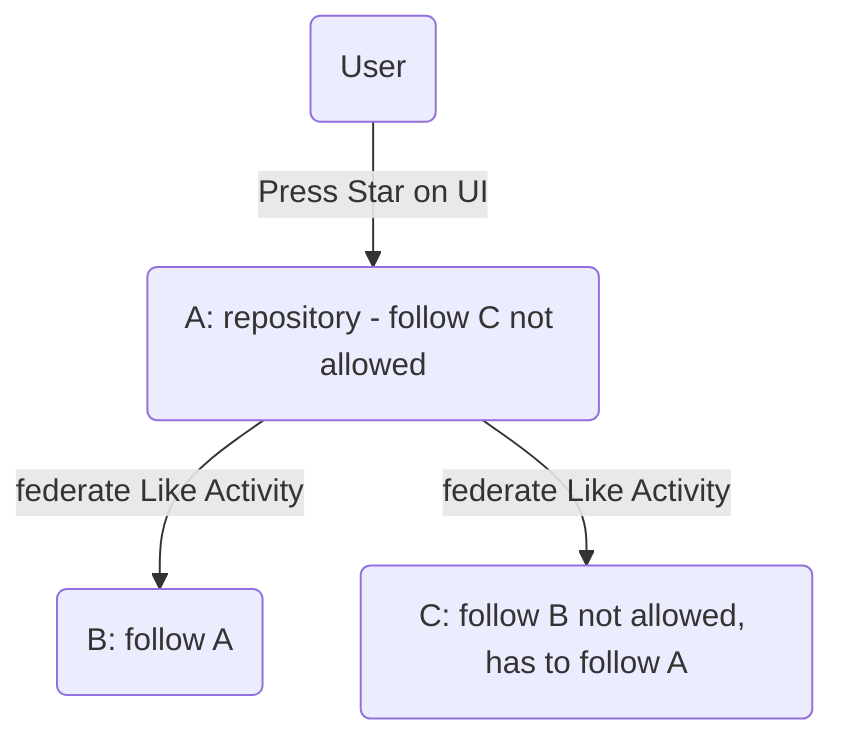

```mermaid
flowchart TD
    U(User) -->|Press Star on UI| A(A: repository - follow C by incident)
    A ~~~ B(B: follow A)
    B ~~~ C(C: follow B)
    C ~~~ A
```

```mermaid
flowchart TD
    U(User) -->|Press Star on UI| A(A: repository - follow C by incident)
    A -->|federate Like Activity| B(B: follow A)
    B -->|federate Like Activity| C(C: follow B)
    C -->|federate Like Activity| A
```

```mermaid
flowchart TD
    U(User) -->|Press Star on UI| A(A: repository - follow C not allowed)
    A -->|federate Like Activity| B(B: follow A)
    A -->|federate Like Activity| C(C: follow B not allowed, has to follow A)
```
