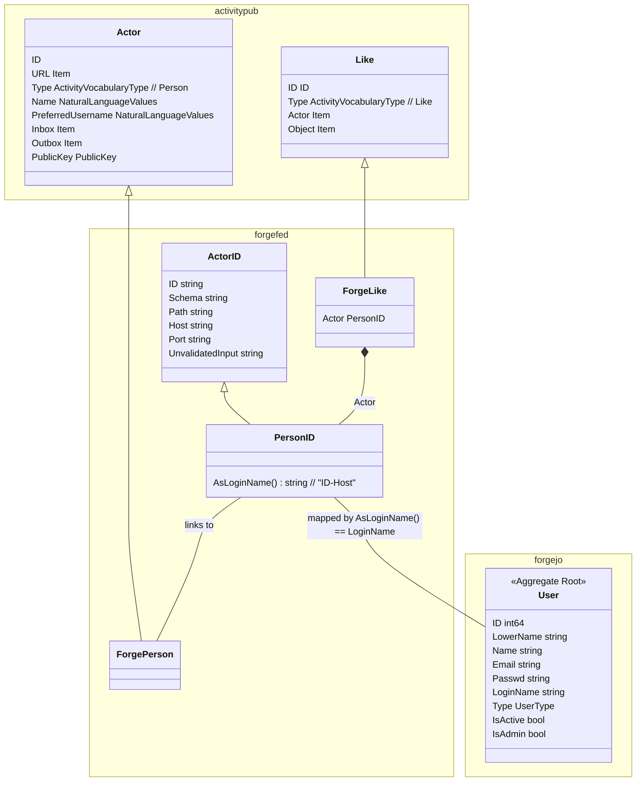
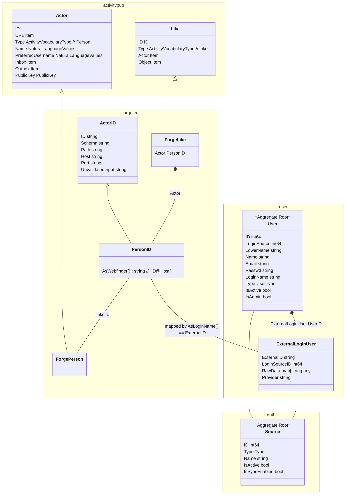
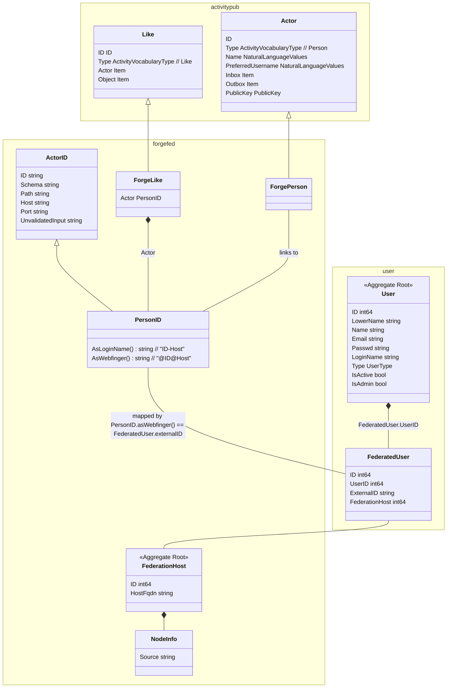
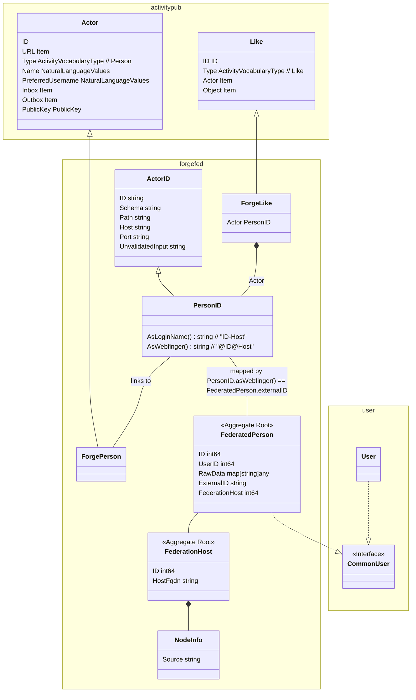

```mermaid
classDiagram
  namespace activitypub {
    class Like {
      ID ID
      Type ActivityVocabularyType // Like
      Actor Item
      Object Item
    }
    class Actor {
      ID
      URL Item
      Type ActivityVocabularyType // Person
      Name NaturalLanguageValues
      PreferredUsername NaturalLanguageValues
      Inbox Item
      Outbox Item
      PublicKey PublicKey
    }
  }
  namespace forgefed {
    class ForgePerson {
    }
    class ForgeLike {
      Actor PersonID
    }
    class ActorID {
      ID               string
      Schema           string
      Path             string
      Host             string
      Port             string
      UnvalidatedInput string
    }
    class PersonID {
      AsLoginName() string // "ID-Host"
    }
  }

  namespace forgejo {
    class User {
      <<Aggregate Root>>
      ID        int64
      LowerName string
      Name      string
      Email     string
      Passwd    string
      LoginName   string
      Type        UserType
      IsActive bool
      IsAdmin bool
    }
  }

  Actor <|-- ForgePerson
  Like <|-- ForgeLike
  ActorID <|-- PersonID

  ForgeLike *-- PersonID: Actor

  PersonID -- User: mapped by AsLoginName() == LoginName
  PersonID -- ForgePerson: links to
```

```mermaid
classDiagram
  namespace activitypub {
    class Like {
      ID ID
      Type ActivityVocabularyType // Like
      Actor Item
      Object Item
    }
    class Actor {
      ID
      URL Item
      Type ActivityVocabularyType // Person
      Name NaturalLanguageValues
      PreferredUsername NaturalLanguageValues
      Inbox Item
      Outbox Item
      PublicKey PublicKey
    }
  }

  namespace forgefed {
    class ForgePerson {
    }
    class ForgeLike {
      Actor PersonID
    }
    class ActorID {
      ID               string
      Schema           string
      Path             string
      Host             string
      Port             string
      UnvalidatedInput string
    }
    class PersonID {
      AsWebfinger() string // "ID@Host"
    }
  }

  namespace user {
    class User {
      <<Aggregate Root>>
      ID        int64
      LoginSource int64
      LowerName string
      Name      string
      Email     string
      Passwd    string
      LoginName   string
      Type        UserType
      IsActive bool
      IsAdmin bool
    }

    class ExternalLoginUser {
      ExternalID        string
      LoginSourceID     int64
      RawData           map[string]any
      Provider          string
    }
  }

  namespace auth {
    class Source {
      <<Aggregate Root>>
      ID            int64
      Type          Type
      Name          string
      IsActive      bool
      IsSyncEnabled bool
    }
  }

  Actor <|-- ForgePerson
  Like <|-- ForgeLike

  ActorID <|-- PersonID
  ForgeLike *-- PersonID: Actor
  PersonID -- ForgePerson: links to
  PersonID -- ExternalLoginUser: mapped by AsLoginName() == ExternalID

  User *-- ExternalLoginUser: ExternalLoginUser.UserID
  User -- Source
  ExternalLoginUser -- Source
```

```mermaid
classDiagram
  namespace activitypub {
    class Like {
      ID ID
      Type ActivityVocabularyType // Like
      Actor Item
      Object Item
    }
    class Actor {
      ID
      Type ActivityVocabularyType // Person
      Name NaturalLanguageValues
      PreferredUsername NaturalLanguageValues
      Inbox Item
      Outbox Item
      PublicKey PublicKey
    }
  }

  namespace forgefed {
    class ForgePerson {
    }
    class ForgeLike {
      Actor PersonID
    }
    class ActorID {
      ID               string
      Schema           string
      Path             string
      Host             string
      Port             string
      UnvalidatedInput string
    }
    class PersonID {
      AsLoginName() string // "ID-Host"
      AsWebfinger() string // "@ID@Host"
    }
    class FederationHost {
      <<Aggregate Root>>
      ID int64
      HostFqdn string
    }

    class NodeInfo {
      Source string
    }
  }

  namespace user {
    class User {
      <<Aggregate Root>>
      ID        int64
      LowerName string
      Name      string
      Email     string
      Passwd    string
      LoginName   string
      Type        UserType
      IsActive bool
      IsAdmin bool
    }

    class FederatedUser {
      ID         int64
      UserID     int64
      ExternalID   string
      FederationHost int64
    }
  }

  Actor <|-- ForgePerson
  Like <|-- ForgeLike

  ActorID <|-- PersonID
  ForgeLike *-- PersonID: Actor
  ForgePerson -- PersonID: links to
  FederationHost *-- NodeInfo

  User *-- FederatedUser: FederatedUser.UserID
  PersonID -- FederatedUser : mapped by PersonID.asWebfinger() == FederatedUser.externalID
  FederatedUser -- FederationHost

```

```mermaid
classDiagram
  namespace activitypub {
    class Like {
      ID ID
      Type ActivityVocabularyType // Like
      Actor Item
      Object Item
    }
    class Actor {
      ID
      URL Item
      Type ActivityVocabularyType // Person
      Name NaturalLanguageValues
      PreferredUsername NaturalLanguageValues
      Inbox Item
      Outbox Item
      PublicKey PublicKey
    }
  }

  namespace forgefed {
    class ForgePerson {
    }
    class ForgeLike {
      Actor PersonID
    }
    class ActorID {
      ID               string
      Schema           string
      Path             string
      Host             string
      Port             string
      UnvalidatedInput string
    }
    class PersonID {
      AsLoginName() string // "ID-Host"
      AsWebfinger() string // "@ID@Host"
    }
    class FederatedPerson {
      <<Aggregate Root>>
      ID         int64
      UserID     int64
      RawData    map[string]any
      ExternalID   string
      FederationHost int64
    }

    class FederationHost {
      <<Aggregate Root>>
      ID int64
      HostFqdn string
    }

    class NodeInfo {
      Source string
    }
  }

  namespace user {
    class CommonUser {
      <<Interface>>
    }
    class User {

    }
  }
  User ..<| CommonUser

  Actor <|-- ForgePerson
  Like <|-- ForgeLike

  ActorID <|-- PersonID
  ForgeLike *-- PersonID: Actor

  PersonID -- ForgePerson: links to
  PersonID -- FederatedPerson : mapped by PersonID.asWebfinger() == FederatedPerson.externalID
  FederationHost *-- NodeInfo
  FederatedPerson -- FederationHost
  FederatedPerson ..<| CommonUser
```
