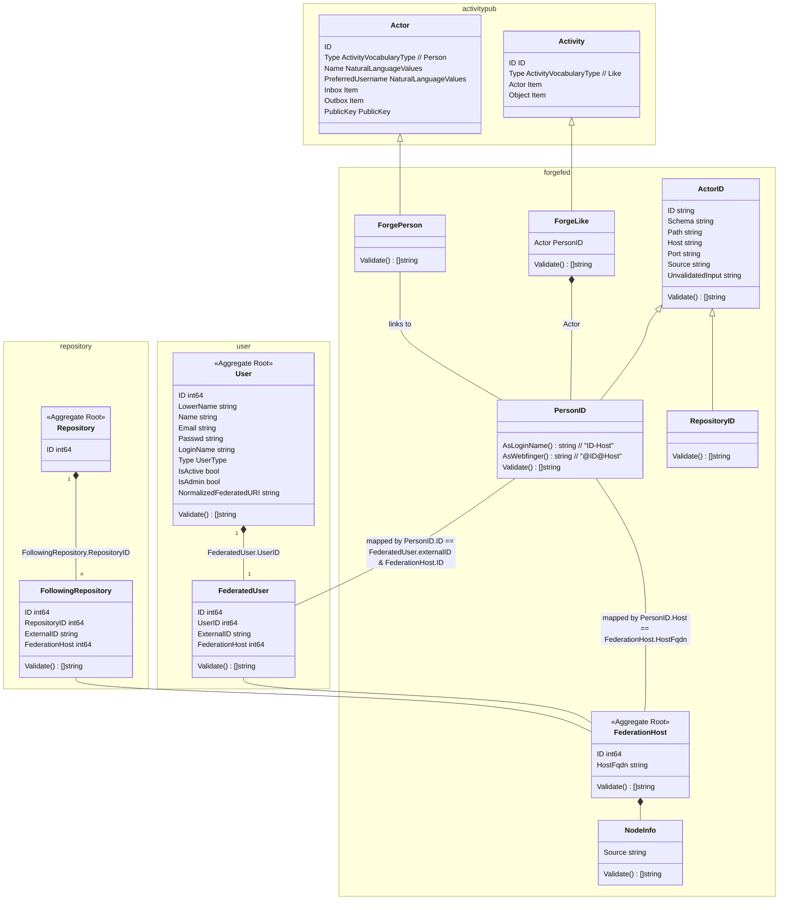

```mermaid
classDiagram
  namespace activitypub {
    class Activity {
      ID ID
      Type ActivityVocabularyType // Like
      Actor Item
      Object Item
    }
    class Actor {
      ID
      Type ActivityVocabularyType // Person
      Name NaturalLanguageValues
      PreferredUsername NaturalLanguageValues
      Inbox Item
      Outbox Item
      PublicKey PublicKey
    }
  }

  namespace forgefed {
    class ForgePerson {
        Validate() []string
    }
    class ForgeLike {
      Actor PersonID
      Validate() []string
    }
    class ActorID {
      ID               string
      Schema           string
      Path             string
      Host             string
      Port             string
      Source           string
      UnvalidatedInput string
      Validate() []string
    }
    class PersonID {
      AsLoginName() string // "ID-Host"
      AsWebfinger() string // "@ID@Host"
      Validate() []string
    }
    class RepositoryID {
      Validate() []string
    }
    class FederationHost {
      <<Aggregate Root>>
      ID int64
      HostFqdn string
      Validate() []string
    }

    class NodeInfo {
      Source string
      Validate() []string
    }
  }

  Actor <|-- ForgePerson
  Activity <|-- ForgeLike

  ActorID <|-- PersonID
  ActorID <|-- RepositoryID
  ForgeLike *-- PersonID: Actor
  ForgePerson -- PersonID: links to
  FederationHost *-- NodeInfo

  namespace user {
    class User {
      <<Aggregate Root>>
      ID                     int64
      LowerName              string
      Name                   string
      Email                  string
      Passwd                 string
      LoginName              string
      Type                   UserType
      IsActive               bool
      IsAdmin                bool
      NormalizedFederatedURI string
      Validate()             []string
    }

    class FederatedUser {
      ID         int64
      UserID     int64
      ExternalID   string
      FederationHost int64
      Validate() []string
    }
  }

  namespace repository {
    class Repository {
      <<Aggregate Root>>
      ID        int64
    }

    class FollowingRepository {
      ID             int64
      RepositoryID   int64
      ExternalID     string
      FederationHost int64
      Validate()     []string
    }
  }

  User "1" *-- "1" FederatedUser: FederatedUser.UserID
  PersonID -- FederatedUser : mapped by PersonID.ID == FederatedUser.externalID & FederationHost.ID
  PersonID -- FederationHost : mapped by PersonID.Host == FederationHost.HostFqdn
  FederatedUser -- FederationHost

  Repository "1" *-- "n" FollowingRepository: FollowingRepository.RepositoryID
  FollowingRepository -- FederationHost
```
