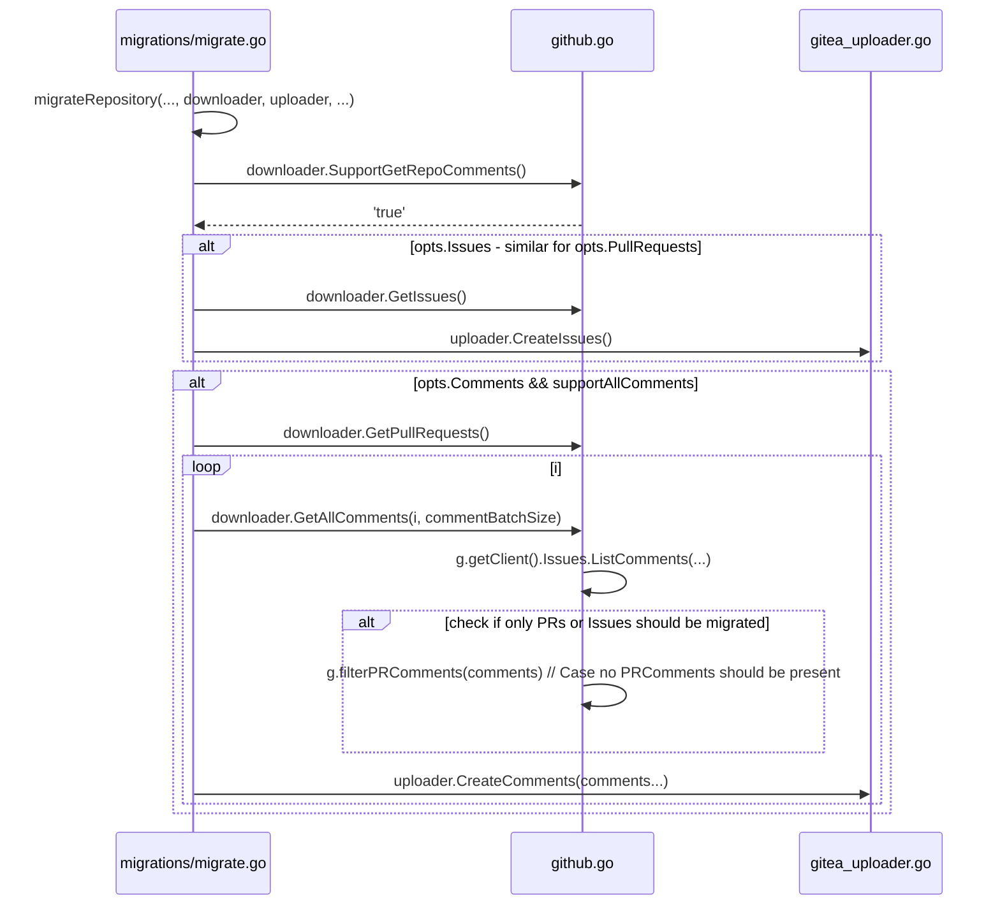

```mermaid
sequenceDiagram
    participant migrations/migrate.go
    participant github.go
    participant gitea_uploader.go

    migrations/migrate.go->>migrations/migrate.go: migrateRepository(..., downloader, uploader, ...)
    migrations/migrate.go->>github.go: downloader.SupportGetRepoComments()
    github.go-->>migrations/migrate.go: 'true'
    alt opts.Issues - similar for opts.PullRequests
        migrations/migrate.go->>github.go: downloader.GetIssues()
        migrations/migrate.go->>gitea_uploader.go: uploader.CreateIssues()
    end

    alt opts.Comments && supportAllComments
        migrations/migrate.go->>github.go: downloader.GetPullRequests()
        loop i
            migrations/migrate.go->>github.go: downloader.GetAllComments(i, commentBatchSize)
            github.go->>github.go: g.getClient().Issues.ListComments(...)
            alt check if only PRs or Issues should be migrated
                github.go->>github.go: g.filterPRComments(comments) // Case no PRComments should be present
            end
            migrations/migrate.go->>gitea_uploader.go: uploader.CreateComments(comments...)
        end
    end
```
