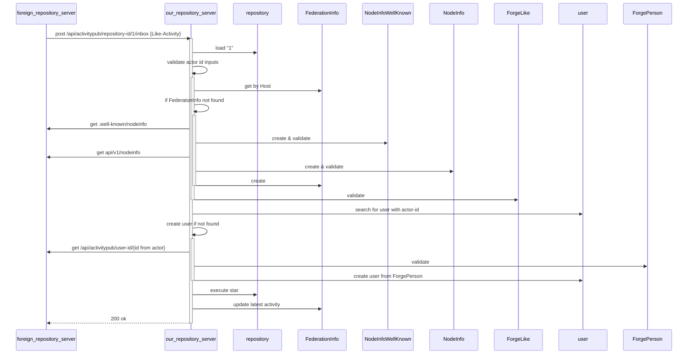
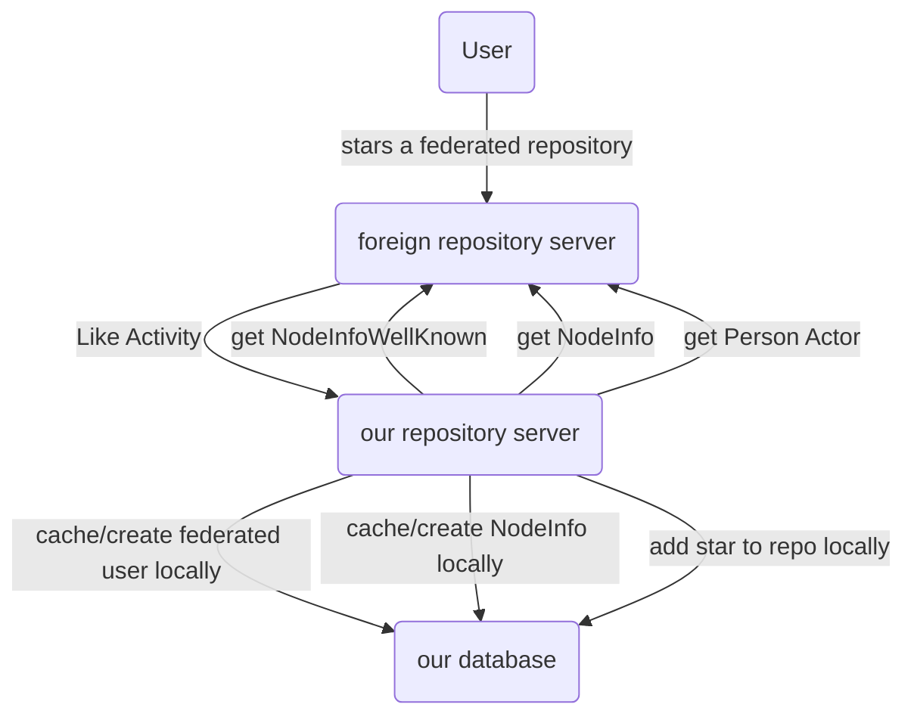

```mermaid
sequenceDiagram
    participant fs as foreign_repository_server
    participant os as our_repository_server

    fs ->> os: post /api/activitypub/repository-id/1/inbox {Like-Activity}
    activate os
    os ->> repository: load "1"
    os ->> os: validate actor id inputs
    activate os
    os ->> FederationInfo: get by Host
    os ->> os: if FederatonInfo not found
    activate os
    os ->> fs: get .well-known/nodeinfo
    os ->> NodeInfoWellKnown: create & validate
    os ->> fs: get api/v1/nodeinfo
    os ->> NodeInfo: create & validate
    os ->> FederationInfo: create
    deactivate os
    os ->> ForgeLike: validate
    deactivate os

    os ->> user: search for user with actor-id
    os ->> os: create user if not found
    activate os
    os ->> fs: get /api/activitypub/user-id/{id from actor}
    os ->> ForgePerson: validate
    os ->> user: create user from ForgePerson
    deactivate os
    os ->> repository: execute star
    os ->> FederationInfo: update latest activity
    os -->> fs: 200 ok
    deactivate os
```

```mermaid
flowchart TD
    A(User) --> |stars a federated repository| B(foreign repository server)
    B --> |Like Activity| C(our repository server)
    C --> |get NodeInfoWellKnown| B
    C --> |get NodeInfo| B
    C --> |get Person Actor| B
    C --> |cache/create federated user locally| D(our database)
    C --> |cache/create NodeInfo locally| D(our database)
    C --> |add star to repo locally| D
```
