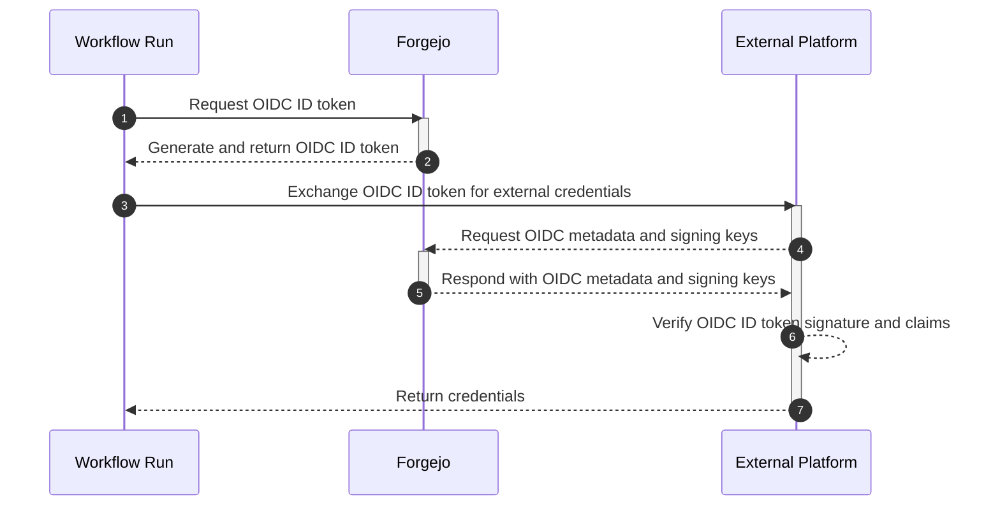

```mermaid
sequenceDiagram
    autonumber
    participant Workflow Run
    participant Forgejo
    participant External Platform

    Workflow Run->>Forgejo: Request OIDC ID token
    activate Forgejo
        Forgejo-->>Workflow Run: Generate and return OIDC ID token
    deactivate Forgejo
  Workflow Run->>External Platform: Exchange OIDC ID token for external credentials
    activate External Platform
        External Platform-->>Forgejo: Request OIDC metadata and signing keys
        activate Forgejo
            Forgejo-->>External Platform: Respond with OIDC metadata and signing keys
        deactivate Forgejo
        External Platform-->>External Platform: Verify OIDC ID token signature and claims
        External Platform-->>Workflow Run: Return credentials
    deactivate External Platform
```
