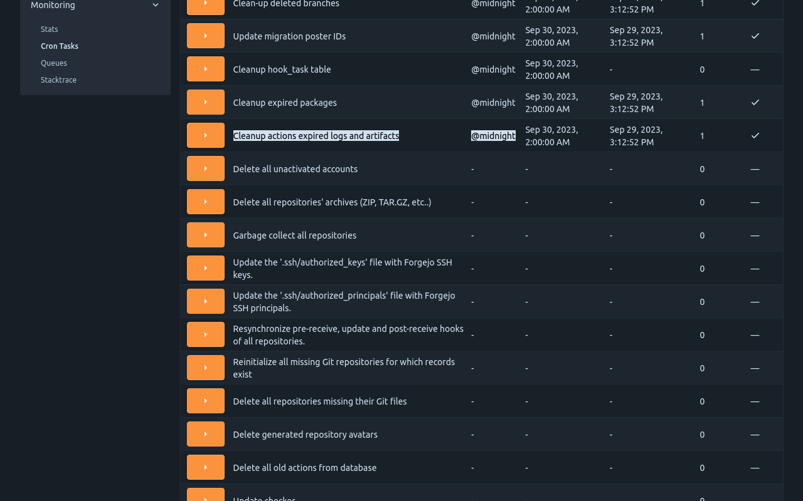
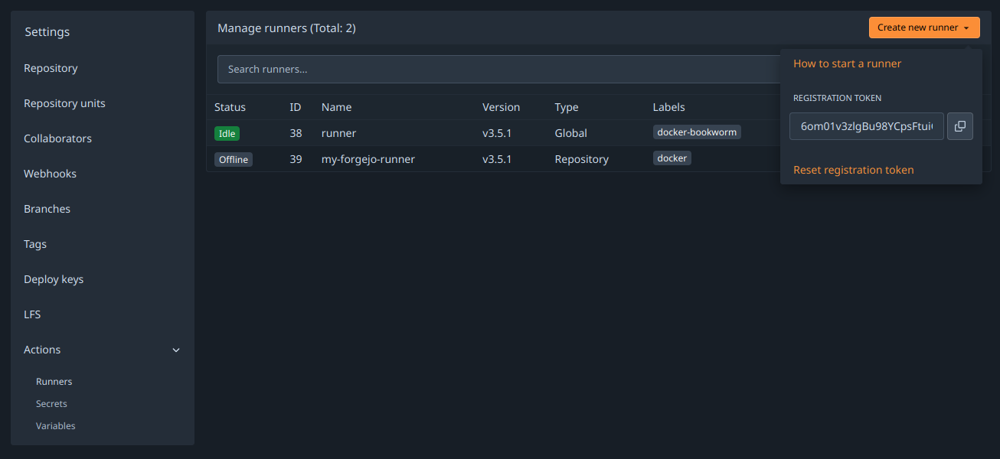

`Forgejo Actions` provides continuous integration driven from the files found in the `.forgejo/workflows` directory of a repository. Note that `Forgejo` does not run the jobs, it relies on the [`Forgejo runner`](https://code.forgejo.org/forgejo/runner) to do so. It needs to be installed separately.

## Settings

### Default Actions URL

In a [workflow](../../user/actions/#glossary), when `uses:` does not specify an absolute URL, the
value of `DEFAULT_ACTIONS_URL` is prepended to it.

```yaml
[actions]
ENABLED = true
DEFAULT_ACTIONS_URL = https://code.forgejo.org
```

The actions published at https://code.forgejo.org are:

- known to work with Forgejo Actions
- published under a Free Software license

They can be found in the following organizations:

- [General purpose actions](https://code.forgejo.org/actions)
- [Docker actions](https://code.forgejo.org/docker)

When setting `DEFAULT_ACTIONS_URL` to a Forgejo instance with an open
registration, **care must be taken to avoid name conflicts**. For
instance if an action has `uses: foo/bar@main` it will clone and try
to run the action found at `DEFAULT_ACTIONS_URL/foo/bar` if it exists,
even if it provides something different than what is expected.

### Disabling

As of `Forgejo v1.21` it is enabled by default. It can be disabled by adding the following to `app.ini`:

```yaml
[actions]
ENABLED = false
```

### Storage

The logs and artifacts are stored in `Forgejo`. The cache is stored by
the runner itself and never sent to `Forgejo`.

#### `job` logs

The logs of each `job` run is stored by the `Forgejo` server and never
expires. The location where these files are stored is configured in
the `storage.actions_log` section of `app.ini` as [explained in in the
storage documentation](../storage/).

#### `artifacts` logs

The artifacts uploaded by a job are stored by the `Forgejo` server and
expire after a delay that defaults to 90 days and can be configured as
follows:

```yaml
[actions]
ARTIFACT_RETENTION_DAYS = 90
```

The location where these artifacts are stored is configured in
the `storage.artifacts` section of `app.ini` as [explained in in the
storage documentation](../storage/).

The `admin/monitor/cron` administration web interface can be used to
manually trigger the expiration of artifacts instead of waiting for
the scheduled task to happen.



## Forgejo runner

The `Forgejo runner` is a daemon that fetches workflows to run from a
Forgejo instance, executes them, sends back with the logs and
ultimately reports its success or failure.

### Installation

Each `Forgejo runner` release is published for all supported architectures as:

- [binaries](https://code.forgejo.org/forgejo/runner/releases)
- [OCI images](https://code.forgejo.org/forgejo/-/packages/container/runner/versions)

#### Installation of the binary

Download the latest [binary release](https://code.forgejo.org/forgejo/runner/releases) and verify its signature:

```shell
$ wget -O forgejo-runner https://code.forgejo.org/forgejo/runner/releases/download/v3.3.0/forgejo-runner-3.3.0-linux-amd64
$ chmod +x forgejo-runner
$ wget -O forgejo-runner.asc https://code.forgejo.org/forgejo/runner/releases/download/v3.3.0/forgejo-runner-3.3.0-linux-amd64.asc
$ gpg --keyserver keys.openpgp.org --recv EB114F5E6C0DC2BCDD183550A4B61A2DC5923710
$ gpg --verify forgejo-runner.asc forgejo-runner
Good signature from "Forgejo <contact@forgejo.org>"
		aka "Forgejo Releases <release@forgejo.org>"
```

#### Installation of the OCI image

The [OCI
images](https://code.forgejo.org/forgejo/-/packages/container/runner/versions)
are built from the Dockerfile which is [found in the source
directory](https://code.forgejo.org/forgejo/runner/src/branch/main/Dockerfile). It contains the `forgejo-runner` binary.

```shell
$ docker run --rm code.forgejo.org/forgejo/runner:3.3.0 forgejo-runner --version
forgejo-runner version v3.3.0
```

It does not run as root:

```shell
$ docker run --rm code.forgejo.org/forgejo/runner:3.3.0 id
uid=1000 gid=1000 groups=1000
```

One way to run the Docker image is via Docker Compose. To do so,
first prepare a `data` directory with non-root permissions
(in this case, we pick `1001:1001`):

```shell
#!/usr/bin/env bash

set -e

mkdir -p data
touch data/.runner
mkdir -p data/.cache

chown -R 1001:1001 data/.runner
chown -R 1001:1001 data/.cache
chmod 775 data/.runner
chmod 775 data/.cache
chmod g+s data/.runner
chmod g+s data/.cache
```

After running this script with `bash setup.sh`, define the following
`docker-compose.yml`:

```yaml
version: '3.8'

services:
  docker-in-docker:
    image: docker:dind
    container_name: 'docker_dind'
    privileged: 'true'
    command: ['dockerd', '-H', 'tcp://0.0.0.0:2375', '--tls=false']
    restart: 'unless-stopped'

  gitea:
    image: 'code.forgejo.org/forgejo/runner:3.3.0'
    links:
      - docker-in-docker
    depends_on:
      docker-in-docker:
        condition: service_started
    container_name: 'runner'
    environment:
      DOCKER_HOST: tcp://docker-in-docker:2375
    # User without root privileges, but with access to `./data`.
    user: 1001:1001
    volumes:
      - ./data:/data
    restart: 'unless-stopped'

    command: '/bin/sh -c "while : ; do sleep 1 ; done ;"'
```

Here, we're not running the `forgejo-runner daemon` yet because we
need to register it first. Please note that in a recent install of
docker `docker-compose`is not a separate command but should be run as
`docker compose`.
Follow the registration instructions below
by starting the `runner` service with `docker-compose up -d` and
entering it via:

```shell
docker exec -it runner /bin/sh
```

In this shell, run the `forgejo-runner register` command as described
below. After that is done, take the service down again with
`docker-compose down` and modify the `command` to:

```yaml
command: '/bin/sh -c "sleep 5; forgejo-runner daemon"'
```

Here, the sleep allows the `docker-in-docker` service to start up
before the `forgejo-runner daemon` is started.

More [docker compose](https://docs.docker.com/compose/) examples [are
provided](https://codeberg.org/forgejo/runner/src/branch/main/examples/docker-compose)
to demonstrate how to install that OCI image to successfully run a workflow.

### Execution of the workflows

The `Forgejo runner` relies on application containers (Docker, Podman,
etc) or system containers (LXC) to execute a workflow in an isolated
environment. They need to be installed and configured independently.

- **Docker:**
  See [the Docker installation](https://docs.docker.com/engine/install/) documentation for more information.

- **Podman:**
  While Podman is generally compatible with Docker,
  it does not create a socket for managing containers by default
  (because it doesn't usually need one).

  If the Forgejo runner complains about "daemon Docker Engine socket not found", or "cannot ping the docker daemon",
  you can use podman to provide a Docker compatible socket from an unprivileged user
  and pass that socket on to the runner,
  e.g. by executing:

  ```shell
  $ podman system service -t 0 &
  $ DOCKER_HOST=unix://${XDG_RUNTIME_DIR}/podman/podman.sock ./forgejo-runner daemon
  ```

- **LXC:**
  For jobs to run in LXC containers, the `Forgejo runner` needs passwordless sudo access for all `lxc-*` commands on a Debian GNU/Linux `bookworm` system where [LXC](https://linuxcontainers.org/lxc/) is installed. The [LXC helpers](https://code.forgejo.org/forgejo/lxc-helpers/) can be used as follows to create a suitable container:

  ```shell
  $ git clone https://code.forgejo.org/forgejo/lxc-helpers
  $ sudo cp -a lxc-helpers/lxc-helpers{,-lib}.sh /usr/local/bin
  $ lxc-helpers.sh lxc_container_create myrunner
  $ lxc-helpers.sh lxc_container_start myrunner
  $ lxc-helpers.sh lxc_container_user_install myrunner 1000 debian
  ```

  > **NOTE:** Multiarch [Go](https://go.dev/) builds and [binfmt](https://github.com/tonistiigi/binfmt) need `bookworm` to produce and test binaries on a single machine for people who do not have access to dedicated hardware. If this is not needed, installing the `Forgejo runner` on `bullseye` will also work.

  The `Forgejo runner` can then be installed and run within the `myrunner` container.

  ```shell
  $ lxc-helpers.sh lxc_container_run forgejo-runners -- sudo --user debian bash
  $ sudo apt-get install docker.io wget gnupg2
  $ wget -O forgejo-runner https://code.forgejo.org/forgejo/runner/releases/download/v3.3.0/forgejo-runner-amd64
  ...
  ```

  > **Warning:** LXC containers do not provide a level of security that makes them safe for potentially malicious users to run jobs. They provide an excellent isolation for jobs that may accidentally damage the system they run on.

- **self-hosted:**
  There is no requirement for jobs that run directly on the host.

  > **Warning:** there is no isolation at all and a single job can permanently destroy the host.

### Registration

The `Forgejo runner` needs to connect to a `Forgejo` instance and must be registered before doing so. It will give it permission to read the repositories and send back information to `Forgejo` such as the logs or its status.

- Online registration

  A special kind of token is needed and can be obtained from the `Create new runner` button:

  - in `/admin/actions/runners` to accept workflows from all repositories.
  - in `/org/{org}/settings/actions/runners` to accept workflows from all repositories within the organization.
  - in `/user/settings/actions/runners` to accept workflows from all repositories of the logged in user
  - in `/{owner}/{repository}/settings/actions/runners` to accept workflows from a single repository.

  

  For instance, using a token obtained for a test repository from `next.forgejo.org`:

  ```shell
  forgejo-runner register --no-interactive --token {TOKEN} --name runner --instance https://next.forgejo.org
  INFO Registering runner, arch=amd64, os=linux, version=3.3.0.
  INFO Runner registered successfully.
  ```

  It will create a `.runner` file that looks like:

  ```json
  {
    "WARNING": "This file is automatically generated. Do not edit.",
    "id": 6,
    "uuid": "fcd0095a-291c-420c-9de7-965e2ebaa3e8",
    "name": "runner",
    "address": "https://next.forgejo.org"
  }
  ```

  The same token can be used multiple times to register any number of
  runners, independent of each other.

  When using the `forgejo-runner register` command, it will ask for a
  label too. To get a runner that is close to GitHub's runners, use

  ```
  ubuntu-22.04:docker://node:20-bullseye
  ```

  or

  ```
  ubuntu-22.04:docker://ghcr.io/catthehacker/ubuntu:act-22.04
  ```

  as the label. The `act` container image is much bigger than the
  `node` image, but also more similar to the GitHub runners. See
  the [labels and `runs-on`](#labels-and-runs-on) section for
  more information.

- Offline registration

  When Infrastructure as Code (Ansible, kubernetes, etc.) is used to
  deploy and configure both Forgejo and the Forgejo runner, it may be
  more convenient for it to generate a secret and share it with both.

  The `forgejo forgejo-cli actions register --secret <secret>` subcommand can be
  used to register the runner with the Forgejo instance and the
  `forgejo-runner create-runner-file --secret <secret>` subcommand can
  be used to configure the Forgejo runner with the credentials that will
  allow it to start picking up tasks from the Forgejo instances as soon
  as it comes online.

  For instance, on the machine running Forgejo:

  ```sh
  $ forgejo forgejo-cli actions register --name runner-name --scope myorganization \
  	  --secret 7c31591e8b67225a116d4a4519ea8e507e08f71f
  ```

  and on the machine on which the Forgejo runner is installed:

  ```sh
  $ forgejo-runner create-runner-file --instance https://example.conf \
  		 --secret 7c31591e8b67225a116d4a4519ea8e507e08f71f
  ```

### Configuration

The default configuration for the runner can be
displayed with `forgejo-runner generate-config`, stored in a
`config.yml` file, modified and used instead of the default with the
`--config` flag.

```yaml
$ forgejo-runner generate-config > config.yml
# Example configuration file, it's safe to copy this as the default config file without any modification.

log:
  # The level of logging, can be trace, debug, info, warn, error, fatal
  level: info

runner:
  # Where to store the registration result.
  file: .runner
  # Execute how many tasks concurrently at the same time.
  capacity: 1
  # Extra environment variables to run jobs.
  envs:
    A_TEST_ENV_NAME_1: a_test_env_value_1
    A_TEST_ENV_NAME_2: a_test_env_value_2
  # Extra environment variables to run jobs from a file.
  # It will be ignored if it's empty or the file doesn't exist.
  env_file: .env
  # The timeout for a job to be finished.
  # Please note that the Forgejo instance also has a timeout (3h by default) for the job.
  # So the job could be stopped by the Forgejo instance if it's timeout is shorter than this.
  timeout: 3h
  # Whether skip verifying the TLS certificate of the Forgejo instance.
  insecure: false
  # The timeout for fetching the job from the Forgejo instance.
  fetch_timeout: 5s
  # The interval for fetching the job from the Forgejo instance.
  fetch_interval: 2s
  # The labels of a runner are used to determine which jobs the runner can run, and how to run them.
  # Like: ["macos-arm64:host", "ubuntu-latest:docker://node:16-bullseye", "ubuntu-22.04:docker://node:16-bullseye"]
  # If it's empty when registering, it will ask for inputting labels.
  # If it's empty when execute `deamon`, will use labels in `.runner` file.
  labels: []

cache:
  # Enable cache server to use actions/cache.
  enabled: true
  # The directory to store the cache data.
  # If it's empty, the cache data will be stored in $HOME/.cache/actcache.
  dir: ""
  # The host of the cache server.
  # It's not for the address to listen, but the address to connect from job containers.
  # So 0.0.0.0 is a bad choice, leave it empty to detect automatically.
  host: ""
  # The port of the cache server.
  # 0 means to use a random available port.
  port: 0

container:
  # Specifies the network to which the container will connect.
  # Could be host, bridge or the name of a custom network.
  # If it's empty, create a network automatically.
  network: ""
  # Whether to create networks with IPv6 enabled. Requires the Docker daemon to be set up accordingly.
  # Only takes effect if "network" is set to "".
  enable_ipv6: false
  # Whether to use privileged mode or not when launching task containers (privileged mode is required for Docker-in-Docker).
  privileged: false
  # And other options to be used when the container is started (eg, --add-host=my.forgejo.url:host-gateway).
  options:
  # The parent directory of a job's working directory.
  # If it's empty, /workspace will be used.
  workdir_parent:
  # Volumes (including bind mounts) can be mounted to containers. Glob syntax is supported, see https://github.com/gobwas/glob
  # You can specify multiple volumes. If the sequence is empty, no volumes can be mounted.
  # For example, if you only allow containers to mount the `data` volume and all the json files in `/src`, you should change the config to:
  # valid_volumes:
  #   - data
  #   - /src/*.json
  # If you want to allow any volume, please use the following configuration:
  # valid_volumes:
  #   - '**'
  valid_volumes: []
  # overrides the docker client host with the specified one.
  # If it's empty, act_runner will find an available docker host automatically.
  # If it's "-", act_runner will find an available docker host automatically, but the docker host won't be mounted to the job containers and service containers.
  # If it's not empty or "-", the specified docker host will be used. An error will be returned if it doesn't work.
  docker_host: ""

host:
  # The parent directory of a job's working directory.
  # If it's empty, $HOME/.cache/act/ will be used.
  workdir_parent:
```

### Cache configuration

Some actions such as https://code.forgejo.org/actions/cache or
https://code.forgejo.org/actions/setup-go can communicate with the
`Forgejo runner` to save and restore commonly used files such as
compilation dependencies. They are stored as compressed tar archives,
fetched when a job starts and saved when it completes.

If the machine has a fast disk, uploading the cache when the job
starts may significantly reduce the bandwidth required to download
and rebuild dependencies.

If the machine on which the `Forgejo runner` is running has a slow
disk and plenty of CPU and bandwidth, it may be better to not activate
the cache as it can slow down the execution time.

### Running the daemon

Once the `Forgejo runner` is successfully registered, it can be run from the directory in which the `.runner` file is found with:

```shell
$ forgejo-runner daemon
INFO[0000] Starting runner daemon
```

To verify it is actually available for the targeted repository, go to `/{owner}/{repository}/settings/actions/runners`. It will show the runners:

- dedicated to the repository with the **repo** type
- available to all repositories within an organization or a user
- available to all repositories, with the **Global** type


Adding the `.forgejo/workflows/demo.yaml` file to the test repository:

```yaml
on: [push]
jobs:
  test:
    runs-on: docker
    steps:
      - run: echo All Good
```

Will send a job request to the `Forgejo runner` that will display logs such as:

```shell
...
INFO[2023-05-28T18:54:53+02:00] task 29 repo is earl-warren/test https://code.forgejo.org https://next.forgejo.org
...
[/test] [DEBUG] Working directory '/workspace/earl-warren/test'
| All Good
[/test]   ✅  Success - Main echo All Good
```

It will also show a similar output in the `Actions` tab of the repository.

If no `Forgejo runner` is available, `Forgejo` will wait for one to connect and submit the job as soon as it is available.

### Enable IPv6 in Docker & Podman Networks

When a `Forgejo runner` creates its own Docker or Podman networks, IPv6 is not enabled by default, and must be enabled explicitly in the `Forgejo runner` configuration.

**Docker only**: The Docker daemon requires additional configuration to enable IPv6. To make use of IPv6 with Docker, you need to provide an `/etc/docker/daemon.json` configuration file with at least the following keys:

```json
{
  "ipv6": true,
  "experimental": true,
  "ip6tables": true,
  "fixed-cidr-v6": "fd00:d0ca:1::/64",
  "default-address-pools": [
    { "base": "172.17.0.0/16", "size": 24 },
    { "base": "fd00:d0ca:2::/104", "size": 112 }
  ]
}
```

Afterwards restart the Docker daemon with `systemctl restart docker.service`.

> **NOTE**: These are example values. While this setup should work out of the box, it may not meet your requirements. Please refer to the Docker documentation regarding [enabling IPv6](https://docs.docker.com/config/daemon/ipv6/#use-ipv6-for-the-default-bridge-network) and [allocating IPv6 addresses to subnets dynamically](https://docs.docker.com/config/daemon/ipv6/#dynamic-ipv6-subnet-allocation).

**Docker & Podman**:
To test IPv6 connectivity in `Forgejo runner`-created networks, create a small workflow such as the following:

```yaml
---
on: push
jobs:
  ipv6:
    runs-on: docker
    steps:
      - run: |
          apt update; apt install --yes curl
          curl -s -o /dev/null http://ipv6.google.com
```

If you run this action with `forgejo-runner exec`, you should expect this job fail:

```shell-session
$ forgejo-runner exec
...
| curl: (7) Couldn't connect to server
[ipv6.yml/ipv6]   ❌  Failure - apt update; apt install --yes curl
curl -s -o /dev/null http://ipv6.google.com
[ipv6.yml/ipv6] exitcode '7': failure
[ipv6.yml/ipv6] Cleaning up services for job ipv6
[ipv6.yml/ipv6] Cleaning up container for job ipv6
[ipv6.yml/ipv6] Cleaning up network for job ipv6, and network name is: FORGEJO-ACTIONS-TASK-push_WORKFLOW-ipv6-yml_JOB-ipv6-network
[ipv6.yml/ipv6] 🏁  Job failed
```

To actually enable IPv6 with `forgejo-runner exec`, the flag `--enable-ipv6` must be provided. If you run this again with `forgejo-runner exec --enable-ipv6`, the job should succeed:

```shell-session
$ forgejo-runner exec --enable-ipv6
...
[ipv6.yml/ipv6]   ✅  Success - Main apt update; apt install --yes curl
curl -s -o /dev/null http://ipv6.google.com
[ipv6.yml/ipv6] Cleaning up services for job ipv6
[ipv6.yml/ipv6] Cleaning up container for job ipv6
[ipv6.yml/ipv6] Cleaning up network for job ipv6, and network name is: FORGEJO-ACTIONS-TASK-push_WORKFLOW-ipv6-yml_JOB-ipv6-network
[ipv6.yml/ipv6] 🏁  Job succeeded
```

Finally, if this test was successful, enable IPv6 in the `config.yml` file of the `Forgejo runner` daemon and restart the daemon:

```yaml
container:
  enable_ipv6: true
```

Now, `Forgejo runner` will create networks with IPv6 enabled, and workflow containers will be assigned addresses from the pools defined in the Docker daemon configuration.

## Labels and `runs-on`

The workflows / tasks defined in the files found in `.forgejo/workflows` must specify the environment they need to run with `runs-on`. Each `Forgejo runner` declares, when they connect to the `Forgejo` instance the list of labels they support so `Forgejo` sends them tasks accordingly. For instance if a job within a workflow has:

```yaml
runs-on: docker
```

it will be submitted to a runner that declared supporting this label.

When the `Forgejo runner` starts, it reads the list of labels from the
configuration file specified with `--config`. For instance:

```yaml
runner:
  labels:
    - 'docker:docker://node:20-bookworm'
    - 'node20:docker://node:20-bookworm'
    - 'lxc:lxc://debian:bullseye'
    - 'bullseye:lxc://debian:bullseye'
    - 'self-hosted:host://-self-hosted'
```

will have the `Forgejo runner` declare that it supports the `node20` and `bullseye` labels.

If the list of labels is empty, it defaults to `docker:docker://node:16-bullseye` and will declare the label `docker`.
Declaring a label means that the `Forgejo runner` will accept tasks that specify this label in the `runs-on` field.

So, to mimick the GitHub runners, the `runs-on` field can be set to `ubuntu-22.04:docker://node:20-bullseye` for instance.
With this, the Forgejo runner will respond to `runs-on: ubuntu-22.04` and will use the `node:20-bullseye` image from hub.docker.com.
This image is quite capable of running many of the workflows that are designed for the GitHub runners.
For a slightly bigger image, use `ghcr.io/catthehacker/ubuntu:act-22.04` instead of `node:20-bullseye` which should be compatible with most actions while remaining relatively small.
There exist larger images used that can go up to 20GB compressed with more software installed if needed.

### Docker or Podman

If `runs-on` is matched to a label mapped to `docker://`, the rest of it is interpreted as the default container image to use if no other is specified. The runner will execute all the steps, as root, within a container created from that image. The default container image can be overridden by a workflow to use `alpine:3.18` as follows.

```yaml
runs-on: docker
container:
  image: alpine:3.18
```

See the user documentation for `jobs.<job_id>.container` for more information.

Labels examples:

- `node20:docker://node:20-bookworm` == `node20:docker://docker.io/node:20-bookworm` defines `node20` to be the `node:20-bookworm` image from hub.docker.com
- `docker:docker://code.forgejo.org/oci/alpine:3.18` defines `docker` to be the `alpine:3.18` image from https://code.forgejo.org/oci/-/packages/container/alpine/3.18

### LXC

If `runs-on` is matched to a label mapped to `lxc://`, the rest of it is interpreted as the default [template and release](https://images.linuxcontainers.org/) to use if no other is specified. The runner will execute all the steps, as root, within a [LXC container](https://linuxcontainers.org/) created from that template and release. The default template is `debian` and the default release is `bullseye`.

[nodejs](https://nodejs.org/en/download/) version 20 is installed.

They can be overridden by a workflow to use `debian` and `bookworm` as follows.

```yaml
runs-on: lxc
container:
  image: debian:bookwork
```

See the user documentation for `jobs.<job_id>.container` for more information.

Labels examples:

- `bookworm:lxc://debian:bookworm` defines bookworm to be an LXC container running Debian GNU/Linux bookworm.

### shell

If `runs-on` is matched to a label mapped to `host://-self-hosted``, the runner will execute all the steps in a shell forked from the runner, directly on the host.

Label example:

- `self-hosted:host://-self-hosted` defines `self-hosted` to be a shell

## Packaging

### NixOS

The [`forgejo-actions-runner`](https://github.com/NixOS/nixpkgs/blob/ac6977498b1246f21af08f3cf25ea7b602d94b99/pkgs/development/tools/continuous-integration/forgejo-actions-runner/default.nix) recipe is released in NixOS.

Please note that the `services.forgejo-actions-runner.instances.<name>.labels` key may be set to `[]` (an empty list) to use the packaged Forgejo instance list. One of `virtualisation.docker.enable` or `virtualisation.podman.enable` will need to be set. The default Forgejo image list is populated with docker images.

IPv6 support is not enabled by default for docker. The following snippet enables this.

```nix
virtualisation.docker = {
  daemon.settings = {
    fixed-cidr-v6 = "fd00::/80";
    ipv6 = true;
  };
};
```

If you would like to use docker runners in combination with [cache actions](#cache-configuration), be sure to add docker bridge interfaces "br-\*" to the firewalls' trusted interfaces:

```nix
networking.firewall.trustedInterfaces = [ "br-+" ];
```

## Other runners

It is possible to use [other runners](https://codeberg.org/forgejo-contrib/delightful-forgejo#user-content-forgejo-actions-runners) instead of `Forgejo runner`. As long as they can connect to a `Forgejo` instance using the [same protocol](https://codeberg.org/forgejo/forgejo/src/branch/forgejo/routers/api/actions), they will be given tasks to run.
