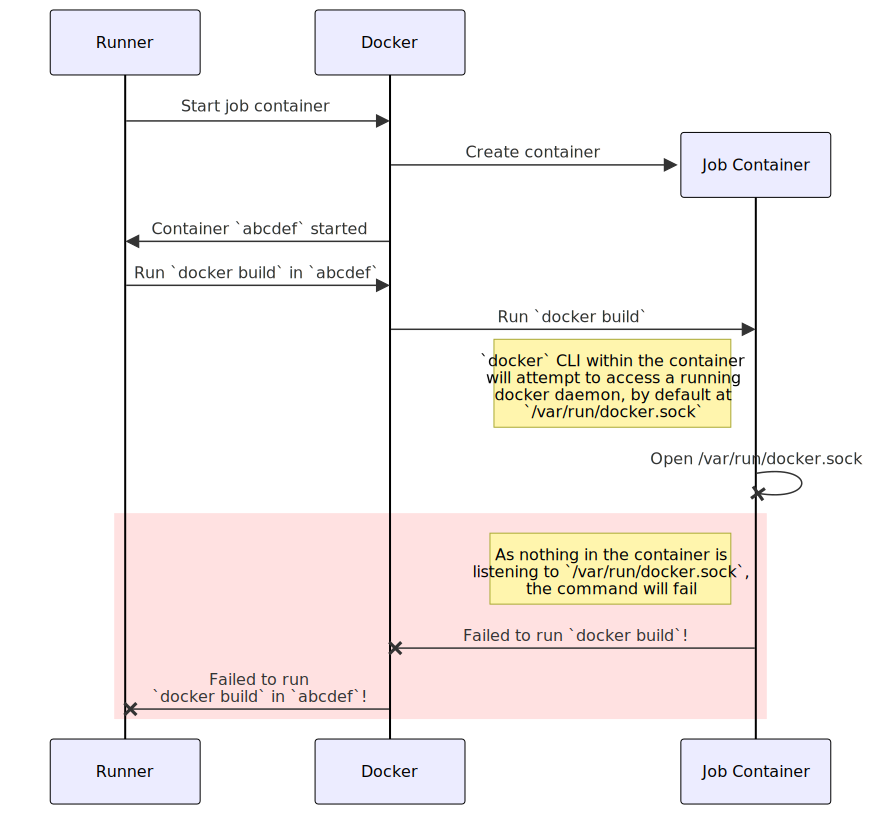
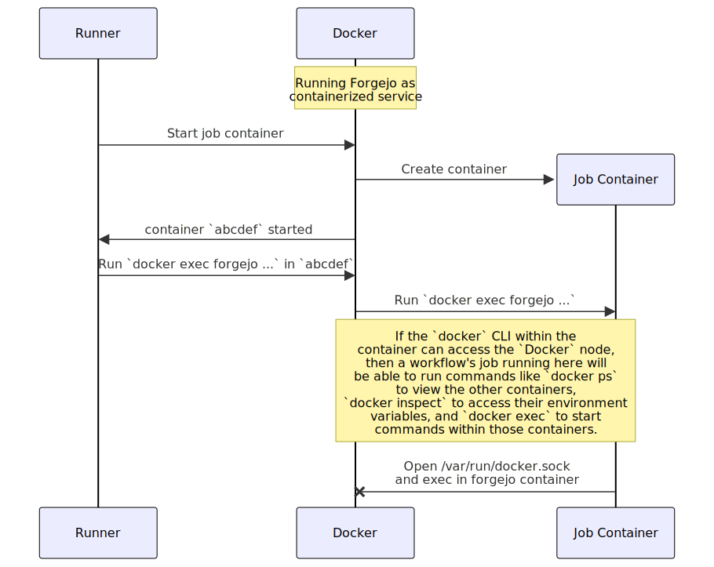
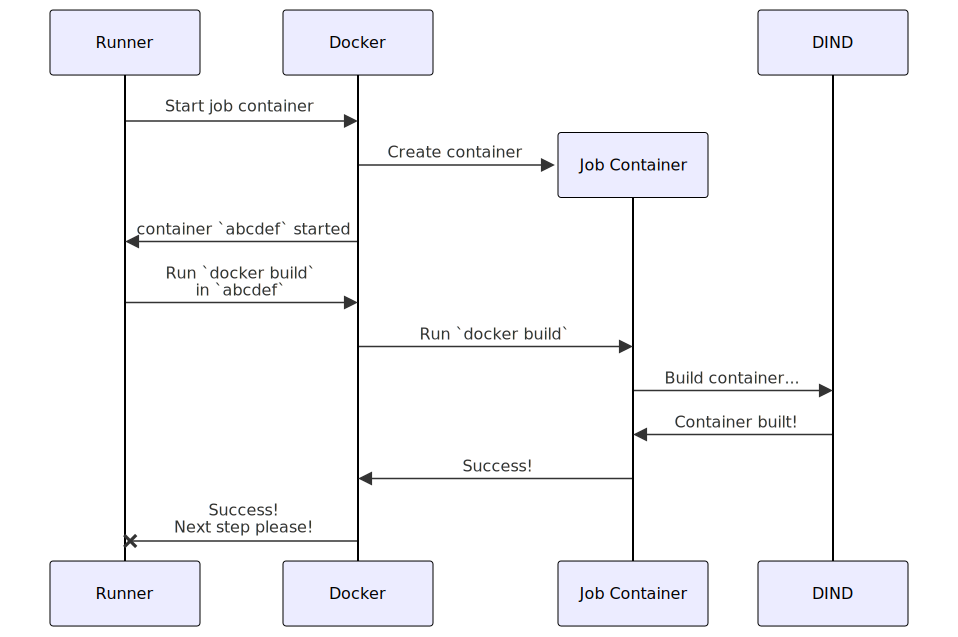
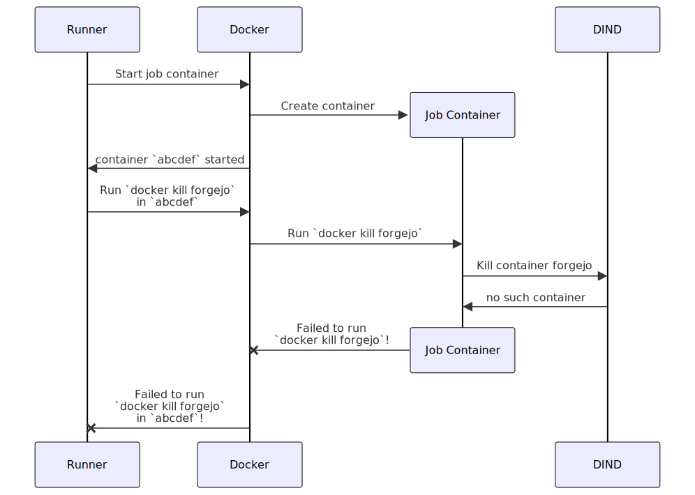
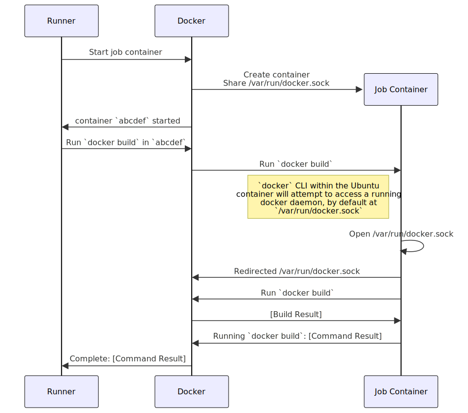

Forgejo Runner uses a container environment to run actions, but additional configuration is required to allow actions to access a container environment as well.

For example, a simple Forgejo workflow like this:

```yaml
name: Docker Build

on:
  push:
    branches: [main]

jobs:
  build:
    runs-on: docker

    steps:
      - uses: actions/checkout@v4
      - run: docker build -t my-app .
```

Will typically fail with an error like this:

```
Cannot connect to the Docker daemon at unix:///var/run/docker.sock. Is the docker daemon running?
```

# Why doesn't it just work?

The job container that Forgejo Runner executes doesn't have access to a docker socket.

When the Forgejo Runner receives a job to execute, it will create a container which will be used to execute the job, the **job container**. The configuration of this container is usually defined by the labels on Forgejo Runner, but can also be configured within the job by the [`jobs.<job_id>.container.image`](../../../user/actions/reference/#jobsjob_idcontainerimage) (and related properties).

The individual steps in the workflow are executed within that job container. Without any special configuration, when a command like `docker build` executes within the job container it will attempt to reach out to a running docker daemon via the default UNIX socket `/var/run/docker.sock`. Accessing this socket will fail because there is no docker daemon available within the job container, even though the job container itself is being run and managed by docker.



As there are a number of different systems being described in this document, these terms will be used consistently to maintain clarity:

- **Host**
  - The machine that is running the Forgejo Runner process.
- **Job container**
  - When executing a job (example: the `build` section of the above workflow), Forgejo Runner typically uses a container environment (Docker, Podman, or LXC) to start a job container. Forgejo Runner executes commands from the job in this job container. (Forgejo Runner can also execute commands directly on the host via a label `...:host`; as that configuration is not affected by the problem described it is out-of-scope of this document.)
- **Service container**
  - Some jobs define additional containers that are started at the same time as the job container. For example, it is typical to start a database engine such as MySQL or PostgreSQL in order to support integration testing with a database. Service containers are defined in the [`jobs.<job_id>.services`](../../../user/actions/reference/#jobsjob_idservices) section of the workflow file.

# Security Considerations

Providing Forgejo Actions workflows the ability to access a Docker daemon adds to the [complex security requirements for Forgejo Runner](../security/). While choosing their desired configuration, an administrator of Forgejo Runner will want to be cautious that providing access to a Docker system doesn't grant unexpected access to **other** resources in the same Docker system.

For example, assuming that both Forgejo and Forgejo Runner are using the same Docker daemon, granting direct access to that daemon would allow an executed Action to shut down the Forgejo instance (see diagram below), or perform far more dangerous actions like creating an administrator account with unlimited access to the instance. This may be an acceptable risk to the administrator, or it may be access that they would prefer to prevent.



# Solutions

## Docker-in-Docker

Forgejo Runner can be configured to use "Docker in Docker" (abbreviated as DIND) for Actions' access to Docker. This involves running a separate "DIND" container that runs on the host's Docker daemon, and provides its own isolated Docker daemon. When configured in this mode, attempts to access Docker will be redirected to the DIND container and will run there:



This configuration prevents access to the host's Docker resources, as they are not available within the job container:



### Configuration

For this configuration, there are three steps:

1. Run a Docker-in-Docker container
2. Configure Forgejo Runner to access the Docker-in-Docker container when it starts job, service, and step containers.
3. Provide a `DOCKER_HOST` environment variable to the job, service, and step containers that also allows access to the Docker-in-Docker container.

Below is a configuration example, but applying each step may vary depending on your Forgejo Runner installation and configuration.

For the first step, starting a Docker-in-Docker container, we'll use `docker run` to create a new container based upon the `docker:dind` image, and expose access to it on a local network port `2376`:

```bash
docker run \
  -p 127.0.0.1:2376:2375 \
  --detach \
  --privileged \
  --restart always \
  --name dind_container \
  docker:dind \
  dockerd -H tcp://0.0.0.0:2375 --tls=false
```

This configuration is creating a Docker-in-Docker instance on `dind_container:2375` and `127.0.0.1:2376` with no encryption (`--tls=false`) and no access control. This instance will be accessible from the host, but not other machines on the local network; this may not be appropriate if there are other untrusted users on the host.

For step two and step three, we'll tweak the Forgejo Runner configuration file; see the inline comments for more details:

```yaml
runner:
  # ... skipping other configuration values you may have ...
  envs:
    # Step 3 (Part 1):
    # This DOCKER_HOST environment variable will be setup in each
    # created container. When you run the docker CLI or related
    # commands, they'll find this variable and reach out to the DIND
    # container to perform work there.
    DOCKER_HOST: tcp://dind_container.docker.internal:2375
  # ... skipping ...

container:
  # ... skipping ...

  # Step 2:
  # Use the Docker-in-Docker host to run any job, service, and step
  # containers. You can get a pretty functional step if you skip this
  # step, as containers will still be able to access docker through
  # the `runner.envs.DOCKER_HOST` setting -- but containers created
  # by a job won't be able to access services. For example, having a
  # `postgresql` service in the job, and then invoking `docker run -e
  # DB_HOST=postgresql some-app:testing`, the two containers will both
  # be in the Docker-in-Docker environment and will communicate freely.
  docker_host: 'tcp://127.0.0.1:2376'
  #
  # Step 3 (Part 2):
  # DNS resolve `dind_container` in the context of the container's
  # host (the DIND container) to allow tcp://... to find it.
  options: '--add-host=dind_container.docker.internal:host-gateway'
  # ... skipping ...
```

If you're using the [OCI image installation](../runner-installation/#setting-up-the-container-environment) configuration described in the Forgejo Runner installation guide, then you can modify this configuration by setting `runner.envs.DOCKER_HOST` to the same `docker-in-docker` container is already present in that guide. A detailed [example docker-compose.yml](https://code.forgejo.org/forgejo/runner/src/branch/main/examples/docker-compose/compose-forgejo-and-runner.yml) is available which writes an appropriate configuration file and updates the forgejo-runner daemon to use that configuration.

### Administrator Notes

The Docker-in-Docker configuration is relatively easy to set up, and provides security by preventing access to other resources on the host's docker system.

However, there are some issues for administrators to be aware of:

- If a Forgejo Runner is configured with `runner.capacity` greater than 1 to allow multiple concurrent tasks, or multiple Forgejo Runners are configured using the same DIND `container.docker_host`, then job containers will be able to view and interact with each other through the docker CLI. This could allow one to compromise the secrets of another running job container or interact with its files while it is running.
- The DIND container will have its own storage, in its own `/var/lib/docker` directory within the container. This means that...
  - Images available on the host won't be available on the DIND container until pulled within that container,
  - Extra storage may be used holding duplicate copies of images relative to the host,
  - The `/var/lib/docker` directory will be wiped if the DIND container is recreated (for example, for software upgrades to the `docker:dind` image) unless it is volume-mapped to a persistent volume, potentially impacting the performance of future workflow runs if image caching is relied upon.
  - If `/var/lib/docker` is volume-mapped to a persistent volume, it will need periodic maintenance such as `docker system prune` to ensure that the images and volumes do not grow indefinitely with out-of-date and irrelevant contents.
- Artifacts that workflows create, such as new images created by `docker build` or containers created by `docker run`, will be left in the DIND container. Any future workflow execution on the same runner will be able to inspect these artifacts and could extract confidential information from them.
- [Resource Constraints](../security/#resource-constraints-via-containeroptions) configured on Forgejo Runner won't have any impact on containers created from workflow actions. However, resources will be constrained to those configured on the created DIND container.

## Configure `container.docker_host` to `automount`

Forgejo Runner can be configured to expose the host's Docker daemon to job containers by mounting the host's UNIX socket into `/var/run/docker.sock` within the job containers.



### Configuration

```yaml
container:
  # ... skipping ...
  #
  # The "automount" option makes Forgejo Runner automatically find the
  # appropriate docker socket in order to start job containers, and then
  # also direct new job containers to have that docker socket mounted
  # into them as `/var/run/docker.sock`.
  docker_host: 'automount'
  # ... skipping ...
```

The valid values for this configuration, and how they relate to accessing Docker from within actions, are:

- `docker_host: "-"`
  - This is the default value.
  - Forgejo Runner will attempt to use the environment variable `DOCKER_HOST` to connect to docker, and if that variable is not available it will use the UNIX socket `/var/run/docker.sock`.
  - Forgejo Runner **will not** share the socket with the containers.
  - This prevents access to docker, but it is the default so that no unexpected security risks are present without the administrator knowingly choosing a different value.
- `docker_host: "automount"`
  - Forgejo Runner will attempt to use the environment variable `DOCKER_HOST` to connect to docker, and fallback to the UNIX socket `/var/run/docker.sock`.
  - Forgejo Runner **will** share the socket with job/service/step containers by mounting it to `/var/run/docker.sock`, if the socket is a UNIX socket. If `DOCKER_HOST` is a `tcp://...` socket, then it cannot be shared in this manner and `"automount"` will act the same as `"-"`.
    - In the [OCI image installation](../runner-installation/#setting-up-the-container-environment) installation method, `"automount"` will not work because `DOCKER_HOST` is a `tcp://...` address. This option is incompatible with this approach to share the Docker socket.
  - This allows containers access to docker; please review the [Administrator Notes](#administrator-notes-1) below for security details.
- `docker_host: "unix://..."` or `docker_host: "tcp://..."`
  - Another URL can be used to provide a specific docker daemon.
  - Forgejo Runner **will not** share the socket with the containers.

### Administrator Notes

This configuration is the simplest in order to access Docker from a job container, but provides no security isolation. The docker daemon that Forgejo Runner discovers through its autodiscovery, which is typically the host's Docker daemon at `/var/run/docker.sock`, will be exposed to action workflows, and all services hosted on that Docker daemon can be inspected and mutated. This configuration is only advisable if measures are taken to ensure that [only trusted users](../security/#forgejo-access) are able to access the Forgejo instance.

Risks to be aware of in choosing this approach include:

- Any containers executed in Docker will be accessible to the job, service, and step containers. For example, if Forgejo or Forgejo Runner are run as containers on the same host, then job containers will be able to execute actions like `docker kill`, `docker inspect`, or `docker exec` on those containers.
- All storage on the host can be compromised by an Action performing volume mounts to newly created containers. For example, an action step such as `docker run -v /:/host-mount ubuntu` would make the entire host's storage available to the container, including any on-disk secrets.
- Artifacts that workflows create, such as new images created by `docker build` or containers created by `docker run`, will be left in the host's docker daemon. Any future workflow execution on the same runner will be able to inspect these artifacts and could extract confidential information from them.
- [Resource Constraints](../security/#resource-constraints-via-containeroptions) configured on Forgejo Runner won't have any impact on containers created from workflow actions.
- Specific network configuration via Forgejo Runner's `container.network` setting will not be applied to any containers created from workflows. Workflows would be able to define settings like `--network=host` to access the host operating system's native network. This creates new security risks by exposing [Local Network Resources](../security/#local-network-resources) to these containers.

## LXC

LXC is a lightweight virtualization method which allows for the creation of Linux containers which are capable of independently running Docker. When Forgejo Runner is configured with a label that runs job containers under LXC, those containers can provide a completely isolated environment for execution of Docker builds without putting host resources at risk.


### Configuration

The Forgejo Runner installation guide contains a section [Setting up the container environment](../runner-installation/#setting-up-the-container-environment) which describes the requirements for configuring LXC access.

Once a Forgejo Runner is configured with a label that uses the LXC container environment (eg. `bookworm-lxc:lxc://debian:bookworm`), the job container will run under LXC. It will be straightforward to install and interact with Docker within an action:

```yaml
name: Test Action

on:
  pull_request:

jobs:
  check-1:
    runs-on: bookworm-lxc
    steps:
      - run: apt update && apt --quiet install --yes -qq docker.io
      - run: docker ps -a
      - run: docker run --rm -it ubuntu echo "Hello, world!"
```

### Administrator Notes

Relative to the [Docker-in-Docker](#docker-in-docker) and [automount](#configure-containerdocker_host-to-automount) options, the LXC configuration provides superior isolation; accessing any Docker resource hosted within the job container is isolated from the runner host and from other job containers.

Using an LXC for job containers does have functional gaps. [Service containers](../../../user/actions/reference/#jobsjob_idservices) are not supported in an action when using the LXC hosting model.

As each LXC container will create its own independent Docker daemon with its own storage, there will be no image caching shared between runs. While this is a strong solution with respect to security risks, it can impact the performance of future workflow runs which will have no cached images during operations.

No solution can provide a guarantee of zero security risks. The LXC container model operates with a shared Linux kernel between multiple lightweight virtual environments. Keeping up-to-date with OS security patches is advised as container escape mechanisms have occasionally been discovered.

## Forgejo Runner in a VM

Depending on the criticality and confidentiality of other services and data that are shared on the Forgejo Runner's host, you may wish to completely isolate Forgejo Runner in its own virtual machine. Once isolated, any of the other configurations described here may be applied to the VM in order to allow access to Docker services. As the underlying host OS will not be accessible to the virtual machine, many of the security risks described are no longer in-scope.
