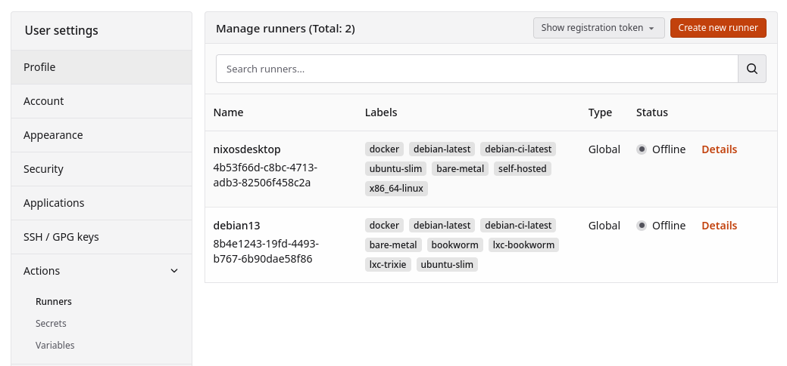
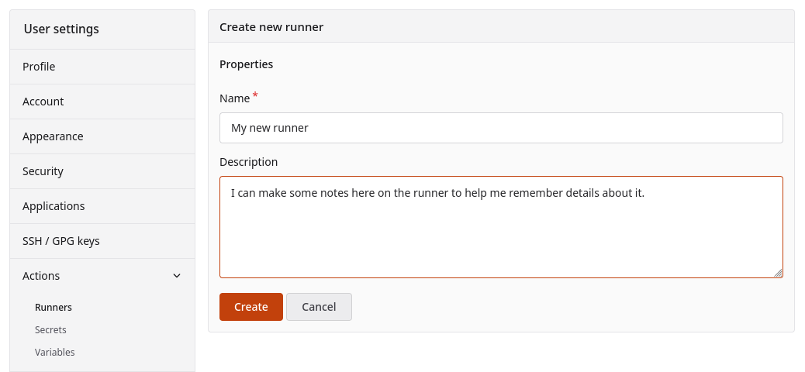
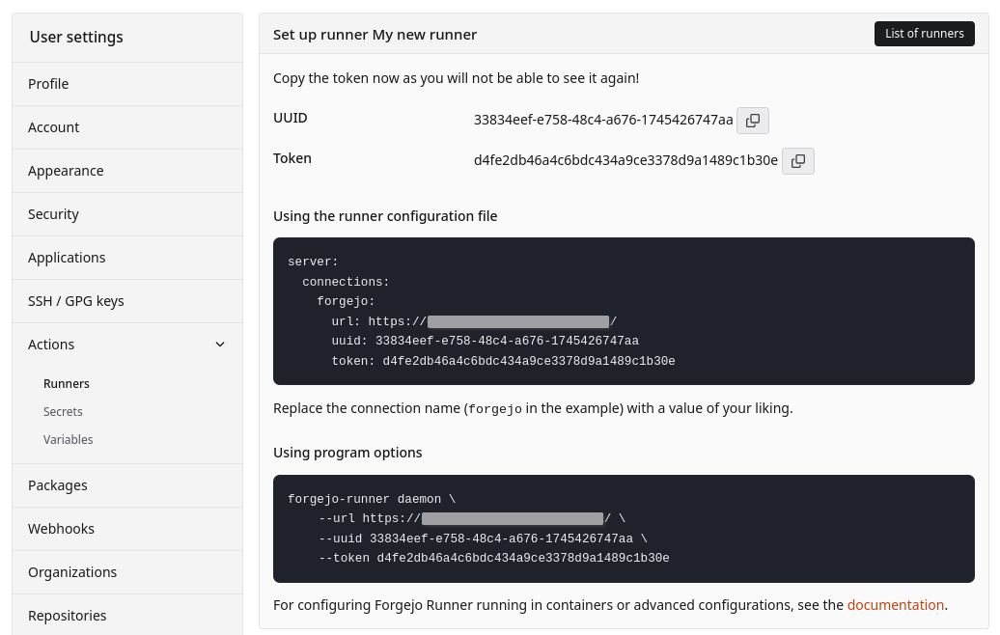

`Forgejo Runner` requires a uuid and token to connect to Forgejo. These values act as a username and password for
identifying and authenticating the connection. There are three ways to obtain them:

- [Interactive registration in Forgejo](#interactive-registration) (recommended)
- Using Forgejo's HTTP API
- [Offline registration](#offline-registration) using Forgejo's command line utility

## Interactive registration

`Forgejo Runner` needs to be registered with Forgejo to execute jobs. Within Forgejo, a user can register a new runner
four different locations, which vary in which workflows will executed on the runner:

- A system administrator can create a runner at `/admin/actions/runners`, which will execute workflows from all
  repositories on the Forgejo instance.
- An organization administrator can create a runner at `/org/{org}/settings/actions/runners` which will execute
  workflows from all the repositories within the organization.
- A user can create a runner at `/user/settings/actions/runners` which will execute workflows from all repositories
  owned by the user.
- A repository administrator can create a runner at `/{owner}/{repository}/settings/actions/runners` which will execute
  workflows from the single repository.

Each of these pages will display any existing runners that are capable of executing jobs, including runners from higher
level registrations. For example, when viewing the runner list in a repository, that will include any runners registered
with the organization that owns the repository, and any runners registered at the system administrator level.



The `Create new runner` button opens a dialog to enter a name and description for the runner:



After hitting the `Create` button, a unique identifier (UUID) and a confidential secret (Token) will be displayed for
the new runner.



The displayed configuration should be copied into the `Forgejo Runner` configuration file, in the `server` section. The
default configuration file (which [can be generated if absent](../installation/binary/#configuration)) has an empty
`server` section which contains only comments about the intended format. For example, to finish this configuration based
upon the UI values:

```yaml
# ... the rest of the config file ...
host:
  # The parent directory of a job's working directory.
  # If it's empty, $HOME/.cache/act/ will be used.
  workdir_parent:

server:
  connections:
    forgejo:
      url: https://example.com/
      uuid: 33834eef-e758-48c4-a676-1745426747aa
      token: d4fe2db46a4c6bdc434a9ce3378d9a1489c1b30e
```

The registration process can be repeated multiple times to connect one `Forgejo Runner` to different Forgejo instances,
or to different organizations, users, or repositories within a single Forgejo instance. In this case, multiple
connections would end up in the configuration file, for example:

```yaml
# ... the rest of the config file ...

server:
  connections:
    company-org1: # keys must be unique, but have no meaning
      url: https://company-forgejo.example.com/
      uuid: 33834eef-e758-48c4-a676-1745426747aa
      token: d4fe2db46a4c6bdc434a9ce3378d9a1489c1b30e
    my-org2:
      url: https://my-forgejo.example.org/
      uuid: f7fb6f55-7140-44b6-893a-37ceae0df435
      token: 111b5aca20e64c290d639987c9a401377a2e4253
```

## Offline registration

When Infrastructure as Code (Ansible, kubernetes, etc.) is used to deploy and configure both Forgejo and the Forgejo
runner, it may be more convenient for it to generate a secret and share it with both. This method of registration is not
applicable for hosted services like Codeberg as it requires system administrator access to the Forgejo instance.

The `forgejo forgejo-cli actions register --secret <secret>` subcommand can be used to register the runner with the
Forgejo instance. First, generate a 40-character long string of hexadecimal numbers.

On the machine running Forgejo:

```sh
$ forgejo forgejo-cli actions register --name runner-name --scope myorganization \
    --secret 7c31591e8b67225a116d4a4519ea8e507e08f71f
37633331-3539-3165-3862-363732323561
```

And on the `Forgejo Runner` instance, add the remote server address, uuid, and token to the configuration file:

```yaml
# ... the rest of the config file ...

server:
  connections:
    forgejo:
      url: https://example.com/
      uuid: 37633331-3539-3165-3862-363732323561
      token: 7c31591e8b67225a116d4a4519ea8e507e08f71f
```

The 40-character secret is a combination of an identifier and a secret value: the first 16 characters will be used as an
identifier for the runner, while the rest is the actual secret. It is possible to update the secret of an existing
runner by running the command again on the Forgejo machine, with the last 24 characters updated.

For instance, the command below would change the secret set by the previous command:

```sh
$ forgejo forgejo-cli actions register --name runner-name --scope myorganization \
    --secret 7c31591e8b67225a84e8e06633b9578e793664c3
#            ^^^^^^^^^^^^^^^^ This part is identical
```
