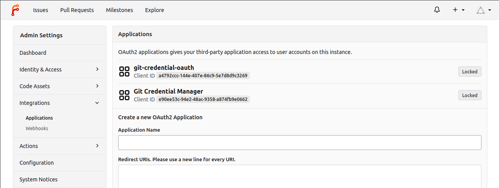

Forgejo can act as an instance wide OAuth2 provider. To achieve that, OAuth2 applications must be created in the `/admin/applications` page.

> **NOTE:** Third party applications obtaining a token for a user via such an application will have administrative rights. OAuth2 scopes are not yet implemented.

## Pre-registered applications

The following OAuth2 applications are pre-registered beause it is generally useful for Forgejo to be an OAuth2 provider for the corresponding third party software. Their usage is explained in the [Forgejo user guide](../../user/oauth2-provider/).

- **git-credential-manager** is the name of the OAuth2 application for the [Git Credential Manager](https://github.com/git-ecosystem/git-credential-manager) (a Git [credential helper](https://git-scm.com/docs/gitcredentials#_custom_helpers))
- **git-credential-oauth** is the name of the OAuth2 application for the [git-credential-oauth](https://github.com/hickford/git-credential-oauth) (a Git [credential helper](https://git-scm.com/docs/gitcredentials#_custom_helpers))

All pre-registered applications are activated by default in the [`[oauth2].DEFAULT_APPLICATIONS`](../config-cheat-sheet/#oauth2-oauth2) setting as displayed in the `/admin/applications` page.

