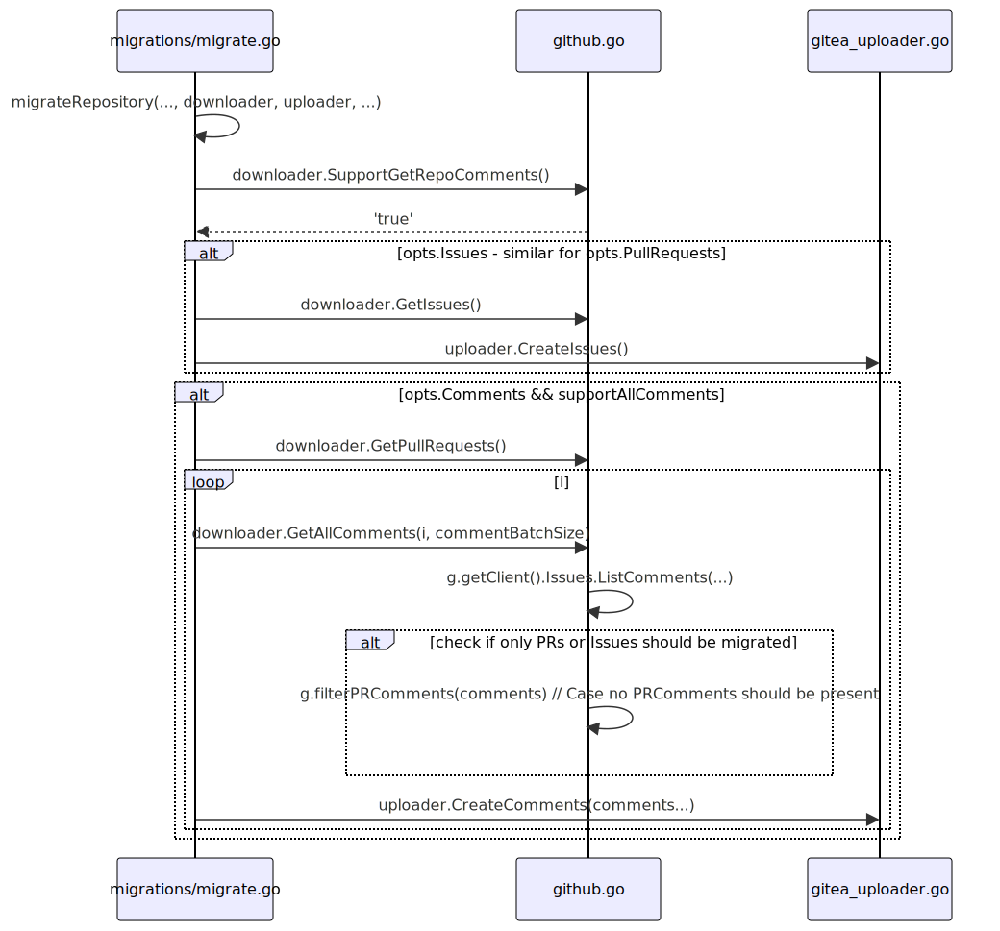

## Basic sequence for getting comments from github

The [sequence diagram](https://en.wikipedia.org/wiki/Sequence_diagram) below shows the different go packages in the top and bottom boxes and their functions within. You can find the relevant code mostly in the services/migrations folder. The arrows are to be read in sequence from top to bottom, while the description of each arrow shows the function and its simplified signature. Reference this diagram if you need a basic overview of how the packages in services/migrations are connected and how PR/Issue comments are filtered based on migration options.

The diagram was made with mermaid.js, you can find the documentation for it [here](https://mermaid.js.org/syntax/sequenceDiagram.html#loops).
