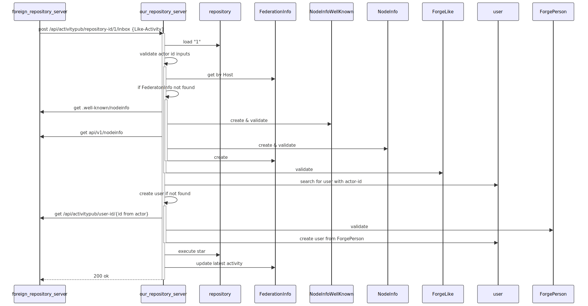

## Technical Background

### Control Flow



### Data transferred

```
# NodeInfoWellKnown
{"links":[
  {"href":"https://federated-repo.prod.meissa.de/api/v1/nodeinfo",
  "rel":"http://nodeinfo.diaspora.software/ns/schema/2.1"}]}

# NodeInfo
{"version":"2.1",
 "software":{"name":"gitea",
 ...}}

# LikeActivity
{"id": "https://repo.prod.meissa.de/api/v1/activitypub/user-id/1/outbox/12345",
  "type": "Like",
  "actor": "https://repo.prod.meissa.de/api/v1/activitypub/user-id/1",
  "object": "https://codeberg.org/api/v1/activitypub/repository-id/12"
  "startTime": "2014-12-31T23:00:00-08:00"
}

# Person
{"id":"https://federated-repo.prod.meissa.de/api/v1/activitypub/user-id/10",
 "type":"Person",
 "preferredUsername":"stargoose9",
 "name": "goose going to star the repo",
 "publicKey":{"id":"https://federated-repo.prod.meissa.de/api/v1/activitypub/user-id/10#main-key",
		"owner":"https://federated-repo.prod.meissa.de/api/v1/activitypub/user-id/10",
		"publicKeyPem":"-----BEGIN PUBLIC KEY-----\nMIIBoj...XAgMBAAE=\n-----END PUBLIC KEY-----\n"}}
```

### Data Flow



## Analysis

### Assets

1. **Service Availability**: The availability of our or foreign servers.
2. **Instance Reputation**: We hope our project does not live on a spam instance.
3. **Project Reputation**: The reputation of an individual project.

### Actors

1. **Script Kiddies**: Boored teens, willing to do some illegal stuff without deep knowledge of tech details but broad knowledge across internet discussions. Able to do some bash / python scripting.
2. **Experienced Hacker**: Hacker with deep knowledge.
3. **Hacker**: Hacker with some knowledge.
4. **Malicious Fediverse Member**: Malicious Members of the fediverse, able to operate malicious forge instances.
5. **Malicious Forge Admin**: Admin of good reputation forge instance in the fediverse.
6. **Federated User**: Members of good reputation forge instance in the fediverse.

### Threat

1. **Knock foreign http server**: Script Kiddi sends a Like Activity containing an attack actor url `http://attacked.target/very/special/path` in place of actor. Our repository server sends a `get Person Actor` request to this url. The target receives a DenialdOfService attack. We loose CPU & instance reputation.
2. **Sql injection**: Experienced hacker sends a Like Activity containing an actor url pointing to an evil forgejo instance. Our repository server sends an `get Person Actor` request to this instance and gets a person having sth. like `; drop database;` in its name. If our server tries to create a new user out of this person, the db might be dropped.
3. **Malicious Activities**: Malicious Fediverse Member sends Star Activities containing non authorized Person Actors. The Actors listed as stargazer might get angry about this. The project may loose project reputation.
4. **DOS by Rate**: Experienced Hacker records activities sent and replays some of them. Without order of activities (i.e. timestamp) we can not decide wether we should execute the activity again. If the replayed activities are UnLike Activity we might loose stars.
5. **Replay**: Experienced Hacker records activities sends a massive amount of activities which leads to new user creation & storage loss. Our instance might fall out of service. See also [replay attack@wikipedia][2].
6. **Replay out of Order**: Experienced Hacker records activities sends again Unlike Activities happened but was succeeded by an Like. Our instance accept the Unlike and removes a star. Our repository gets rated unintended bad.
7. **DOS by Slowlories**: Experienced Hacker may craft their malicious server to keep connections open. Then they send a Like Activity with the actor URL pointing to that malicious server, and your background job keeps waiting for data. Then they send more such requests, until you exhaust your limit of file descriptors openable for your system and cause a DoS (by causing cascading failures all over the system, given file descriptors are used for about everything, from files, to sockets, to pipes). See also [Slowloris@wikipedia][1].
8. **Saturate by future StartTime**: Hacker sends an Activity having `startTime` in far future. Our Instance does no longer accept Activities till they have far far future `startTime` from the actors instance.
9. **Malicious Forge**: If a "Malicious Fediverse Member" deploys an 'federated' forge that sends the right amount of Like activities to not hit the rate limiter, an malicious user can modify the code of any 'federated' forge to ensure that if an foreign server tries to verify and activity, it will always succeed (such as creating users on demand, or simply mocking the data).
10. **Malicious Controlled Forge**: A "Malicious Forge Admin" of a good reputation instance may impersonate users on his instance and trigger federated activities.
11. **Side Chanel Malicious Activities**: A Owner of a good reputation instance may craft malicious activities with the hope not to get moderated.

### Mitigations

1. Validate object uri in order to send only requests to well defined endpoints.
2. xorm global SQL injection protection.
3. We accept only signed Activities
4. We accept only activities having an startTime & remember the last executed activity startTime.
5. We introduce (or have) rate limiting per IP.
6. We ensure, that outgoing HTTP requests have a reasonable timeout (if you didn't get that 500b JSON response after 10 seconds, you probably won't get it).
7. **Instance Level Moderation** (such as blocking other federated forges) can mitigate "Malicious Forge"
8. **User Level Moderation** (such as blocking other federated users) can mitigate "Side Chanel Malicious Activities"

### DREAD-Score

| Threat | Damage  | Reproducibility | Exploitability | Affected Users | Discoverability | Mitigations |
| :----- | :------ | :-------------- | :------------- | :------------- | :-------------- | :---------- |
| 1.     | ... tbd |                 |                |                |                 |             |
| 2.     | ... tbd |                 |                |                |                 |             |

Threat Score with values between 1 - 6

- Damage – how severe would the damage be if the attack is successful? 6 is a very bad damage.
- Reproducibility – how easy would the attack be reproducible? 6 is very easy to reproduce.
- Exploitability – How much time, effort and experience are necessary to exploit the threat? 6 is very easy to make.
- Affected Users – if a threat were exploited, how many percentage of users would be affected?
- Discoverability – How easy can an attack be discovered? Does the attacker have to expect prosecution? 6 is very hard to discover / is not illegal

## Contributors

In addition to direct committer our special thanks goes to the experts joining our discussions:

- [kik](https://codeberg.org/oelmekki)

## Reference

[1]: https://en.wikipedia.org/wiki/Slowloris_(computer_security)
[2]: https://en.wikipedia.org/wiki/Replay_attack
