`Forgejo Actions` provides Continuous Integration driven from the files in the `.forgejo/workflows` directory of a repository, with a web interface to show the results. The syntax and semantics of the `workflow` files will be familiar to people used to [GitHub Actions](https://docs.github.com/en/actions) but **they are not and will never be identical**.

The following guide explains key **concepts** to help understand how `workflows` are interpreted, with a set of **examples** that can be copy/pasted and modified to fit particular use cases.

## Quick start

- Verify that `Enable Repository Actions` is checked in the `Repository` tab of the `/{owner}/{repository}/settings` page. If the checkbox does not show it means the administrator of the Forgejo instance did not activate the feature.
  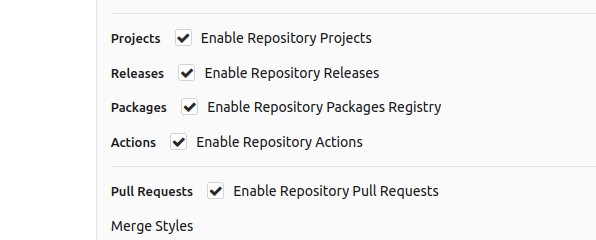
- Add the following to the `.forgejo/workflows/demo.yaml` file in the repository.
  ```yaml
  on: [push]
  jobs:
    test:
      runs-on: docker
      steps:
        - run: echo All Good
  ```
  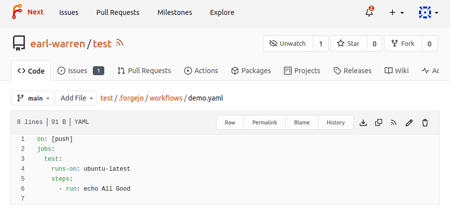
- Go to the `Actions` tab of the `/{owner}/{repository}/actions` page of the repository to see the result of the run.
  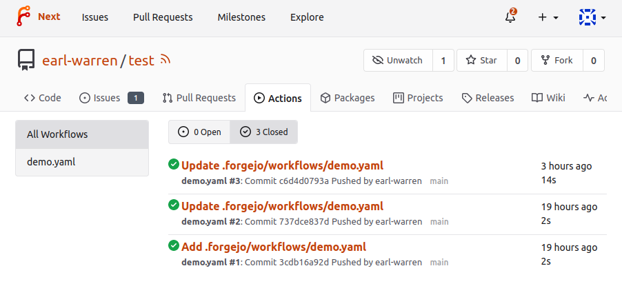
- Click on the workflow link to see the details and the job execution logs.
  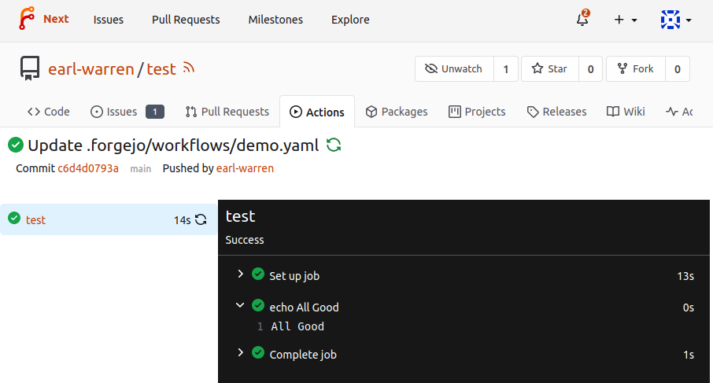

## Hierarchy

In Forgejo terminology a `workflow` is a `.yml` file in the
`.forgejo/workflows` directory of the repository. A `workflow` has `jobs` with
`steps` to be executed by a Action runner. See the [Glossary](#glossary) for
more descriptions of key terms.

## Actions

An `Action` is a repository that contains the equivalent of a function in any programming language. It comes in two flavors, depending on the file found at the root of the repository:

- **action.yml:** describes the inputs and outputs of the action and the implementation. See [this example](https://code.forgejo.org/actions/setup-forgejo/src/branch/main/action.yml).
- **Dockerfile:** if no `action.yml` file is found, it is used to create an image with `docker build` and run a container from it to carry out the action. See [this example](https://code.forgejo.org/forgejo/test-setup-forgejo-docker) and [the workflow that uses it](https://code.forgejo.org/forgejo/end-to-end/src/branch/main/actions/example-docker-action). Note that files written outside of the **workspace** will be lost when the **step** using such an action terminates.

One of the most commonly used action is [checkout](https://code.forgejo.org/actions/checkout#usage) which clones the repository that triggered a `workflow`. Another one is [setup-go](https://code.forgejo.org/actions/setup-go#usage) that will install Go.

Just as any other program of function, an `Action` has pre-requisites to successfully be installed and run. When looking at re-using an existing `Action`, this is an important consideration. For instance [setup-go](https://code.forgejo.org/actions/setup-go) depends on NodeJS during installation.

## Automatic token

At the start of each `workflow`, a unique authentication token is
automatically created and destroyed when it completes. It can be used
to read the repositories associated with the workflow, even when they
are private. It is available:

- in the environment of each step as `GITHUB_TOKEN`
- as `github.token`
- as `env.GITHUB_TOKEN`
- as `secrets.FORGEJO_TOKEN`
- as `secrets.GITHUB_TOKEN`
- as `secrets.GITEA_TOKEN`

This token can only be used for interactions with the repository of
the project and any attempt to use it on other repositories, even
for creating an issue, will return a 404 error.

This token also has write permission to the repository and can be used
to push commits or use API endpoints such as creating a label or merge
a pull request.

In order to avoid infinite recursion, no `workflow` will be triggered
as a side effect of a change authored with this token. For instance,
if a branch is pushed to the repository and there exists a workflow that
is triggered on push events, it will not fire.

A `workflow` triggered by a `pull_request` event is an exception: in
that case the token does not have write permissions to the repository.
The pull request could contain an untested or malicious workflow.

## Expressions

In a `workflow` file strings that look like `${{ ... }}` are evaluated by the `Forgejo runner` and are called expressions. As a shortcut, `if: ${{ ... }}` is equivalent to `if: ...`, i.e the `${{ }}` surrounding the expression is implicit and can be stripped. [Check out the example](https://code.forgejo.org/forgejo/end-to-end/src/branch/main/actions/example-expression/.forgejo/workflows/test.yml) that illustrates expressions.

### Literals

- boolean: true or false
- null: null
- number: any number format supported by JSON
- string: enclosed in single quotes

### Logical operators

| Operator | Description           |
| -------- | --------------------- |
| `( )`    | Logical grouping      |
| `[ ]`    | Index                 |
| `.`      | Property de-reference |
| `!`      | Not                   |
| `<`      | Less than             |
| `<=`     | Less than or equal    |
| `>`      | Greater than          |
| `>=`     | Greater than or equal |
| `==`     | Equal                 |
| `!=`     | Not equal             |
| `&&`     | And                   |
| `\|\|`   | Or                    |

> **NOTE:** String comparisons are case insensitive.

### Conditionals

Can be used in `if:` conditionals on jobs and steps.

- `success()`. returns true when none of the previous jobs/steps have failed or been cancelled.
- `always()`. causes the job/step to always execute, and returns true, even when cancelled. If you want to run a job/step regardless of its success or failure, use the recommended alternative: `'!cancelled()'` (the expression must be enclosed by quotes to not be interpreted as YAML tag).
- `failure()`. returns true when any previous step/job has failed.

### Functions

- `contains( search, item )`. Returns `true` if `search` contains `item`. If `search` is an array, this function returns `true` if the `item` is an element in the array. If `search` is a string, this function returns `true` if the `item` is a substring of `search`. This function is not case sensitive. Casts values to a string.
- `startsWith( searchString, searchValue )`. Returns `true` when `searchString` starts with `searchValue`. This function is not case sensitive. Casts values to a string.
- `endsWith( searchString, searchValue )`. Returns `true` if `searchString` ends with `searchValue`. This function is not case sensitive. Casts values to a string.
- `format( string, replaceValue0, replaceValue1, ..., replaceValueN)`. Replaces values in the `string`, with the variable `replaceValueN`. Variables in the `string` are specified using the `{N}` syntax, where `N` is an integer. You must specify at least one `replaceValue` and `string`. Escape curly braces using double braces.
- `join( array, optionalSeparator )`. The value for `array` can be an array or a string. All values in `array` are concatenated into a string. If you provide `optionalSeparator`, it is inserted between the concatenated values. Otherwise, the default separator `,` is used. Casts values to a string.
- `toJSON(value)`. Returns a pretty-print JSON representation of `value`.
- `fromJSON(value)`. Returns a JSON object or JSON data type for `value`. You can use this function to provide a JSON object as an evaluated expression or to convert environment variables from a string.

## Sharing files between jobs

Two `jobs`, even if they are part of the same `workflow`, may run on
different machines. The files created on the file system of the host
by one `job` cannot be re-used by the `job` that follows because it
may run on a different machine.

There are three ways for a `job` to upload and download files,
depending on the use case:

- Using the cache provided by the `Forgejo runner`, for instance to
  speed up compilation of the cache happens to contain the required file.
- Using the artifacts provided by the `Forgejo` server, for instance to
  share files between `jobs` within the same `workflow`.
- Using the [a generic package](../packages/generic) to publish assets
  such as screenshots.

### Artifacts

`Artifacts` allow you to persist data after a `job` has completed, and
share that data with another `job` in the same `workflow`. An `artifact` is
a file or collection of files produced during a `workflow` run. For
example, you can use `artifacts` to save your build and test output
after a workflow run has ended. All `actions` and `workflows` called
within a run have write access to that run's `artifacts`.

The artifacts created by a `workflow` can be downloaded from the web
interface that shows the the details of the jobs for a `workflow`.

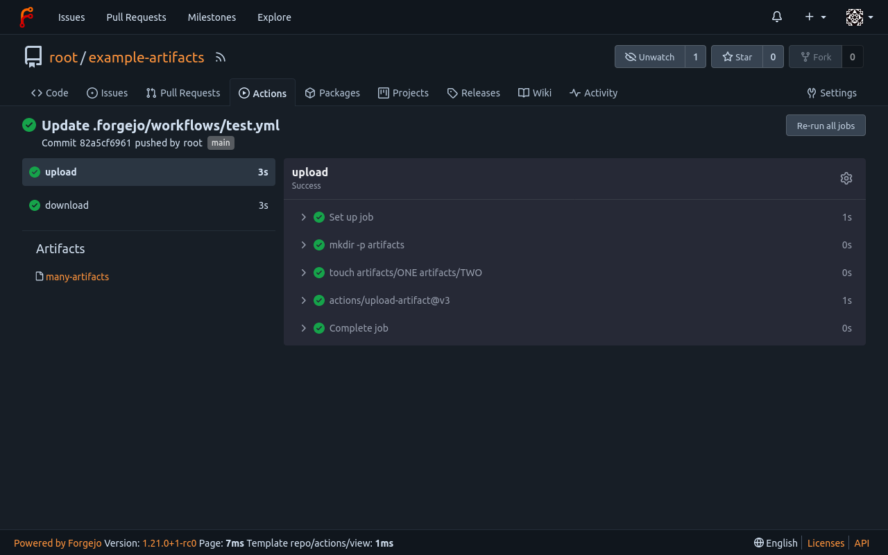

The `artifacts` expire after a delay that defaults to 90 days, but this value
can be modified by the instance admin.

[Check out the example](https://code.forgejo.org/forgejo/end-to-end/src/branch/main/actions/example-artifacts/.forgejo/workflows)
based on the [upload-artifact](https://code.forgejo.org/actions/upload-artifact) action and
the [download-artifact](https://code.forgejo.org/actions/download-artifact) action.

### Cache

When a `job` starts, it can communicate with the `Forgejo runner` to
fetch commonly used files that were saved by previous runs. For
instance the https://code.forgejo.org/actions/setup-go action will do
that by default to save downloading and compiling packages found in
`go.mod`.

It is also possible to explicitly control what is cached (and when)
by using the https://code.forgejo.org/actions/cache action.

There is no guarantee that the cache is populated, even when two `jobs`
run in sequence. It is not a substitute for `artifacts`.

See also the [set of examples](https://code.forgejo.org/forgejo/end-to-end/src/branch/main/actions/example-cache/.forgejo/workflows/).

> **NOTE:** [actions/cache](https://code.forgejo.org/actions/cache) will use `zstd` if present when compressing files to be sent to the cache. It is faster than the default compression.

> **NOTE:** if the runner is not configured to provide a cache, [actions/cache](https://code.forgejo.org/actions/cache) will fail with the following error: `Cache action is only supported on GHES version >= 3.5`.

## Auto cancellation of workflows

When a new commit is pushed to a branch, the workflows that are were
triggered by parent commits are canceled.

## Services

PostgreSQL, Redis and other services can be run from container images with something similar to the following. See also the [set of examples](https://code.forgejo.org/forgejo/end-to-end/src/branch/main/actions/example-service/.forgejo/workflows/).

```yaml
services:
  pgsql:
    image: postgres:15
    env:
      POSTGRES_DB: test
      POSTGRES_PASSWORD: postgres
```

A container with the specified `image:` is run before the `job` starts and is terminated when it completes. The job can address the service using its name, in this case `pgsql`.

The IP address of `pgsql` is on the same [network](https://docs.docker.com/engine/reference/commandline/network/) as the container running the **steps** and there is no need for port binding (see the [docker run --publish](https://docs.docker.com/engine/reference/commandline/run/) option for more information). The `postgres:15` image exposes the PostgreSQL port 5432 and a client will be able to connect as [shown in this example](https://code.forgejo.org/forgejo/end-to-end/src/branch/main/actions/example-service/.forgejo/workflows/test.yml)

### image

The location of the container image to run.

### env

Key/value pairs injected in the environment when running the container, equivalent to [--env](https://docs.docker.com/engine/reference/commandline/run/).

### cmd

A list of command and arguments, equivalent to [[COMMAND] [ARG...]](https://docs.docker.com/engine/reference/commandline/run/).

### options

A string of the following additional options, as documented [docker run](https://docs.docker.com/engine/reference/commandline/run/).

- `--volume`
- `--tmpfs`
- `--hostname` (except for Forgejo runner 6.0.x and 6.1.x)

> **NOTE:** the `--volume` option is restricted to a allowlist of volumes configured in the runner executing the task. See the [Forgejo runner installation guide](../../admin/runner-installation/#configuration) for more information.

### username

The username to authenticate with the registry where the image is located.

### password

The password to authenticate with the registry where the image is located.

## Forgejo runner

`Forgejo` itself does not run the `jobs`, it relies on the [Forgejo runner](https://code.forgejo.org/forgejo/runner) to do so. See the [Forgejo Actions administrator guide](../../admin/actions/) for more information.

### List of runners and their tasks

A `Forgejo runner` listens on a `Forgejo` instance, waiting for jobs. To figure out if a runner is available for a given repository, go to `/{owner}/{repository}/settings/actions/runners`. If there are none, you can run one for yourself on your laptop.


Some runners are **Global** and are available for every repository, others are only available for the repositories within a given user or organization. And there can even be runners dedicated to a single repository. The `Forgejo` administrator is the only one able to launch a **Global** runner. But the user who owns an organization can launch a runner without requiring any special permission. All they need to do is to get a runner registration token and install the runner on their own laptop or on a server of their choosing (see the [Forgejo Actions administrator guide](../../admin/actions/) for more information).

Clicking on the pencil icon next to a runner shows the list of tasks it executed, with the status and a link to display the details of the execution.

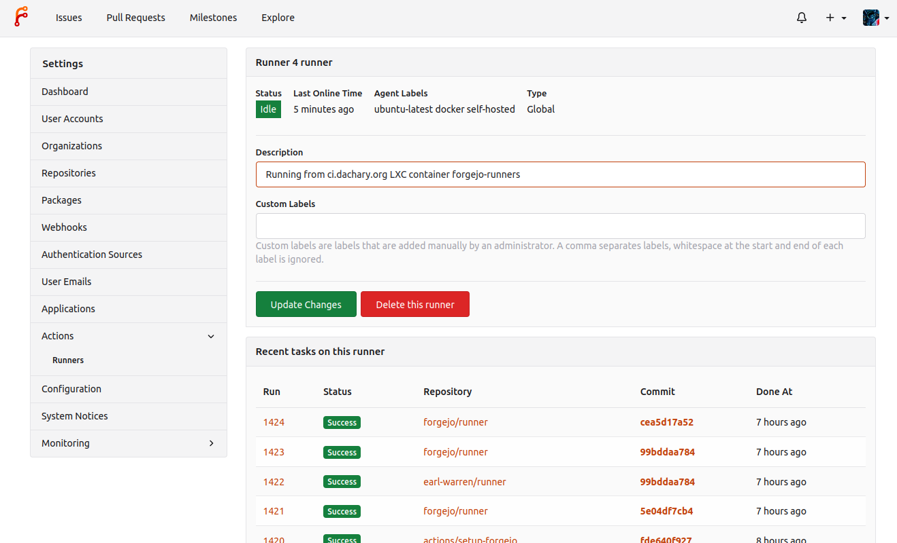

### List of tasks in a repository

From the `Actions` tab in a repository, the list of ongoing and past tasks triggered by this repository is displayed with their status.

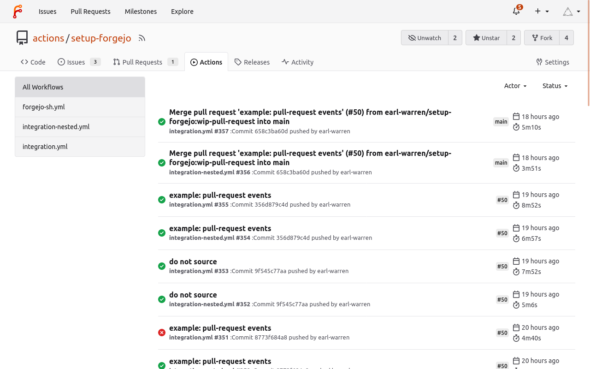

Following the link on a task displays the logs and the `Re-run all jobs` button. It is also possible to re-run a specific job by hovering on it and clicking on the arrows.

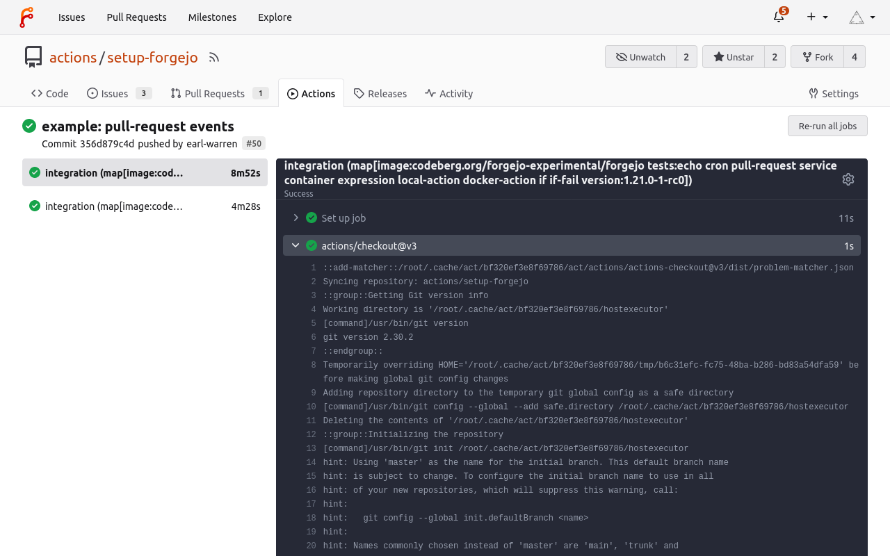

A `workflow` can be disabled (or enabled) by selecting it and using the three dot menu to the right.

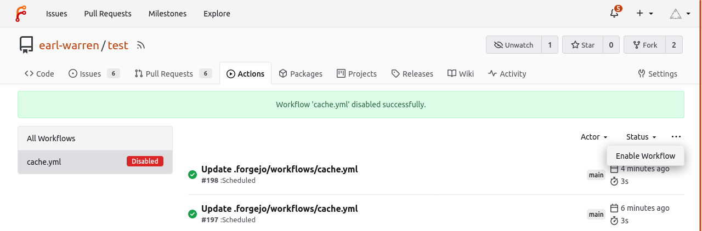

## Pull request workflows are moderated

The first time a user proposes a pull request, the `on.pull_request`
workflows are blocked.

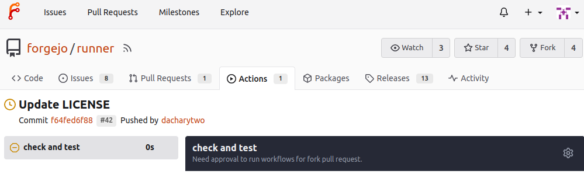

They can be approved by a maintainer of the project and there will be
no need to unblock future pull requests.

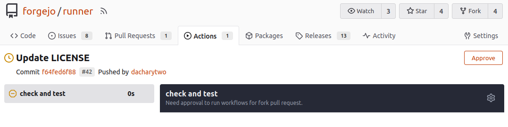

The `on.pull_request_target` workflows are not subject to the same
restriction and will always run.

## Secrets

A repository, a user or an organization can hold secrets, a set of key/value pairs that are stored encrypted in the `Forgejo` database and revealed to the `workflows` as `${{ secrets.KEY }}`. They can be defined from the web interface:

- in `/org/{org}/settings/actions/secrets` to be available in all the repositories that belong to the organization
- in `/user/settings/actions/secrets` to be available in all the repositories that belong to the logged in user
- in `/{owner}/{repo}/settings/actions/secrets` to be available to the `workflows` of a single repository

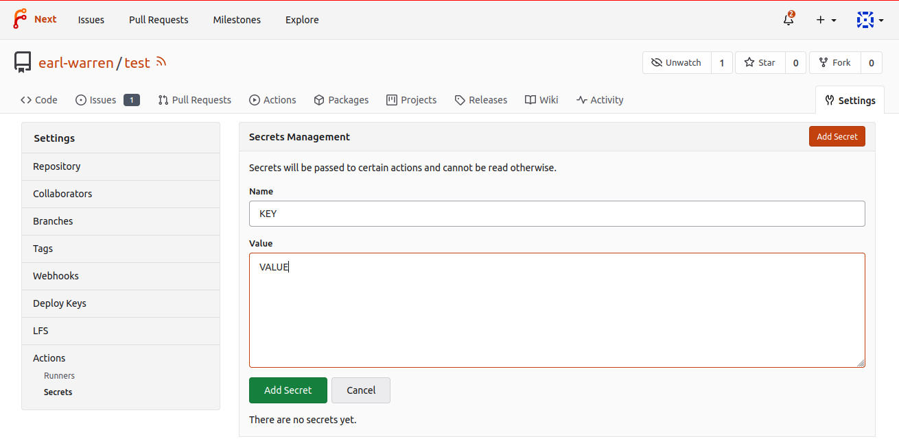

Once the secret is added, its value cannot be changed or displayed.

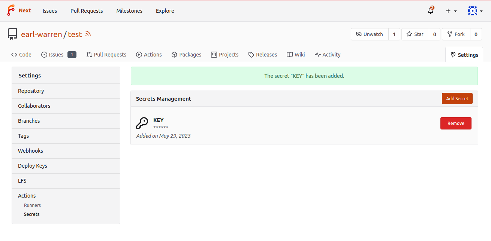

## Variables

A repository, a user or an organization can hold variables, a set of key/value pairs that are stored in the `Forgejo` database and available to the `workflows` as `${{ vars.KEY }}`. They can be defined from the web interface:

- in `/org/{org}/settings/actions/variables` to be available in all the repositories that belong to the organization
- in `/user/settings/actions/variables` to be available in all the repositories that belong to the logged in user
- in `/{owner}/{repo}/settings/actions/variables` to be available to the `workflows` of a single repository

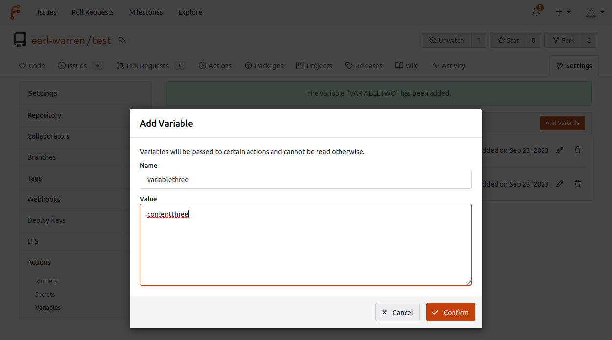

After a variable is added, its value can be modified.

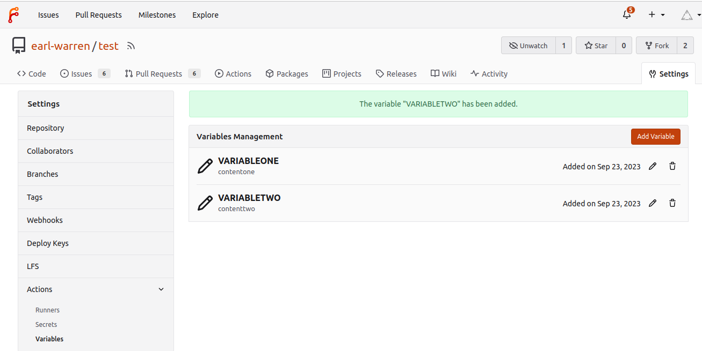

### Name constraints

The following rules apply to variable names:

- Variable names can only contain alphanumeric characters (`[a-z]`, `[A-Z]`, `[0-9]`) or underscores (`_`). Spaces are not allowed.
- Variable names must not start with the `FORGEJO_`, `GITHUB_` or `GITEA_` prefix.
- Variable names must not start with a number.
- Variable names are case-insensitive.
- Variable names must be unique at the level they are created at.
- Variable names must not be `CI`.

### Precedence

A variable found in the settings of the owner of a repository (organization or user) has precedence
over the same variable found in a repository.

## Contexts reference guide

A context is an object that contains information relevant to a `workflow` run. For instance the `secrets` context contains the secrets defined in the repository. Each of the following context is defined as a top-level variable when evaluating expressions. For instance `${{ secrets.MYSECRET }}` will be replaced by the value of `MYSECRET`.

| Context name | Description                                     |
| ------------ | ----------------------------------------------- |
| secrets      | secrets available in the repository             |
| vars         | variables available in the repository           |
| env          | environment variables defined in the workflow   |
| github       | information about the workflow being run        |
| matrix       | information about the current row of the matrix |
| steps        | information about the steps that have been run  |
| inputs       | the input parameters given to an action         |

### secrets

A map of the repository secrets. It is empty if the `event` that triggered the `workflow` is `pull_request` and the head is from a fork of the repository.

Example: `${{ secrets.MYSECRETS }}`

### vars

A map of the repository variables.

Example: `${{ vars.MYVARIABLE }}`

### env

A map of the environment variables defined in the workflow.

Example: `${{ env.SOMETHING }}`

In addition the following variables are defined by default:

| Name                     | Description                                                                                                                                                      |
| ------------------------ | ---------------------------------------------------------------------------------------------------------------------------------------------------------------- |
| CI                       | Always set to true.                                                                                                                                              |
| GITHUB_ACTION            | The numerical id of the current step.                                                                                                                            |
| GITHUB_ACTION_PATH       | When evaluated while running a `composite` action (i.e. `using: "composite"`, the path where an action files are located.                                        |
| GITHUB_ACTION_REPOSITORY | For a step executing an action, this is the owner and repository name of the action (e.g. `actions/checkout`).                                                   |
| GITHUB_ACTIONS           | Set to true when the Forgejo runner is running the workflow on behalf of a Forgejo instance. Set to false when running the workflow from `forgejo-runner exec`.  |
| GITHUB_ACTOR             | The name of the user that triggered the `workflow`.                                                                                                              |
| GITHUB_API_URL           | The API endpoint of the Forgejo instance running the workflow (e.g. https://code.forgejo.org/api/v1).                                                            |
| GITHUB_BASE_REF          | The name of the base branch of the pull request (e.g. main). Only defined when a workflow runs because of a `pull_request` or `pull_request_target` event.       |
| GITHUB_HEAD_REF          | The name of the head branch of the pull request (e.g. my-feature). Only defined when a workflow runs because of a `pull_request` or `pull_request_target` event. |
| GITHUB_ENV               | The path on the runner to the file that sets variables from workflow commands. This file is unique to the current step and changes for each step in a job.       |
| GITHUB_EVENT_NAME        | The name of the event that triggered the workflow (e.g. `push`).                                                                                                 |
| GITHUB_EVENT_PATH        | The path to the file on the Forgejo runner that contains the full event webhook payload.                                                                         |
| GITHUB_JOB               | The `job_id` of the current job.                                                                                                                                 |
| GITHUB_OUTPUT            | The path on the runner to the file that sets the current step's outputs. This file is unique to the current step.                                                |
| GITHUB_PATH              | The path on the runner to the file that sets the PATH environment variable. This file is unique to the current step.                                             |
| GITHUB_REF               | The fully formed git reference (i.e. starting with `refs/`) associated with the event that triggered the workflow.                                               |
| GITHUB_REF_NAME          | The short git reference name of the branch or tag that triggered the workflow for `push` or `tag` events only.                                                   |
| GITHUB_REPOSITORY        | The owner and repository name (e.g. forgejo/docs).                                                                                                               |
| GITHUB_REPOSITORY_OWNER  | The repository owner's name (e.g. forgejo)                                                                                                                       |
| GITHUB_RUN_NUMBER        | A unique id for the current workflow run in the Forgejo instance.                                                                                                |
| GITHUB_SERVER_URL        | The URL of the Forgejo instance running the workflow (e.g. https://code.forgejo.org)                                                                             |
| GITHUB_SHA               | The commit SHA that triggered the workflow. The value of this commit SHA depends on the event that triggered the workflow.                                       |
| GITHUB_STEP_SUMMARY      | The path on the runner to the file that contains job summaries from workflow commands. This file is unique to the current step.                                  |
| GITHUB_TOKEN             | The unique authentication token automatically created for duration of the workflow.                                                                              |
| GITHUB_WORKSPACE         | The default working directory on the runner for steps, and the default location of the repository when using the checkout action.                                |

[Check out the example](https://code.forgejo.org/forgejo/end-to-end/src/branch/main/actions/example-context/.forgejo/workflows/test.yml).

### github

The following are identical to the matching environment variable
(e.g. `github.base_ref` is the same as `env.GITHUB_BASE_REF`):

| Name              |
| ----------------- |
| action_path       |
| action_repository |
| actions           |
| actor             |
| api_url           |
| base_ref          |
| head_ref          |
| event_name        |
| event_path        |
| job               |
| output            |
| ref               |
| ref_name          |
| repository        |
| repository_owner  |
| run_number        |
| server_url        |
| sha               |
| token             |
| workspace         |

Example: `${{ github.SHA }}`

### github.event

The `github.event` object is set to the payload associated with the
event (`github.event_name`) that triggered the workflow.

- [`push` and `push.branches` event](https://codeberg.org/forgejo/docs/src/branch/v1.21/docs/user/actions-contexts/push/push/github) produced by [an example workflow](https://code.forgejo.org/forgejo/end-to-end/src/commit/d825dac67e1a0b7fa1117db0558fe42152313763/actions/example-push/.forgejo/workflows/test.yml)
- [`push.tags` event](https://codeberg.org/forgejo/docs/src/branch/v1.21/docs/user/actions-contexts/tag/push/github) produced by [an example workflow](https://code.forgejo.org/forgejo/end-to-end/src/commit/d825dac67e1a0b7fa1117db0558fe42152313763/actions/example-tag/.forgejo/workflows/test.yml)
- `pull_request` and `pull_request_event` events produced by [an example workflow](https://code.forgejo.org/forgejo/end-to-end/src/commit/d825dac67e1a0b7fa1117db0558fe42152313763/actions/example-pull-request/.forgejo/workflows/test.yml).
  - [`pull_request` from the same repository](https://codeberg.org/forgejo/docs/src/branch/v1.21/docs/user/actions-contexts/pull-request/root/pull_request/github)
  - [`pull_request` from a forked repository](https://codeberg.org/forgejo/docs/src/branch/v1.21/docs/user/actions-contexts/pull-request/fork-org/pull_request/github)
  - [`pull_request_target` from the same repository](https://codeberg.org/forgejo/docs/src/branch/v1.21/docs/user/actions-contexts/pull-request/root/pull_request_target/github)
  - [`pull_request_target` from a forked repository](https://codeberg.org/forgejo/docs/src/branch/v1.21/docs/user/actions-contexts/pull-request/fork-org/pull_request_target/github)
- [`schedule` event](https://codeberg.org/forgejo/docs/src/branch/v1.21/docs/user/actions-contexts/cron/schedule/github) produced by [an example workflow](https://code.forgejo.org/forgejo/end-to-end/src/commit/d825dac67e1a0b7fa1117db0558fe42152313763/actions/example-cron/.forgejo/workflows/test.yml)

### matrix

An object that exists in the context of a job where `jobs.<job_id>.strategy.matrix` is defined . For instance:

```yaml
jobs:
  actions:
    runs-on: self-hosted
    strategy:
      matrix:
        info:
          - version: v1.22
            branch: next
```

Example: `${{ matrix.info.version }}`

[Check out the example](https://code.forgejo.org/forgejo/end-to-end/src/commit/b6591e2f71196b12f6e0851774f0bd6e2148ec18/.forgejo/workflows/actions.yml#L22-L37).

### steps

The `steps` context contains information about the `steps` in the current job that have
an id specified (`jobs.<job_id>.step[*].id`) and have already run.

The `steps.<step_id>.outputs` object is a key/value map of the output of the
corresponding step, defined by writing to `$GITHUB_OUTPUT`. For instance:

```yaml
- id: mystep
  run: echo 'check=good' >> $GITHUB_OUTPUT
- run: test ${{ steps.mystep.outputs.check }} = good
```

Values that contain newlines can be set as follows:

```yaml
      - id: mystep
        run: |
	   cat >> $GITHUB_OUTPUT <<EOF
	   thekey<<STRING
	   value line 1
	   value line 2
	   STRING
	   EOF
```

[Check out the example](https://code.forgejo.org/forgejo/end-to-end/src/branch/main/actions/example-expression/.forgejo/workflows/test.yml).

### inputs

The `inputs` context maps keys (strings) to values (also strings) when running an action. They are provided as `jobs.<job_id>.step[*].with`
in a step where `jobs.<job_id>.step[*].uses` specifies an action. For instance:

```yaml
inputs:
  input-one:
    description: 'description one'

runs:
  using: 'composite'
  steps:
    - run: echo ${{ inputs.input-one }}
```

[Check out the example](https://code.forgejo.org/forgejo/end-to-end/src/branch/main/actions/example-local-action/.forgejo/workflows/test.yml)

## Workflow reference guide

The syntax and semantics of the YAML file describing a `workflow` are _partially_ explained here. When an entry is missing the [GitHub Actions](https://docs.github.com/en/actions) documentation may be helpful because there are similarities. But there also are significant differences that require testing.

The name of each chapter is a pseudo YAML path where user defined
values are in `<>`. For instance `jobs.<job_id>.runs-on` documents the
following YAML equivalent where `job-id` is `myjob`:

```yaml
jobs:
  myjob:
    runs-on: docker
```

### `on`

Workflows will be triggered `on` certain events with the following:

```yaml
on:
  <event-name>:
    <event-parameter>:
    ...
```

e.g. to run a workflow when branch `main` is pushed

```yaml
on:
  push:
    branches:
      - main
```

### `on.push`

Trigger the workflow when a commit or a tag is pushed.

If the `branches` event parameter is present, it will only be
triggered if the a commit is pushed to one of the branches in the
list.

If the `paths` event parameter is present, it will only be
triggered if the a pushed commit modifies one of the path in the list.

If both `branches` and `paths` are present, the workflow will only
be triggered if both match.

```yaml
on:
  push:
    branches:
      - 'mai*'
    paths:
      - '**/test.yml'
```

[Check out the push branches example](https://code.forgejo.org/forgejo/end-to-end/src/branch/main/actions/example-push/.forgejo/workflows/test.yml).

If the `tags` event parameter is present, it will only be
triggered if the the pushed tag matches one of the tags in the list.

```yaml
on:
  push:
    tags:
      - 'v1.*'
```

[Check out the push tags example](https://code.forgejo.org/forgejo/end-to-end/src/branch/main/actions/example-tag/.forgejo/workflows/test.yml).

> **NOTE:** combining `tags` with `paths` or `branches` is unspecified.

### `on.issues`

Trigger the workflow when an event happens on an issue or a pull request, as
specified with the `types` event parameter. It defaults to `[opened, edited]` if not specified.

- `opened` the issue or pull request was created.
- `reopened` the closed issue or pull request was reopened.
- `closed` the issue or pull request was closed or merged.
- `labeled` a label was added.
- `unlabeled` a label was removed.
- `assigned` an assignee was added.
- `unassigned` an assignee was removed.
- `edited` the body, title or comments of the issue or pull request were modified.

```yaml
on:
  issues:
    types: [opened, edited]
```

[Check out the example](https://code.forgejo.org/forgejo/end-to-end/src/branch/main/actions/example-issue/.forgejo/workflows/test.yml).

### `on.pull_request`

Trigger the workflow when an event happens on a pull request, as
specified with the `types` event parameter. It defaults to `[opened,
synchronize, reopened]` if not specified.

- `opened` the pull request was created.
- `reopened` the closed pull request was reopened.
- `closed` the pull request was closed or merged.
- `labeled` a label was added.
- `unlabeled` a label was removed.
- `synchronize` the commits associated with the pull request were modified.
- `assigned` an assignee was added.
- `unassigned` an assignee was removed.
- `edited` the body, title or comments of the pull request were modified.

```yaml
on:
  pull_request:
    types: [opened, synchronize, reopened]
```

If the head of a pull request is from a forked repository, the secrets
are not available and the automatic token only has read permissions.

[Check out the example](https://code.forgejo.org/forgejo/end-to-end/src/branch/main/actions/example-pull-request/.forgejo/workflows/test.yml).

### `on.pull_request_target`

It is similar to the `on.pull_request` event, with the following exceptions:

- secrets stored in the base repository are available in the `secrets` `context`, (e.g. `${{ secrets.KEY }}`).
- the workflow runs in the context of the default branch of the base repository, meaning that:
  - changes to the workflow in the pull request will be ignored
  - the [actions/checkout](https://code.forgejo.org/actions/checkout) action will checkout the default branch instead
    of the content of the pull request

[Check out the example](https://code.forgejo.org/forgejo/end-to-end/src/branch/main/actions/example-pull-request/.forgejo/workflows/test.yml).

### `on.schedule`

The `schedule` event allows you to trigger a workflow at a scheduled
time. When a workflow with a `schedule` event is present in the
default branch, Forgejo will add a task to run it at the
designated time. The scheduled workflows on other branches or pull
requests are ignored.

The scheduled time is specified using
the [POSIX cron syntax](https://pubs.opengroup.org/onlinepubs/9699919799/utilities/crontab.html#tag_20_25_07).
See also the [crontab(5)](https://man.archlinux.org/man/crontab.5) manual page for a more information and some examples.
The scheduled time will use the UTC timezone.

```yaml
on:
  schedule:
    - cron: '30 5,17 * * *'
```

[Check out the example](https://code.forgejo.org/forgejo/end-to-end/src/branch/main/actions/example-cron/.forgejo/workflows/test.yml).

### `on.workflow_dispatch`

The `workflow_dispatch` events allows for manual triggering a workflow by either using the Forgejo UI, or the API with the `POST /repos/{owner}/{repo}/actions/workflows/{workflowname}/dispatches` endpoint. This event allows for inputs to be defined, which will get rendered in the Forgejo UI or read from the body of the API request.

Inputs are declared in the `inputs` sub-key, where each sub-key itself is an input. Each of those inputs need to have an `type`. These types can be:

- `choice`: A dropdown where the available options are defined as a list of strings with `options`
- `boolean`: A checkbox with the values of `true` or `false`
- `number`
- `string`

Additionally, every input can be made `required`, given an human-readable `description`, and an `default` value.

```yaml
on:
  workflow_dispatch:
    inputs:
      logLevel:
        description: 'Log Level'
        required: true
        default: 'warning'
        type: choice
        options:
          - info
          - warning
          - debug
      boolean:
        description: 'Boolean'
        required: false
        type: boolean
      number:
        description: 'Number'
        default: '100'
        type: number
      string:
        description: 'String'
        required: true
        type: string
```

Inputs then can be used inside the jobs with the `inputs` context:

```yaml
jobs:
  test:
    runs-on: docker
    steps:
      - run: echo ${{ inputs.logLevel }}
```

[Check out the example](https://code.forgejo.org/forgejo/end-to-end/src/branch/main/actions/example-workflow-dispatch/.forgejo/workflows/test.yml).

### `env`

Set environment variables that are available in the workflow in the `env` `context` and as regular environment variables.

```yaml
env:
  KEY1: value1
  KEY2: value2
```

- The expression `${{ env.KEY1 }}` will be evaluated to `value1`
- The environment variable `KEY1` will be set to `value1`

[Check out the example](https://code.forgejo.org/forgejo/end-to-end/src/branch/main/actions/example-expression/.forgejo/workflows/test.yml).

### `jobs`

The list of jobs in the workflow. The key to each job is a `job_id`
and its content defines the sequential `step`s to be run.

Each job runs in a different container and shares nothing with other jobs.

All jobs run in parallel, unless they depend on each other as specified with [`jobs.<job_id>.needs`](#jobsjob_idneeds).

### `jobs.<job_id>`

Each `job` in a `workflow` must specify the kind of machine it needs to run its `steps` with `runs-on`. For instance `docker` in the following `workflow`:

```yaml
---
jobs:
  test:
    runs-on: docker
```

means that the `Forgejo runner` that claims to provide a kind of machine labeled `docker` will be selected by `Forgejo` and sent the job to be run.

The actual machine provided by the runner **entirely depends on how the `Forgejo runner` was registered** (see the [Forgejo Actions administrator guide](../../admin/actions/) for more information).

The list of available `labels` for a given repository can be seen in the `/{owner}/{repo}/settings/actions/runners` page.


### `jobs.<job_id>.runs-on`

By default the `docker` label will create a container from a [Node.js 16 Debian GNU/Linux bullseye image](https://hub.docker.com/_/node/tags?name=16-bullseye) and will run each `step` as root. Since an application container is used, the jobs will inherit the limitations imposed by the engine (Docker for instance). In particular they will not be able to run or install software that depends on `systemd`.

The `runs-on: lxc` label will run the jobs in a [LXC](https://linuxcontainers.org/lxc/) container where software that rely on `systemd` can be installed. Nested containers can also be created recursively (see [the `end-to-end` tests](https://code.forgejo.org/forgejo/end-to-end/src/branch/main/.forgejo/workflows/integration.yml) for an example). `Services` are not supported for jobs that run on LXC.

The `runs-on: self-hosted` label will run the jobs directly on the host, in a shell spawned from the runner. It provides no isolation at all.

### `jobs.<job_id>.if`

If specified, the job is only run if the **expression** evaluates to true.

For instance:

```yaml
---
jobs:
  build:
    if: github.ref == 'refs/heads/main'
    steps:
      - run: echo only run on main branch
```

### `jobs.<job_id>.needs`

Can be used to introduce ordering between different jobs by listing their respective `<job_id>`. All jobs listed here must complete successfully before this job is considered for execution.

`needs` can either be a single string, naming a single job as pre-requisite, or an array for specifying multiple jobs to run before this one.

For instance:

```yaml
---
jobs:
  lint:
    steps:
      - run: echo linting the code
  build:
    needs:
      - job1
    steps:
      - run: echo only run after linting
```

### `jobs.<job_id>.strategy.matrix`

If present, it will generate a matrix from the content of the object
and create one job per cell in the matrix instead of a single job.

For instance:

```yaml
jobs:
  test:
    runs-on: self-hosted
    strategy:
      matrix:
        variant: ['bookworm', 'bullseye']
        node: ['18', '20']
```

> **NOTE:** dynamic matrix objects, e.g. using `fromJSON`, are not supported - this is a [known caveat](https://code.forgejo.org/forgejo/runner/issues/525).

Will create four jobs where:

- `matrix.variant` = "bookworm" & `matrix.node` = "18"
- `matrix.variant` = "bookworm" & `matrix.node` = "20"
- `matrix.variant` = "bullseye" & `matrix.node` = "18"
- `matrix.variant` = "bullseye" & `matrix.node` = "20"

They each run independently and can use the `matrix` context to access these values. For instance:

```yaml
jobs:
  test:
---
steps:
  - uses: https://code.forgejo.org/actions/setup-node@v4
    with:
      node-version: '${{ matrix.node }}'
```

[Check out the example](https://code.forgejo.org/forgejo/end-to-end/src/commit/b6591e2f71196b12f6e0851774f0bd6e2148ec18/.forgejo/workflows/actions.yml#L22-L37).

### `jobs.<job_id>.container.image`

- **Docker or Podman:**
  If the default image is unsuitable, a job can specify an alternate container image with `container:`, [as shown in this example](https://code.forgejo.org/forgejo/end-to-end/src/branch/main/actions/example-container/.forgejo/workflows/test.yml). If not specified, the shell defaults to `sh`. For instance the following will ensure the job is run using [Alpine 3.20](https://hub.docker.com/_/alpine/tags?name=3.20).

  ```yaml
  runs-on: docker
  container:
    image: alpine:3.20
  ```

- **LXC:**
  If the default [template and release](https://images.linuxcontainers.org/) are unsuitable, a job can specify an alternate template and release as follows.

  ```yaml
  runs-on: lxc
  container:
    image: debian:bookworm
  ```

### `jobs.<job_id>.container.env`

Set environment variables in the container.

> **NOTE:** ignored if `jobs.<job_id>.runs-on` is an LXC container.

### `jobs.<job_id>.container.credentials`

If the image's container registry requires authentication to pull the image, `username` and `password` will be used.
The credentials are the same values that you would provide to the docker login command. For instance:

```yaml
runs-on: docker
container:
  image: alpine:3.20
  credentials:
    username: 'root'
    password: 'admin1234'
```

> **NOTE:** ignored if `jobs.<job_id>.runs-on` is an LXC container.

[Check out the example](https://code.forgejo.org/forgejo/end-to-end/src/branch/main/actions/example-container/.forgejo/workflows/test.yml)

### `jobs.<job_id>.container.volumes`

Set the volumes for the container to use, as if provided with the `--volume` argument of the `docker run` command.

> **NOTE:** the `--volume` option is restricted to a allowlist of volumes configured in the runner executing the task. See the [Forgejo runner installation guide](../../admin/runner-installation/#configuration) for more information.

> **NOTE:** ignored if `jobs.<job_id>.runs-on` is an LXC container.

[Check out the example](https://code.forgejo.org/forgejo/end-to-end/src/branch/main/actions/example-context/.forgejo/workflows/test.yml)

### `jobs.<job_id>.container.options`

A string of the following additional options, as documented [docker run](https://docs.docker.com/engine/reference/commandline/run/).

- `--volume`
- `--tmpfs`
- `--hostname` (except for Forgejo runner 6.0.x and 6.1.x)

> **NOTE:** the `--volume` option is restricted to a allowlist of volumes configured in the runner executing the task. See the [Forgejo Actions administrator guide](../../admin/actions/) for more information.

> **NOTE:** ignored if `jobs.<job_id>.runs-on` is an LXC container.

[Check out the example](https://code.forgejo.org/forgejo/end-to-end/src/branch/main/actions/example-service/.forgejo/workflows/test.yml)

### `jobs.<job_id>.services`

The map of services to run before the job starts and terminate when it completes. The key determines the name of the host where the
service runs. For instance:

```yaml
services:
  pgsql:
    image: postgres:15
      POSTGRES_DB: test
      POSTGRES_PASSWORD: postgres
steps:
  - run: PGPASSWORD=postgres psql -h pgsql -U postgres -c '\dt' test
```

[Check out the example](https://code.forgejo.org/forgejo/end-to-end/src/branch/main/actions/example-service/.forgejo/workflows/test.yml)

### `jobs.<job_id>.services.image`

See also `jobs.<job_id>.container.image`

### `jobs.<job_id>.services.credentials`

See also `jobs.<job_id>.container.credentials`

### `jobs.<job_id>.services.env`

See also `jobs.<job_id>.container.env`

### `jobs.<job_id>.services.volumes`

See also `jobs.<job_id>.container.volumes`

### `jobs.<job_id>.services.options`

See also `jobs.<job_id>.container.options`

### `jobs.<job_id>.steps.if`

The steps are run if the **expression** evaluates to true.

### `jobs.<job_id>.steps`

An array of steps executed sequentially on the host specified by `runs-on`.

### `jobs.<job_id>.steps[*].run`

A shell script to run in the environment specified with
`jobs.<job_id>.runs-on`. It runs as root using the default shell unless
specified otherwise with `jobs.<job_id>.steps[*].shell`. For instance:

```yaml
jobs:
  test:
    runs-on: docker
    container:
      image: alpine:3.20
    steps:
      - run: |
          grep Alpine /etc/os-release
          echo SUCCESS
```

[Check out the example](https://code.forgejo.org/forgejo/end-to-end/src/branch/main/actions/example-container/.forgejo/workflows/test.yml)

### `jobs.<job_id>.steps[*].working-directory`

The working directory from which the script specified with `jobs.<job_id>.step[*].run` will run. For instance:

```yaml
- run: test $(pwd) = /tmp
  working-directory: /tmp
```

### `jobs.<job_id>.steps[*].shell`

The shell used to run the script specified with `jobs.<job_id>.step[*].run`. If not specified it defaults to `bash`.

For instance:

```yaml
jobs:
  test:
    runs-on: docker
    steps:
      - run: echo using bash here
```

Or to specify that `sh` must be used instead:

```yaml
jobs:
  test:
    runs-on: docker
    steps:
      - shell: sh
	    run: echo using sh here
```

If `jobs.<job_id>.container.image` is set and the shell is not specified, it defaults to `sh`.

For instance:

```yaml
jobs:
  test:
    runs-on: docker
    container:
      image: alpine:3.20
    steps:
      - run: echo using sh here
```

Available values:

- `bash`
- `pwsh`
- `python`
- `sh`
- `cmd`
- `powershell`
- A custom commandline, where the literal string `{0}` is replaced with the path to a (temporary) file, containing the content of `jobs.<job_id>.steps[*].run`. For example `bash -v {0}` would become `bash -v /tmp/xxx`.

[Check out the example](https://code.forgejo.org/forgejo/end-to-end/src/branch/main/actions/example-pull-request/.forgejo/workflows/test.yml)

### `jobs.<job_id>.steps[*].id`

A unique identifier for the step.

### `jobs.<job_id>.steps[*].if`

The step is run if the **expression** evaluates to true.

Check out the workflows in [example-if](https://code.forgejo.org/forgejo/end-to-end/src/branch/main/actions/example-if/) and [example-if-fail](https://code.forgejo.org/forgejo/end-to-end/src/branch/main/actions/example-if-fail/).

### `jobs.<job_id>.steps[*].uses`

Specifies the repository from which the `Action` will be cloned or a directory where it can be found.

- Remote actions
  A relative `Action` such as `uses: actions/checkout@v3` will clone the repository at the URL composed by prepending the default actions URL which is https://code.forgejo.org/. It is the equivalent of providing the fully qualified URL `uses: https://code.forgejo.org/actions/checkout@v3`. In other words the following:

  ```yaml
  on: [push]
  jobs:
    test:
      runs-on: docker
      steps:
        - uses: actions/checkout@v3
  ```

  is the same as:

  ```yaml
  on: [push]
  jobs:
    test:
      runs-on: docker
      steps:
        - uses: https://code.forgejo.org/actions/checkout@v3
  ```

  When possible **it is strongly recommended to choose fully qualified
  URLs** to avoid ambiguities. During installation, the `Forgejo'
  instance may use another default URL and a workflow could fail because
  it gets an outdated version from https://tooold.org/actions/checkout
  instead. Or even a repository that does not contain the intended
  action.

- Local actions

  An action that begins with a `./` will be loaded from a directory
  instead of being cloned from a repository. The structure of the
  directory is otherwise the same as if it was located in a remote
  repository.

  > **NOTE:** the most common mistake when using an action included in the repository under test is to forget to checkout the repository with `uses: actions/checkout@v3`.

  [Check out the example](https://code.forgejo.org/forgejo/end-to-end/src/branch/main/actions/example-local-action/).

### `jobs.<job_id>.steps[*].with`

A dictionary mapping the inputs of the action to concrete values. The `action.yml` defines and documents the inputs.

```yaml
on: [push]
jobs:
  ls:
    runs-on: docker
    steps:
      - uses: ./.forgejo/local-action
        with:
          input-two: 'two'
```

[Check out the example](https://code.forgejo.org/forgejo/end-to-end/src/branch/main/actions/example-local-action/.forgejo/workflows/test.yml)

### `jobs.<job_id>.steps[*].with.args`

For actions that are implemented with a `Dockerfile`, the `args` key is used as command line arguments when the container is run.

[Check out the example](https://code.forgejo.org/forgejo/end-to-end/src/branch/main/actions/example-docker-action/.forgejo/workflows/test.yml)

### `jobs.<job_id>.steps[*].with.entrypoint`

For actions that are implemented with a `Dockerfile`, the `entrypoint` key is used to overrides the `ENTRYPOINT` in the Dockerfile. It must be
the path to the executable file to run.

[Check out the example](https://code.forgejo.org/forgejo/end-to-end/src/branch/main/actions/example-docker-action/.forgejo/workflows/test.yml)

### `jobs.<job_id>.steps[*].env`

Set environment variables like it's [top-level variant `env`](#env-2), but only for the current step.

### `jobs.<job_id>.steps[*].continue-on-error`

If it is set to `true` for a step the following steps continue to run independent of its failure or success. Also, the job has successful state.

```yaml
steps:
  - run: echo "failing step" && false
    continue-on-error: true
  - run: echo "this step runs and job is successful"
```

## Debugging workflows

### Errors in the YAML file

When the YAML file describing the workflow contains an error that can
be detected with static analysis, it is signaled by a warning sign in
the actions task list of the repository, next to the file name that
contains the workflow. Hovering on the file name will show a tooltip
with a detailed error message.

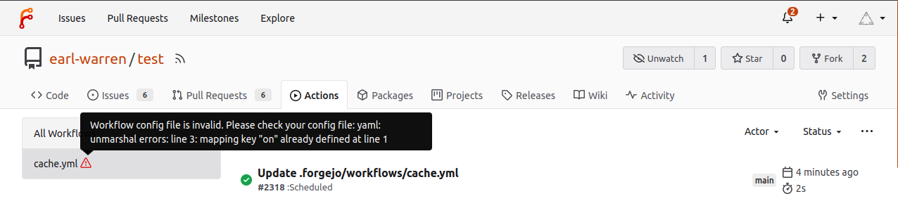

### With forgejo-runner exec

To get a quicker debug loop when working on a workflow, it may be more
convenient to run them on your laptop using `forgejo-runner exec`. For
instance:

```sh
$ git clone --depth 1 http://code.forgejo.org/forgejo/runner
$ cd runner
$ forgejo-runner exec --workflows .forgejo/workflows/test.yml --job lint
INFO[0000] Using default workflow event: push
INFO[0000] Planning job: lint
INFO[0000] cache handler listens on: http://192.168.1.20:44261
INFO[0000] Start server on http://192.168.1.20:34567
[checks/check and test] 🚀  Start image=node:16-bullseye
[checks/check and test]   🐳  docker pull image=node:16-bullseye platform= username= forcePull=false
[checks/check and test]   🐳  docker create image=node:16-bullseye platform= entrypoint=["/bin/sleep" "10800"] cmd=[]
[checks/check and test]   🐳  docker run image=node:16-bullseye platform= entrypoint=["/bin/sleep" "10800"] cmd=[]
[checks/check and test]   ☁  git clone 'https://code.forgejo.org/actions/setup-go' # ref=v3
[checks/check and test] ⭐ Run Main actions/setup-go@v3
[checks/check and test]   🐳  docker cp src=/home/loic/.cache/act/actions-setup-go@v3/ dst=/var/run/act/actions/actions-setup-go@v3/
...
|
| ==> Ok
|
[checks/check and test]   ✅  Success - Main test
[checks/check and test] ⭐ Run Post actions/setup-go@v3
[checks/check and test]   🐳  docker exec cmd=[node /var/run/act/actions/actions-setup-go@v3/dist/cache-save/index.js] user= workdir=
[checks/check and test]   ✅  Success - Post actions/setup-go@v3
[checks/check and test] Cleaning up services for job check and test
[checks/check and test] Cleaning up container for job check and test
[checks/check and test] Cleaning up network for job check and test, and network name is: FORGEJO-ACTIONS-TASK-push_WORKFLOW-checks_JOB-check-and-test-network
[checks/check and test] 🏁  Job succeeded
```

> **NOTE:** When Docker or Podman is used and IPv6 support is required, the `--enable-ipv6` flag must be provided, and IPv6 must be enabled in the `Forgejo runner`'s Docker daemon configuration. See the [Forgejo Actions administrator guide](../../admin/actions/) for more information.

## Examples

Each example is part of the [setup-forgejo](https://code.forgejo.org/forgejo/end-to-end/) action [test suite](https://code.forgejo.org/forgejo/end-to-end/src/branch/main/actions). They can be run locally with something similar to:

```sh
$ git clone --depth 1 http://code.forgejo.org/forgejo/end-to-end
$ cd end-to-end
$ forgejo-runner exec --workflows actions/example-expression/.forgejo/workflows/test.yml
INFO[0000] Using the only detected workflow event: push
INFO[0000] Planning jobs for event: push
INFO[0000] cache handler listens on: http://192.168.1.20:43773
INFO[0000] Start server on http://192.168.1.20:34567
[test.yml/test] 🚀  Start image=node:16-bullseye
[test.yml/test]   🐳  docker pull image=node:16-bullseye platform= username= forcePull=false
[test.yml/test]   🐳  docker create image=node:16-bullseye platform= entrypoint=["/bin/sleep" "10800"] cmd=[]
[test.yml/test]   🐳  docker run image=node:16-bullseye platform= entrypoint=["/bin/sleep" "10800"] cmd=[]
[test.yml/test] ⭐ Run Main set -x
test "KEY1=value1" = "KEY1=value1"
test "KEY2=$KEY2" = "KEY2=value2"
[test.yml/test]   🐳  docker exec cmd=[bash --noprofile --norc -e -o pipefail /var/run/act/workflow/0] user= workdir=
| + test KEY1=value1 = KEY1=value1
| + test KEY2=value2 = KEY2=value2
[test.yml/test]   ✅  Success - Main set -x
test "KEY1=value1" = "KEY1=value1"
test "KEY2=$KEY2" = "KEY2=value2"
[test.yml/test] Cleaning up services for job test
[test.yml/test] Cleaning up container for job test
[test.yml/test] Cleaning up network for job test, and network name is: FORGEJO-ACTIONS-TASK-push_WORKFLOW-test-yml_JOB-test-network
[test.yml/test] 🏁  Job succeeded
```

- [Echo](https://code.forgejo.org/forgejo/end-to-end/src/branch/main/actions/example-echo/.forgejo/workflows/test.yml) - a single step that prints one sentence.
- [Expression](https://code.forgejo.org/forgejo/end-to-end/src/branch/main/actions/example-expression/.forgejo/workflows/test.yml) - a collection of various forms of expression.
- [Local actions](https://code.forgejo.org/forgejo/end-to-end/src/branch/main/actions/example-local-action/.forgejo) - using an action found in a directory instead of a remote repository.
- [PostgreSQL service](https://code.forgejo.org/forgejo/end-to-end/src/branch/main/actions/example-service/.forgejo/workflows/test.yml) - a PostgreSQL service and a connection to display the (empty) list of tables of the default database.
- [Using services](https://code.forgejo.org/forgejo/end-to-end/src/branch/main/actions/example-service/.forgejo/workflows/test.yml) - illustrates how to configure and use services.
- [Choosing the image with `container`](https://code.forgejo.org/forgejo/end-to-end/src/branch/main/actions/example-container/.forgejo/workflows/test.yml) - replacing the `runs-on: docker` image with the `alpine:3.20` image using `container:`.
- [Docker action](https://code.forgejo.org/forgejo/end-to-end/src/branch/main/actions/example-docker-action/.forgejo/workflows/test.yml) - using a action implemented as a `Dockerfile`.
- [`on.pull_request` and `on.pull_request_target` events](https://code.forgejo.org/forgejo/end-to-end/src/branch/main/actions/example-pull-request/.forgejo/workflows/test.yml).
- [`on.schedule` event](https://code.forgejo.org/forgejo/end-to-end/src/branch/main/actions/example-cron/.forgejo/workflows/test.yml).
- [Artifacts upload and download](https://code.forgejo.org/forgejo/end-to-end/src/branch/main/actions/example-artifacts/.forgejo/workflows/test.yml) - sharing files between `jobs`.

## Glossary

- **action:** a repository that can be used in a way similar to a function in any programming language to run a single **step**.
- **artifact:** a file or collection of files produced during a **workflow** **run**.
- **automatic token:** the unique token created during each **run** by the **runner**.
- **context:** top level objects containing the current state of a **run** containing information about the **workflow** and the **runner** handling the **job**.
- **expression:** a string enclosed in `${{ ... }}` and evaluated at runtime.
- **job:** a sequential set of **steps**.
- **label:** the kind of machine that is matched against the value of `runs-on` in a **workflow**.
- **run:** the execution of a **job**.
- **runner:** the [Forgejo runner](https://code.forgejo.org/forgejo/runner) daemon created to execute the **workflows**.
- **step:** a command the **runner** is required to carry out.
- **workflow:** a file in the `.forgejo/workflows` directory containing **jobs**.
- **workspace:** the directory where the files of the **job** are stored and shared between all **step**s.
