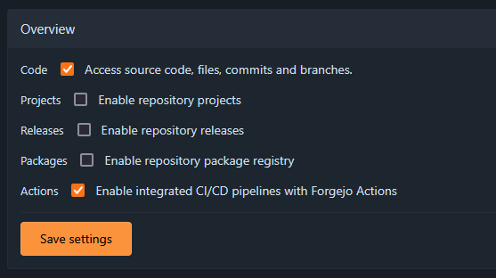
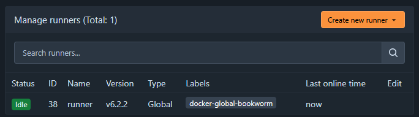
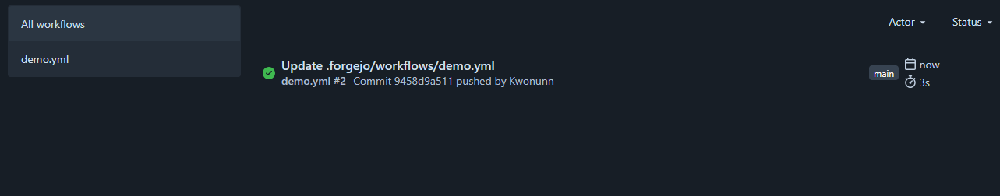
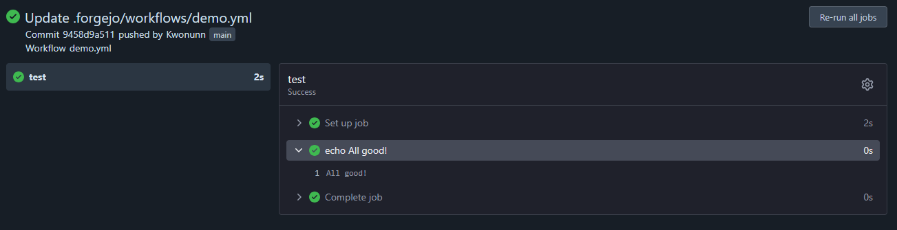
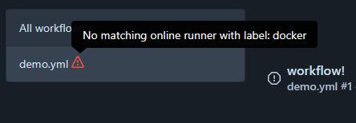
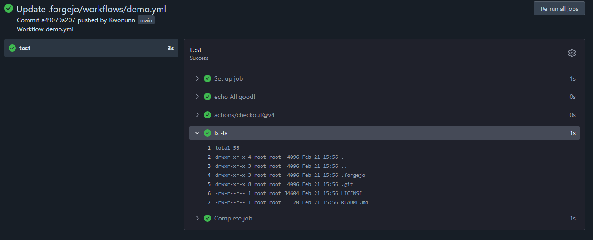

This guide explains how to set up a simple Forgejo Actions workflow. The basic concepts are all mentioned here, and links to further information are provided.

## Setting up Actions

To get started we will have to do some setup:

1. First, verify that Actions is enabled for your repository. Visit your repository settings, and go to Units > Overview. Make sure the Actions checkbox is ticked. If it is not visible, your instance administrator has disabled Forgejo Actions.
   

2. Next, see if there is a runner available for the repository. Visit the repository settings, and go to Actions > Runners. If there are no runners listed, follow the [Forgejo Runner installation guide](../../../admin/actions/runner-installation/) to set up a runner, and return here when you're finished.
   

## Adding the workflow

Now we are ready to write a workflow file and add it to our repository:

3. Create a file `.forgejo/workflows/demo.yaml`, and add the following code:

```yaml
on: [push]
jobs:
  test:
    runs-on: docker
    steps:
      - run: echo All good!
```

This file describes a workflow. The workflow will trigger `on` a `push` event. The workflow contains one `job`, called `test`. This job will `run on` a runner with the label `docker`. If your runner (from step 2) has a different label, you should specify it here. The `test` job has one `step`, which is to simply `run` the command `echo All good!`.

Save the file and push it to the main branch of the repository.


4. Go to the `Actions` tab of the repository. You should see your `demo.yml` workflow listed on the left. Because you pushed to a branch, the workflow has been triggered, and you can view the results of the run on the right.
   
   If you click on the run you'll get a more detailed view with the output from the runner:
   

If the run does not start and you get a warning that no matching runner is online, you have most likely forgotten to change the `runs-on` field in the workflow. Find the label for the runner you want to use in step 2, and edit your workflow file.


Congratulations! You've just run your first workflow. Now you can expand your workflow to do all sorts of things, from building your code to sending it to a remote server. For most tasks you'll want to get the code into the workflow, so we'll cover that in the next section.

## Using an action to check out your code

An action is a reusable procedure for doing something in your CI workflow. In many ways, actions are similar to functions. To get the content of your repository into a workflow, we will be using the [`actions/checkout`](https://code.forgejo.org/actions/checkout) action. An action is simply a repository with some special files in it. For more information about how to use them and how to make your own, check out the [actions guide](../actions/).

5. Add the following lines to the `demo.yaml` file, below `- run: echo All good!`:

```yaml
- uses: actions/checkout@v4
- run: ls -la
```

Here we are adding two steps. The first step `uses` the action `actions/checkout`, specifically `v4`. We are not passing any parameters, as we just want to check out this repository. The second step simply `runs` the command `ls -la` to show us the content of the working directory.

Commit these changes and push them to the main branch of the repository.

6. Go to the actions tab and view the output the most recent run. You should see the two new steps.
   
