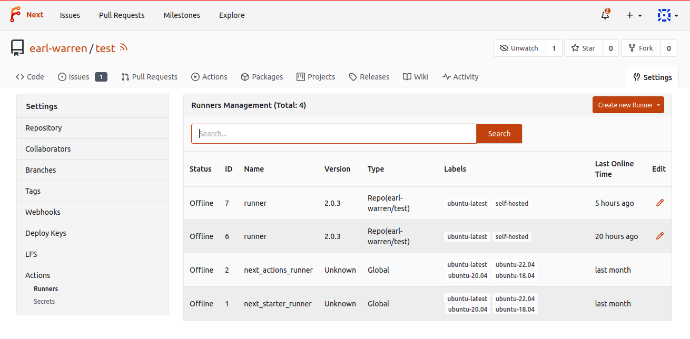

This page contains the complete reference for Forgejo Actions workflow files. For a more information on what the different parts of these files mean and how to use the syntax, check the [basic concepts](../basic-concepts/).

---

Jump to the [context reference](#contexts).

## Workflow Syntax

The syntax and semantics of the YAML file describing a `workflow` are _partially_ explained here. If something is not documented here, the [GitHub Actions documentation](https://docs.github.com/en/actions) may be helpful. However, GitHub Actions and Forgejo Actions _are not the same_ and things might not work right away.

Each chapter documents the function of one key in a workflow YAML file. Keys like `<job_id>` are placeholders for user-specified names.

### `name`

An optional name for the workflow. This name is displayed in the actions tab. If omitted, the name of the workflow file will be used.

### `on`

Workflows will be triggered `on` certain events with the following:

```yaml
on:
  <event-name>:
    <event-parameter>:
    ...
```

e.g. to run a workflow when branch `main` is pushed

```yaml
on:
  push:
    branches:
      - main
```

### `on.push`

Trigger the workflow when a commit or a tag is pushed.

If the `branches` event parameter is present, it will only be triggered if the a commit is pushed to one of the branches in the list.

If the `paths` event parameter is present, it will only be triggered if the a pushed commit modifies one of the path in the list.

If both `branches` and `paths` are present, the workflow will only be triggered if both match.

```yaml
on:
  push:
    branches:
      - 'mai*'
    paths:
      - '**/test.yml'
```

[Check out the push branches example](https://code.forgejo.org/forgejo/end-to-end/src/branch/main/actions/example-push/.forgejo/workflows/test.yml).

If the `tags` event parameter is present, it will only be triggered if the the pushed tag matches one of the tags in the list.

```yaml
on:
  push:
    tags:
      - 'v1.*'
```

[Check out the push tags example](https://code.forgejo.org/forgejo/end-to-end/src/branch/main/actions/example-tag/.forgejo/workflows/test.yml).

> **NOTE:** combining `tags` with `paths` or `branches` is not intended.

### `on.issues`

Trigger the workflow when an event happens on an issue or a pull request, as specified with the `types` event parameter. It defaults to `[opened, edited]` if not specified.

- `opened` the issue or pull request was created.
- `reopened` the closed issue or pull request was reopened.
- `closed` the issue or pull request was closed or merged.
- `labeled` a label was added.
- `unlabeled` a label was removed.
- `assigned` an assignee was added.
- `unassigned` an assignee was removed.
- `edited` the body, title or comments of the issue or pull request were modified.

```yaml
on:
  issues:
    types: [opened, edited]
```

[Check out the example](https://code.forgejo.org/forgejo/end-to-end/src/branch/main/actions/example-issue/.forgejo/workflows/test.yml).

### `on.pull_request`

Trigger the workflow when an event happens on a pull request, as specified with the `types` event parameter. It defaults to `[opened, synchronize, reopened]` if not specified.

- `opened` the pull request was created.
- `reopened` the closed pull request was reopened.
- `closed` the pull request was closed or merged.
- `labeled` a label was added.
- `unlabeled` a label was removed.
- `synchronize` the commits associated with the pull request were modified.
- `assigned` an assignee was added.
- `unassigned` an assignee was removed.
- `edited` the body, title or comments of the pull request were modified.

```yaml
on:
  pull_request:
    types: [opened, synchronize, reopened]
```

If the head of a pull request is from a forked repository, the secrets are not available and the automatic token only has read permissions.

[Check out the example](https://code.forgejo.org/forgejo/end-to-end/src/branch/main/actions/example-pull-request/.forgejo/workflows/test.yml).

### `on.pull_request_target`

It is similar to the `on.pull_request` event, with the following exceptions:

- secrets stored in the base repository are available in the `secrets` `context`, (e.g. `${{ secrets.KEY }}`).
- the automatic token has write permission to the repository.
- the workflow runs in the context of the default branch of the base repository, meaning that:
  - changes to the workflow in the pull request will be ignored
  - the [actions/checkout](https://code.forgejo.org/actions/checkout) action will checkout the default branch instead of the content of the pull request

Care must be taken to unset the `FORGEJO_TOKEN` and `GITHUB_TOKEN` environment variables
when a job runs scripts from a checkout of the pull request so that it does not leak. For instance:

```yaml
on:
  pull_request_target:

jobs:
  preview:
    runs-on: docker
    steps:
      - uses: actions/checkout@v4
        with:
          ref: ${{ github.event.pull_request.head.sha }}
            - name: lint
      - run: |
          ./script-from-the-pull-request
        env:
          FORGEJO_TOKEN: override
          GITHUB_TOKEN: override
```

[Check out the example](https://code.forgejo.org/forgejo/end-to-end/src/branch/main/actions/example-pull-request/.forgejo/workflows/test.yml).

### `on.schedule`

The `schedule` event allows you to trigger a workflow at a scheduled time. When a workflow with a `schedule` event is present in the default branch, Forgejo will add a task to run it at the designated time. The scheduled workflows on other branches or pull requests are ignored.

The scheduled time is specified using the [POSIX cron syntax](https://pubs.opengroup.org/onlinepubs/9699919799/utilities/crontab.html#tag_20_25_07). See also the [crontab(5)](https://man.archlinux.org/man/crontab.5) manual page for a more information and some examples.

```yaml
on:
  schedule:
    - cron: '30 5,17 * * *'
```

[Check out the example](https://code.forgejo.org/forgejo/end-to-end/src/branch/main/actions/example-cron/.forgejo/workflows/test.yml).

### `on.workflow_dispatch`

The `workflow_dispatch` events allows for manual triggering a workflow by either using the Forgejo UI, or the API with the `POST /repos/{owner}/{repo}/actions/workflows/{workflowname}/dispatches` endpoint. This event allows for inputs to be defined, which will get rendered in the Forgejo UI or read from the body of the API request.

Inputs are declared in the `inputs` sub-key, where each sub-key itself is an input. Each of those inputs need to have an `type`. These types can be:

- `choice`: A dropdown where the available options are defined as a list of strings with `options`
- `boolean`: A checkbox with the values of `true` or `false`
- `number`
- `string`

Additionally, every input can be made `required`, given a human-readable `description`, and a `default` value.

```yaml
on:
  workflow_dispatch:
    inputs:
      logLevel:
        description: 'Log Level'
        required: true
        default: 'warning'
        type: choice
        options:
          - info
          - warning
          - debug
      boolean:
        description: 'Boolean'
        required: false
        type: boolean
      number:
        description: 'Number'
        default: '100'
        type: number
      string:
        description: 'String'
        required: true
        type: string
```

Inputs then can be used inside the jobs with the `inputs` context:

```yaml
jobs:
  test:
    runs-on: docker
    steps:
      - run: echo ${{ inputs.logLevel }}
```

[Check out the example](https://code.forgejo.org/forgejo/end-to-end/src/branch/main/actions/example-workflow-dispatch/.forgejo/workflows/test.yml).

### `env`

Set environment variables that are available in the workflow in the `env` context and as regular environment variables.

```yaml
env:
  KEY1: value1
  KEY2: value2
```

- The expression `${{ env.KEY1 }}` will be evaluated to `value1`
- The environment variable `KEY1` will be set to `value1`

[Check out the example](https://code.forgejo.org/forgejo/end-to-end/src/branch/main/actions/example-expression/.forgejo/workflows/test.yml).

### `jobs`

The list of jobs in the workflow. The key to each job is a `job_id` and its content defines the sequential `step`s to be run.

Each job runs in a different container and shares nothing with other jobs.

All jobs run in parallel, unless they depend on each other as specified with [`jobs.<job_id>.needs`](#jobsjob_idneeds).

### `jobs.<job_id>`

Specifies the id for the job. This is used in some places to uniquely identify the job.

### `jobs.<job_id>.runs-on`

Each `job` in a `workflow` must specify the kind of machine it needs to run its `steps` with `runs-on`. For instance `docker` in the following `workflow`

```yaml
---
jobs:
  test:
    runs-on: docker
```

means that the job will only be sent to a `runner` which has declared the `docker` label.

You may have labels to differentiate between:

- Different running environments (Docker, Podman, LXC, host, etc.)
- Different default images (ubuntu-latest, alpine-latest, etc.)
- Different architectures (arm, x86_64, etc.)
- Specific hardware installed on the runner (nvidia-gpu, big-ram, etc.)

The actual machine provided by the runner **entirely depends on how the runner was registered** (see the [Forgejo Actions administrator guide](../../admin/actions/) for more information).

The list of available `labels` for a given repository can be seen in the `/{owner}/{repo}/settings/actions/runners` page.



If your job specifies a labal for which no runner is online, the job cannot be executed and your pipeline will halt until a runner with a matching label comes online. You will be able to see this in the Actions tab of your repository.

### `jobs.<job_id>.if`

When specified, the job is only run if the **expression** evaluates to true.

For instance:

```yaml
---
jobs:
  build:
    if: forge.ref == 'refs/heads/main'
    steps:
      - run: echo only run on main branch
```

### `jobs.<job_id>.needs`

Can be used to introduce ordering between different jobs by listing their respective `<job_id>`. All jobs listed here must complete successfully before this job is considered for execution.

`needs` can either be a single string, naming a single job as pre-requisite, or an array for specifying multiple jobs to run before this one.

For instance:

```yaml
---
jobs:
  lint:
    steps:
      - run: echo linting the code
  build:
    needs:
      - lint
    steps:
      - run: echo only run after linting
```

### `jobs.<job_id>.strategy.matrix`

If present, it will generate a matrix from the content of the object
and create one job per cell in the matrix instead of a single job.

For instance:

```yaml
jobs:
  test:
    runs-on: self-hosted
    strategy:
      matrix:
        variant: ['bookworm', 'bullseye']
        node: ['18', '20']
    steps:
      - uses: https://code.forgejo.org/actions/setup-node@v4
        with:
          node-version: '${{ matrix.node }}'
```

Will create four jobs where:

- `matrix.variant` = "bookworm" & `matrix.node` = "18"
- `matrix.variant` = "bookworm" & `matrix.node` = "20"
- `matrix.variant` = "bullseye" & `matrix.node` = "18"
- `matrix.variant` = "bullseye" & `matrix.node` = "20"

They each run independently and can use the `matrix` context to access these values, like in the `node-version` key in the snippet.

[Check out the example](https://code.forgejo.org/forgejo/end-to-end/src/commit/b6591e2f71196b12f6e0851774f0bd6e2148ec18/.forgejo/workflows/actions.yml#L22-L37).

### `jobs.<job_id>.container.image`

- **Docker or Podman:**
  If the default image is unsuitable, a job can specify an alternate container image with `container:`, [as shown in this example](https://code.forgejo.org/forgejo/end-to-end/src/branch/main/actions/example-container/.forgejo/workflows/test.yml). For instance the following will ensure the job is run using [Alpine 3.20](https://hub.docker.com/_/alpine/tags?name=3.20).

  > **Note:** Many `Actions` require node to run. Using a custom container image that does not contain node may cause these actions to break.

  ```yaml
  runs-on: docker
  container:
    image: alpine:3.20
  ```

- **LXC:**
  If the default [template and release](https://images.linuxcontainers.org/) specified by the runner are unsuitable, a job can specify an alternate template and release as follows.

  ```yaml
  runs-on: lxc
  container:
    image: debian:bookworm
  ```

### `jobs.<job_id>.container.env`

Set environment variables in the container.

> **NOTE:** ignored if `jobs.<job_id>.runs-on` is an LXC container.

### `jobs.<job_id>.container.credentials`

If the image's container registry requires authentication to pull the image, `username` and `password` will be used.
The credentials are the same values that you would provide to the `docker login` command. For instance:

```yaml
runs-on: docker
container:
  image: alpine:3.20
  credentials:
    username: 'root'
    password: 'admin1234'
```

> **NOTE:** ignored if `jobs.<job_id>.runs-on` is an LXC container.

[Check out the example](https://code.forgejo.org/forgejo/end-to-end/src/branch/main/actions/example-container/.forgejo/workflows/test.yml)

### `jobs.<job_id>.container.volumes`

Set the volumes for the container to use, as if provided with the `--volume` argument of the `docker run` command.

> **NOTE:** the `--volume` option is restricted to a allowlist of volumes configured in the runner executing the task. See the [Forgejo runner installation guide](../../admin/runner-installation/#configuration) for more information.

> **NOTE:** ignored if `jobs.<job_id>.runs-on` is an LXC container.

[Check out the example](https://code.forgejo.org/forgejo/end-to-end/src/branch/main/actions/example-context/.forgejo/workflows/test.yml)

### `jobs.<job_id>.container.options`

A string of the following additional options, as documented [docker run](https://docs.docker.com/engine/reference/commandline/run/).

- `--volume`
- `--tmpfs`
- `--hostname` (except for Forgejo runner 6.0.x and 6.1.x)

> **NOTE:** the `--volume` option is restricted to a allowlist of volumes configured in the runner executing the task. See the [Forgejo Actions administrator guide](../../admin/actions/) for more information.

> **NOTE:** ignored if `jobs.<job_id>.runs-on` is an LXC container.

[Check out the example](https://code.forgejo.org/forgejo/end-to-end/src/branch/main/actions/example-service/.forgejo/workflows/test.yml)

### `jobs.<job_id>.services`

The map of services to run before the job starts and terminate when it completes. The key determines the name of the host where the
service runs. For instance:

```yaml
services:
  pgsql:
    image: postgres:15
      POSTGRES_DB: test
      POSTGRES_PASSWORD: postgres
steps:
  - run: PGPASSWORD=postgres psql -h pgsql -U postgres -c '\dt' test
```

[Check out the example](https://code.forgejo.org/forgejo/end-to-end/src/branch/main/actions/example-service/.forgejo/workflows/test.yml)

### `jobs.<job_id>.services.image`

See also `jobs.<job_id>.container.image`

### `jobs.<job_id>.services.credentials`

See also `jobs.<job_id>.container.credentials`

### `jobs.<job_id>.services.env`

See also `jobs.<job_id>.container.env`

### `jobs.<job_id>.services.volumes`

See also `jobs.<job_id>.container.volumes`

### `jobs.<job_id>.services.options`

See also `jobs.<job_id>.container.options`

### `jobs.<job_id>.steps`

An array of steps executed sequentially on the host specified by `runs-on`.

### `jobs.<job_id>.steps.if`

The steps are run if the **expression** evaluates to true.

For instance:

```yaml
jobs:
  my-job:
    steps:
      - name: some-step
        # This step runs when the event that triggerend the workflow was the opening of a pull request
        if: ${{ forge.event_name == 'pull_request' && forge.event.action == 'opened' }}
      - name: another-step
        # This step runs when the event that triggered the workflow was the closing of a pull request
        if: ${{ forge.event_name == 'pull_request' && forge.event.action == 'closed' }}
```

### `jobs.<job_id>.steps[*].run`

A shell script to run in the environment specified with
`jobs.<job_id>.runs-on`. It runs as root using the default shell unless
specified otherwise with `jobs.<job_id>.steps[*].shell`. For instance:

```yaml
jobs:
  test:
    runs-on: docker
    container:
      image: alpine:3.20
    steps:
      - run: |
          grep Alpine /etc/os-release
          echo SUCCESS
```

[Check out the example](https://code.forgejo.org/forgejo/end-to-end/src/branch/main/actions/example-container/.forgejo/workflows/test.yml)

### `jobs.<job_id>.steps[*].working-directory`

The working directory from which the script specified with `jobs.<job_id>.step[*].run` will run. For instance:

```yaml
- run: test $(pwd) = /tmp
  working-directory: /tmp
```

### `jobs.<job_id>.steps[*].shell`

The shell used to run the script specified with `jobs.<job_id>.step[*].run`. If not specified it defaults to `bash`.

For instance:

```yaml
jobs:
  test:
    runs-on: docker
    steps:
      - run: echo using bash here
```

Or to specify that `sh` must be used instead:

```yaml
jobs:
  test:
    runs-on: docker
    steps:
      - shell: sh
        run: echo using sh here
```

If `jobs.<job_id>.container.image` is set and the shell is not specified, it defaults to `sh`.

For instance:

```yaml
jobs:
  test:
    runs-on: docker
    container:
      image: alpine:3.20
    steps:
      - run: echo using sh here
```

Example values:

- `bash`
- `pwsh`
- `python`
- `sh`
- `cmd`
- `powershell`
- A custom commandline, where the literal string `{0}` is replaced with the path to a (temporary) file, containing the content of `jobs.<job_id>.steps[*].run`. For example `bash -v {0}` would become `bash -v /tmp/xxx`.

[Check out the example](https://code.forgejo.org/forgejo/end-to-end/src/branch/main/actions/example-pull-request/.forgejo/workflows/test.yml)

### `jobs.<job_id>.steps[*].id`

A unique identifier for the step. You will only need this if you want to refer to inputs or outputs from this step, for example using the `steps.<step_id>.outputs` context.

### `jobs.<job_id>.steps[*].if`

The step is run if the **expression** evaluates to true.

Check out the workflows in [example-if](https://code.forgejo.org/forgejo/end-to-end/src/branch/main/actions/example-if/) and [example-if-fail](https://code.forgejo.org/forgejo/end-to-end/src/branch/main/actions/example-if-fail/).

### `jobs.<job_id>.steps[*].uses`

Specifies the repository from which the `Action` will be cloned or a directory where it can be found.

- **Remote actions**  
  A relative `Action` such as `uses: actions/checkout@v4` will clone the repository at the URL composed by prepending the `DEFAULT_ACTIONS_URL` (`https://data.forgejo.org` by default, see note below). It is the equivalent of providing the fully qualified URL `uses: https://data.forgejo.org/actions/checkout@v4`. In other words the following:

  ```yaml
  on: [push]
  jobs:
    test:
      runs-on: docker
      steps:
        - uses: actions/checkout@v4
  ```

  is the same as:

  ```yaml
  on: [push]
  jobs:
    test:
      runs-on: docker
      steps:
        - uses: https://data.forgejo.org/actions/checkout@v4
  ```

  > **NOTE:** When possible **it is strongly recommended to choose fully qualified URLs** to avoid ambiguities. During installation, the instance administrator may change the `DEFAULT_ACTIONS_URL`. This can cause your workflow to break if the actions you want to use are not available on the specified instance.

  The string after the `@` specifies the version of the action. There are various ways of specifying a version:

  ```yaml
  steps:
    # Using the commit SHA of a specific commit.
    - uses: actions/checkout@09d2acae674a48949e3602304ab46fd20ae0c42f
    # Using the full name of a tag.
    - uses: actions/checkout@v4.2.0
    # Using part of the name of a tag to match the newest version of that tag.
    - uses: actions/checkout@v4
    # Using the name of a branch
    - uses: actions/checkout@main
  ```

  Because it is possible to [compromise tags](https://nvd.nist.gov/vuln/detail/cve-2025-30066), it is recommended to use commit SHAs for security reasons.

- **Remote container actions**
  An OCI container can be used as an action. You may specify a container action with `uses: docker://[host]/[container]:[tag]`.

  For example, the YAML

  ```yaml
  uses: docker://code.forgejo.org/actions/some-action:latest
  ```

  would get the `latest` version of the `some-action` container by user `actions` from `code.forgejo.org`.

- **Local actions**  
  An action that begins with a `./` will be loaded from a directory
  instead of being cloned from a repository. The structure of the
  directory is otherwise the same as if it was located in a remote
  repository.

  > **NOTE:** the most common mistake when using an action included in the repository under test is to forget to checkout the repository with `uses: actions/checkout@v4`.

  [Check out the example](https://code.forgejo.org/forgejo/end-to-end/src/branch/main/actions/example-local-action/).

### `jobs.<job_id>.steps[*].with`

A dictionary mapping the inputs of the action to concrete values. The `action.yml` defines and documents the inputs.

```yaml
on: [push]
jobs:
  ls:
    runs-on: docker
    steps:
      - uses: ./.forgejo/local-action
        with:
          input-two: 'two'
```

[Check out the example](https://code.forgejo.org/forgejo/end-to-end/src/branch/main/actions/example-local-action/.forgejo/workflows/test.yml)

### `jobs.<job_id>.steps[*].with.args`

For actions that are implemented with a `Dockerfile`, the `args` key is used to override the `CMD` passed to the `ENTRYPOINT` of the container. If not specified the `CMD` from the `Dockerfile` will be used.

[Check out the example](https://code.forgejo.org/forgejo/end-to-end/src/branch/main/actions/example-docker-action/.forgejo/workflows/test.yml)

### `jobs.<job_id>.steps[*].with.entrypoint`

For actions that are implemented with a `Dockerfile`, the `entrypoint` key is used to overrides the `ENTRYPOINT` in the Dockerfile. It must be the path to the executable file to run.

[Check out the example](https://code.forgejo.org/forgejo/end-to-end/src/branch/main/actions/example-docker-action/.forgejo/workflows/test.yml)

### `jobs.<job_id>.steps[*].env`

Set environment variables like it's [top-level variant `env`](#env-2), but only for the current step.

### `jobs.<job_id>.steps[*].continue-on-error`

It set to `true` on a step, the step won't cause the job to fail if it fails. Following steps will still run, and if they succeed the job will be marked successful.

```yaml
steps:
  - run: echo "failing step" && false
    continue-on-error: true
  - run: echo "this step runs and job is successful"
```

When a step with `continue-on-error` fails, its `steps.<step_id>.outcome` will be `failure`, but its `steps.<step_id>.conclusion` will be `success`.

## Contexts

A context is an object that contains information relevant to a `workflow` run. For instance the `secrets` context contains the secrets defined in the repository. Each of the following context is defined as a top-level variable when evaluating expressions. For instance `${{ secrets.MYSECRET }}` will be replaced by the value of `MYSECRET`.

| Context name | Description                                     |
| ------------ | ----------------------------------------------- |
| secrets      | secrets available in the repository             |
| vars         | variables available in the repository           |
| env          | environment variables defined in the workflow   |
| forge        | information about the workflow being run        |
| matrix       | information about the current row of the matrix |
| steps        | information about the steps that have been run  |
| inputs       | the input parameters given to an action         |

To help with re-using actions and workflows originally developed for GitHub Actions, the `github` context is defined to be the same as the `forge` context.

### secrets

A map of the repository secrets. It is empty if the `event` that triggered the `workflow` is `pull_request` and the head is from a fork of the repository.

Example: `${{ secrets.MYSECRETS }}`

### vars

A map of the repository variables.

Example: `${{ vars.MYVARIABLE }}`

### env

A map of the environment variables defined in the workflow.

Example: `${{ env.SOMETHING }}`

In addition the following variables are defined by default:

| Name                      | Description                                                                                                                                                      |
| ------------------------- | ---------------------------------------------------------------------------------------------------------------------------------------------------------------- |
| CI                        | Always set to true.                                                                                                                                              |
| FORGEJO_ACTION            | The numerical id of the current step.                                                                                                                            |
| FORGEJO_ACTION_PATH       | When evaluated while running a `composite` action (i.e. `using: "composite"`, the path where an action files are located.                                        |
| FORGEJO_ACTION_REPOSITORY | For a step executing an action, this is the owner and repository name of the action (e.g. `actions/checkout`).                                                   |
| FORGEJO_ACTIONS           | Set to true when the Forgejo runner is running the workflow on behalf of a Forgejo instance. Set to false when running the workflow from `forgejo-runner exec`.  |
| FORGEJO_ACTOR             | The name of the user that triggered the `workflow`.                                                                                                              |
| FORGEJO_API_URL           | The API endpoint of the Forgejo instance running the workflow (e.g. https://code.forgejo.org/api/v1).                                                            |
| FORGEJO_BASE_REF          | The name of the base branch of the pull request (e.g. main). Only defined when a workflow runs because of a `pull_request` or `pull_request_target` event.       |
| FORGEJO_HEAD_REF          | The name of the head branch of the pull request (e.g. my-feature). Only defined when a workflow runs because of a `pull_request` or `pull_request_target` event. |
| FORGEJO_ENV               | The path on the runner to the file that sets variables from workflow commands. This file is unique to the current step and changes for each step in a job.       |
| FORGEJO_EVENT_NAME        | The name of the event that triggered the workflow (e.g. `push`).                                                                                                 |
| FORGEJO_EVENT_PATH        | The path to the file on the Forgejo runner that contains the full event webhook payload.                                                                         |
| FORGEJO_JOB               | The `job_id` of the current job.                                                                                                                                 |
| FORGEJO_OUTPUT            | The path on the runner to the file that sets the current step's outputs. This file is unique to the current step.                                                |
| FORGEJO_PATH              | The path on the runner to the file that sets the PATH environment variable. This file is unique to the current step.                                             |
| FORGEJO_REF               | The fully formed git reference (i.e. starting with `refs/`) associated with the event that triggered the workflow.                                               |
| FORGEJO_REF_NAME          | The short git reference name of the branch or tag that triggered the workflow for `push` or `tag` events only.                                                   |
| FORGEJO_REPOSITORY        | The owner and repository name (e.g. forgejo/docs).                                                                                                               |
| FORGEJO_REPOSITORY_OWNER  | The repository owner's name (e.g. forgejo)                                                                                                                       |
| FORGEJO_RUN_NUMBER        | A unique id for the current workflow run in the Forgejo instance.                                                                                                |
| FORGEJO_SERVER_URL        | The URL of the Forgejo instance running the workflow (e.g. https://code.forgejo.org)                                                                             |
| FORGEJO_SHA               | The commit SHA that triggered the workflow. The value of this commit SHA depends on the event that triggered the workflow.                                       |
| FORGEJO_STEP_SUMMARY      | The path on the runner to the file that contains job summaries from workflow commands. This file is unique to the current step.                                  |
| FORGEJO_TOKEN             | The unique authentication token automatically created for duration of the workflow.                                                                              |
| FORGEJO_WORKSPACE         | The default working directory on the runner for steps, and the default location of the repository when using the checkout action.                                |

To help with re-using actions and workflows originally developed for GitHub Actions, each `FORGEJO_*` variable is also available as a `GITHUB_*` variable with the same suffix (e.g. `GITHUB_REPOSITORY` is the same as `FORGEJO_REPOSITORY`).

> **NOTE:** the `FORGEJO_*` variables require [Forgejo runner v7.0.0](https://code.forgejo.org/forgejo/runner/src/branch/main/RELEASE-NOTES.md#7-0-0) or above. With earlier versions only the `GITHUB_*` variables were defined.

[Check out the example](https://code.forgejo.org/forgejo/end-to-end/src/branch/main/actions/example-context/.forgejo/workflows/test.yml).

### github

To help with re-using actions and workflows originally developed for GitHub Actions, the `github` context is defined to be the same as the `forge` context.

### forge

The following are identical to the matching environment variable
(e.g. `forge.base_ref` is the same as `env.FORGEJO_BASE_REF`):

| Name              | Description                                                                                                                                                      |
| ----------------- | ---------------------------------------------------------------------------------------------------------------------------------------------------------------- |
| action            | The numerical id of the current step.                                                                                                                            |
| action_path       | When evaluated while running a `composite` action (i.e. `using: "composite"`, the path where an action files are located.                                        |
| action_repository | For a step executing an action, this is the owner and repository name of the action (e.g. `actions/checkout`).                                                   |
| actions           | Set to true when the Forgejo runner is running the workflow on behalf of a Forgejo instance. Set to false when running the workflow from `forgejo-runner exec`.  |
| actor             | The name of the user that triggered the `workflow`.                                                                                                              |
| api_url           | The API endpoint of the Forgejo instance running the workflow (e.g. https://code.forgejo.org/api/v1).                                                            |
| base_ref          | The name of the base branch of the pull request (e.g. main). Only defined when a workflow runs because of a `pull_request` or `pull_request_target` event.       |
| head_ref          | The name of the head branch of the pull request (e.g. my-feature). Only defined when a workflow runs because of a `pull_request` or `pull_request_target` event. |
| env               | The path on the runner to the file that sets variables from workflow commands. This file is unique to the current step and changes for each step in a job.       |
| event_name        | The name of the event that triggered the workflow (e.g. `push`).                                                                                                 |
| event_path        | The path to the file on the Forgejo runner that contains the full event webhook payload.                                                                         |
| job               | The `job_id` of the current job.                                                                                                                                 |
| output            | The path on the runner to the file that sets the current step's outputs. This file is unique to the current step.                                                |
| path              | The path on the runner to the file that sets the PATH environment variable. This file is unique to the current step.                                             |
| ref               | The fully formed git reference (i.e. starting with `refs/`) associated with the event that triggered the workflow.                                               |
| ref_name          | The short git reference name of the branch or tag that triggered the workflow for `push` or `tag` events only.                                                   |
| repository        | The owner and repository name (e.g. forgejo/docs).                                                                                                               |
| repository_owner  | The repository owner's name (e.g. forgejo)                                                                                                                       |
| run_number        | A unique id for the current workflow run in the Forgejo instance.                                                                                                |
| server_url        | The URL of the Forgejo instance running the workflow (e.g. https://code.forgejo.org)                                                                             |
| sha               | The commit SHA that triggered the workflow. The value of this commit SHA depends on the event that triggered the workflow.                                       |
| step_summary      | The path on the runner to the file that contains job summaries from workflow commands. This file is unique to the current step.                                  |
| token             | The unique authentication token automatically created for duration of the workflow.                                                                              |
| workspace         | The default working directory on the runner for steps, and the default location of the repository when using the checkout action.                                |

Example: `${{ forge.SHA }}`

### forge.event

The `forge.event` object is set to the payload associated with the
event (`forge.event_name`) that triggered the workflow.

- [`push` and `push.branches` event](https://codeberg.org/forgejo/docs/src/branch/v1.21/docs/user/actions-contexts/push/push/github) produced by [an example workflow](https://code.forgejo.org/forgejo/end-to-end/src/commit/d825dac67e1a0b7fa1117db0558fe42152313763/actions/example-push/.forgejo/workflows/test.yml)
- [`push.tags` event](https://codeberg.org/forgejo/docs/src/branch/v1.21/docs/user/actions-contexts/tag/push/github) produced by [an example workflow](https://code.forgejo.org/forgejo/end-to-end/src/commit/d825dac67e1a0b7fa1117db0558fe42152313763/actions/example-tag/.forgejo/workflows/test.yml)
- `pull_request` and `pull_request_event` events produced by [an example workflow](https://code.forgejo.org/forgejo/end-to-end/src/commit/d825dac67e1a0b7fa1117db0558fe42152313763/actions/example-pull-request/.forgejo/workflows/test.yml).
  - [`pull_request` from the same repository](https://codeberg.org/forgejo/docs/src/branch/v1.21/docs/user/actions-contexts/pull-request/root/pull_request/github)
  - [`pull_request` from a forked repository](https://codeberg.org/forgejo/docs/src/branch/v1.21/docs/user/actions-contexts/pull-request/fork-org/pull_request/github)
  - [`pull_request_target` from the same repository](https://codeberg.org/forgejo/docs/src/branch/v1.21/docs/user/actions-contexts/pull-request/root/pull_request_target/github)
  - [`pull_request_target` from a forked repository](https://codeberg.org/forgejo/docs/src/branch/v1.21/docs/user/actions-contexts/pull-request/fork-org/pull_request_target/github)
- [`schedule` event](https://codeberg.org/forgejo/docs/src/branch/v1.21/docs/user/actions-contexts/cron/schedule/github) produced by [an example workflow](https://code.forgejo.org/forgejo/end-to-end/src/commit/d825dac67e1a0b7fa1117db0558fe42152313763/actions/example-cron/.forgejo/workflows/test.yml)

### matrix

An object that exists in the context of a job where `jobs.<job_id>.strategy.matrix` is defined . For instance:

```yaml
jobs:
  actions:
    runs-on: self-hosted
    strategy:
      matrix:
        info:
          - version: v1.22
            branch: next
```

Example: `${{ matrix.info.version }}`

[Check out the example](https://code.forgejo.org/forgejo/end-to-end/src/commit/b6591e2f71196b12f6e0851774f0bd6e2148ec18/.forgejo/workflows/actions.yml#L22-L37).

### steps

The `steps` context contains information about the `steps` in the current job that have
an id specified (`jobs.<job_id>.step[*].id`) and have already run.

The `steps.<step_id>.outputs` object is a key/value map of the output of the
corresponding step, defined by writing to `$FORGEJO_OUTPUT`. For instance:

```yaml
- id: mystep
  run: echo 'check=good' >> $FORGEJO_OUTPUT
- run: test ${{ steps.mystep.outputs.check }} = good
```

Values that contain newlines can be set as follows:

```yaml
- id: mystep
  run: |
    cat >> $FORGEJO_OUTPUT <<EOF
    thekey<<STRING
    value line 1
    value line 2
    STRING
    EOF
```

[Check out the example](https://code.forgejo.org/forgejo/end-to-end/src/branch/main/actions/example-expression/.forgejo/workflows/test.yml).

### inputs

The `inputs` context maps keys (strings) to values (also strings) when running an action. They are provided as `jobs.<job_id>.step[*].with`
in a step where `jobs.<job_id>.step[*].uses` specifies an action.

For example, an action defined with the following `action.yaml`:

```yaml
inputs:
  message-input:
    description: 'The message to print'

runs:
  using: 'composite'
  steps:
    - run: echo ${{ inputs.message-input }}
```

would have an input `input-one` which could be used by a `workflow.yaml` like this:

```yaml
steps:
  - uses: my-action
    with:
      message-input: 'message to print'
```

[Check out the example](https://code.forgejo.org/forgejo/end-to-end/src/branch/main/actions/example-local-action/.forgejo/workflows/test.yml)
