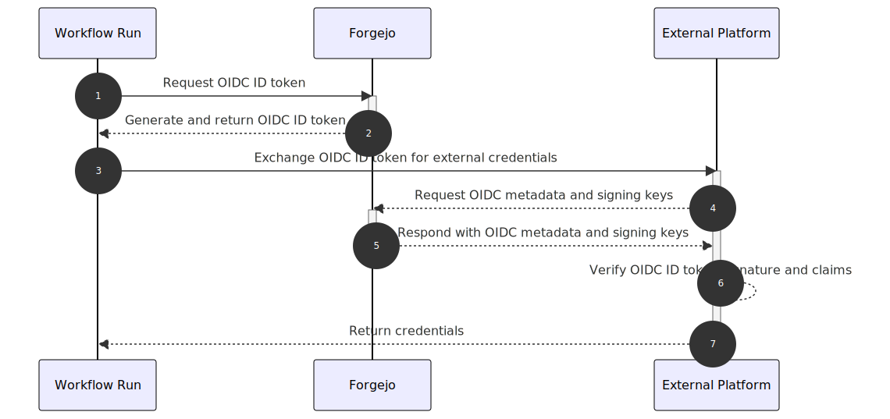

Forgejo Actions allows for workflows to request OpenID Connect compatible JWT ID tokens from Forgejo to exchange with external systems for credentials once a trust relationship between the external service and Forgejo is established.

These trust relationships can be configured in platforms such as AWS, GCP, and Azure, to make assertions on metadata in Forgejo ID tokens and exchange them for granularly scoped and short-lived access tokens.

### Benefits

- Eliminates the needs for secrets stored in Forgejo for compatible external systems
- Access tokens generated by external systems are short-lived and expire automatically
- Allows for granular control over authentication and authorization in external systems via assertions on metadata in the Forgejo ID tokens

### High level flow



1. A workflow run makes a request to Forgejo to generate an OIDC (OpenID Connect) ID token.
2. Forgejo generates and returns an OIDC ID token that contains metadata about the run, repo, actor, and other information.
3. The returned OIDC ID token can be exchanged with external platforms for short-lived credentials in these systems.
4. The external platform will make a request to Forgejo for required metadata and keys to validate the received token.
5. Forgejo responds to these requests with OIDC metadata, including where to find signing keys.
6. The external platform uses this metadata, the keys, and a configured trust relationship to validate access and provide short-lived credentials if these validations pass.
7. The workflow run receives these short-lived credentials, and can now use them to access the external platform.

### Prerequisites

A trust relationship must be established in a compatible external system to allow for exchanging an ID token for short-lived credentials.

Setup instructions for some compatible external systems are as follows:

- [AWS](https://docs.aws.amazon.com/IAM/latest/UserGuide/id_roles_providers_create_oidc.html)
- [GCP](https://docs.cloud.google.com/iam/docs/workload-identity-federation)
- [Azure](https://learn.microsoft.com/en-us/entra/workload-id/workload-identity-federation)
- [Tailscale](https://tailscale.com/kb/1581/workload-identity-federation)

> **NOTE:** Improperly configured trust relationships can allow for unintended access to third party systems.
> The `sub`, `iss`, and `aud` claims should be validated in the trust relationship at the minimum.
> Trust relationships should be configured to be as strict and narrowly scoped as is possible for your usecase.

### Token structure

JWT tokens are comprised of three main components:

1. A header which contains information about the signing algorithm and key used for signing the token
2. A body or payload which contains
3. A signature of the other two sections based on the signing algorithm used

These sections are Base64 URL encoded and joined by `.` to form the JWT.
Examples of what the decoded sections look like follow below.

##### Header

```json
{
  "alg": "RS256",
  "kid": "iSrBtRq6EaN6605cSatQEnafFF82rOfm_22_d_V6ehQ",
  "typ": "JWT"
}
```

##### Body

```json
{
  "actor": "user1",
  "aud": "exampleAudience",
  "event_name": "push",
  "exp": 1767217099,
  "iat": 1767213499,
  "iss": "https://example.com/api/actions",
  "nbf": 1767213499,
  "ref": "refs/heads/master",
  "ref_protected": "false",
  "ref_type": "branch",
  "repository": "user1/testing",
  "repository_owner": "user1",
  "run_attempt": "1",
  "run_id": "43",
  "run_number": "43",
  "sha": "76cb2978acb72029ac23277a6192eea1707c6a2c",
  "sub": "repo:user1/testing:ref:refs/heads/master",
  "workflow": "test.yml",
  "workflow_ref": "user1/testing/.forgejo/workflows/test.yml@refs/heads/master"
}
```

#### Signature

The format of the signature will depend on the algorithm used for signing the JWT ID token.

### Reference

#### Requesting an ID token

OpenID connect must be enabled in workflow files at either the [workflow](../reference/#enable-openid-connect) or [individual job](../reference/#jobsjob_idenable-openid-connect) level to be able to generate ID tokens from action runs.

When enabled, `ACTIONS_ID_TOKEN_REQUEST_TOKEN` and `ACTIONS_ID_TOKEN_REQUEST_URL` will be injected into the runners environment. A token can then be generated by running:

```shell
curl -H "Authorization: bearer $ACTIONS_ID_TOKEN_REQUEST_TOKEN" "$ACTIONS_ID_TOKEN_REQUEST_URL&audience=exampleCustomAudience"
```

where the `audience` is an optional query param can be customized to match the value of the `aud` claim expected by the trust relationship in the external platform.

When unspecified, the `aud` value will default to the Forgejo instance's URL with the repository owner as a suffix.

For example, `https://example.com/user1`.

#### Subject format

When the event that triggered the workflow is a `pull_request` the subject format is:

```shell
repo:[repository]:pull_request
```

where `[repository]` is the owner and repository name (e.g., forgejo/docs).

For all other events that trigger workflows, the subject format is:

```shell
repo:[repository]:ref:[ref]
```

where `[ref]` is the fully formed git reference (i.e. starting with `refs/`) associated with the event that triggered the workflow, if any (e.g. `refs/heads/main`)

#### Standard claims

The Forgejo ID token contains a number of well-known standard (also known as registered) claims as defined by [RFC 7519](https://datatracker.ietf.org/doc/html/rfc7519#section-4.1).

| Claim | Summary    | Description                                                                                                                                                                        |
| ----- | ---------- | ---------------------------------------------------------------------------------------------------------------------------------------------------------------------------------- |
| `aud` | Audience   | The intended audience of the ID token. This can be configured using the `audience` URL param when requesting a token, and defaults to `[forgejo instance URL]/[repository owner]`. |
| `iss` | Issuer     | The issuer of the ID token. This will be in the format: `[forgejo instance URL]/api/actions`. For example, `https://example.com/api/actions`.                                      |
| `sub` | Subject    | The subject claim for the token. See [subject format](#subject-format) for more details.                                                                                           |
| `iat` | Issued at  | The time that the token was issued.                                                                                                                                                |
| `exp` | Expires at | The expiry time of the token.                                                                                                                                                      |
| `nbf` | Not before | The time after which this token is valid.                                                                                                                                          |

#### Custom claims

The Forgejo ID token contains a number of custom claims that contain Forgejo specific information.

| Claim              | Summary                | Description                                                                                                                                                |
| ------------------ | ---------------------- | ---------------------------------------------------------------------------------------------------------------------------------------------------------- |
| `actor`            | Triggering actor       | The name of the user that triggered the `workflow`.                                                                                                        |
| `base_ref`         | Base reference         | The name of the base branch of the pull request (e.g. main). Only defined when a workflow runs because of a `pull_request` or `pull_request_target` event. |
| `event_name`       | Event name             | The name of the event that triggered the workflow (e.g. `push`).                                                                                           |
| `ref`              | Reference              | The fully formed git reference (i.e. starting with `refs/`) associated with the event that triggered the workflow, if any (e.g. `refs/heads/main`).        |
| `ref_protected`    | Is reference protected | `true` if branch protections are configured for the ref that triggered the workflow run.                                                                   |
| `ref_type`         | Reference type         | The type of the `ref` (`branch` or `tag` for example).                                                                                                     |
| `repository`       | Repository             | The owner and repository name (e.g. forgejo/docs).                                                                                                         |
| `repository_owner` | Repository owner       | The repository owner's name (e.g. forgejo)                                                                                                                 |
| `run_attempt`      | Run attempt            | Attempt number for this run, beginning at 1 and incrementing when the job is re-run.                                                                       |
| `run_id`           | Run identifier         | A unique id for the current workflow run in the Forgejo instance.                                                                                          |
| `run_number`       | Run number             | A unique id for the current workflow run in the repository of the workflow.                                                                                |
| `sha`              | Git SHA                | The commit SHA that triggered the workflow. The value of this commit SHA depends on the event that triggered the workflow.                                 |
| `workflow`         | Workflow name          | The name of the workflow that triggered the run.                                                                                                           |
| `workflow_ref`     | Workflow ref           | Ref path to the workflow, for example, `owner/example-respository/.forgejo/workflows/test-workflow.yaml@refs/heads/main`                                   |
