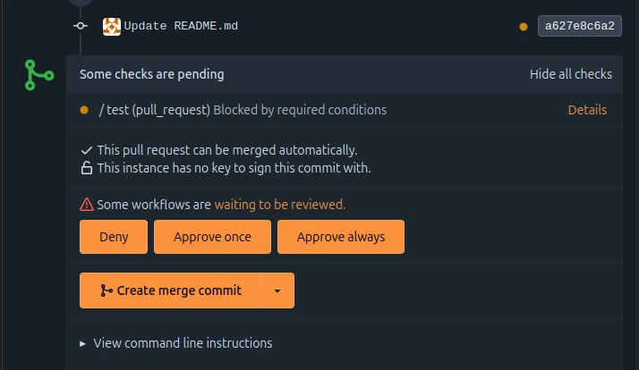
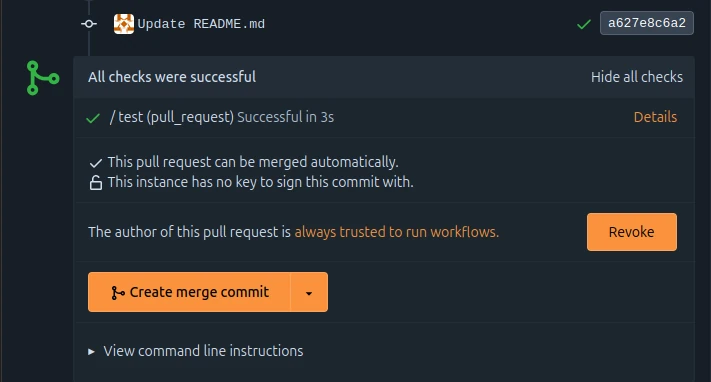
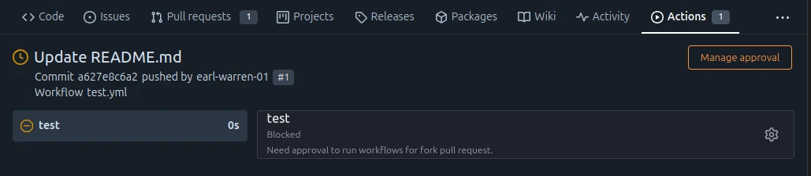

A pull request may contain code that changes what is run by Forgejo
Actions, for instance if it modifies a file in the
`.forgejo/workflows` directory. When such a pull request originates
from a fork of a public repository on a Forgejo instance with open
registration, the author may be a malicious user. For this reason the
workflows of such pull requests need to be approved before they are run.

Users with elevated permissions on a repository can approve or deny
workflows runs using the pull request conversation page.

### Trust management

Trust is either granted or denied to the author of a pull request.

When using the `Approve once` button, all pending workflows will be
allowed to run. However future workflows will need another manual
approval (for instance if a new commit is pushed to the same pull request).

Using the `Approve always` button will trust the author of the pull request to always
run workflows on this repository.

It is possible to revoke that trust at any time.

The page displaying the run of each blocked workflow shows a link to
the trust management area of the pull request.

### Which users need approval?

The users who only have read access to the repository need approval
before workflows triggered by a pull request they authored can be run.

The users who have elevated permissions on the repository do not need
approval, even if they author a pull request from a forked
repository. That includes:

- Collaborators with write access
- Team members with write permissions on the `Actions` unit
- `Owners` of the repository
- Instance admins

The author of a pull request is held responsible for all commits they push to
their pull request, including commits written by a third party. For
instance, if a pull request is from a branch of a repository to which
multiple users are allowed to push they are also implicitly trusted if
the author of the pull request is trusted.

### What pull requests need approval?

Assuming the author of a pull request is not implicitly trusted
because of their elevated permissions, approval will be required for
pull requests that are either:

- from a fork of the repository
- created using the `AGit` workflow

### Which user can grant approval?

Trust management is available to users who are either:

- Collaborators with write access
- Team members with write permissions on the `Actions` unit
- `Owners` of the repository
- Instance admins

### Which workflow files are used?

When a trusted user submits a pull request, workflows found in the
pull request content are used (except for the ones using the
`pull_request_target` event), taking into account any changes done to
these files as part of that pull request.

If the pull request is not from a trusted user and a workflow is
triggered by a trusted user, the workflows found in the target branch of the
pull request will be used instead of those found in the pull request.

A concrete use case is to allow the repository owner to set a label on
a pull request from an untrusted user without having to verify if the
pull request contains a malicious workflow.

### Trust expiration

When a permanently trusted user has not submitted a pull request for
over three months, the trust they may have been granted on a given
repository will be automatically revoked.

### Blocked users

When a [user is blocked](../blocking-user), the trust they were
granted on all repositories owned by the user doing the blocking will
be revoked.

All workflow runs created on their behalf on those repositories will
be canceled.
