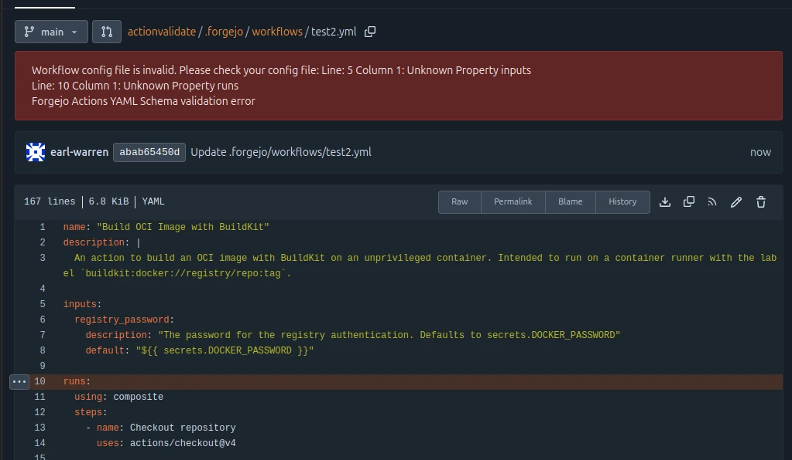
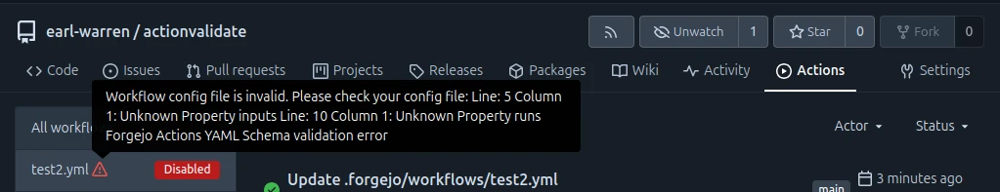
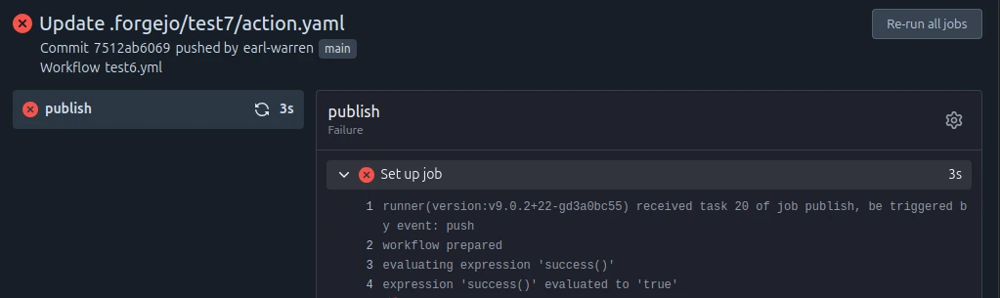
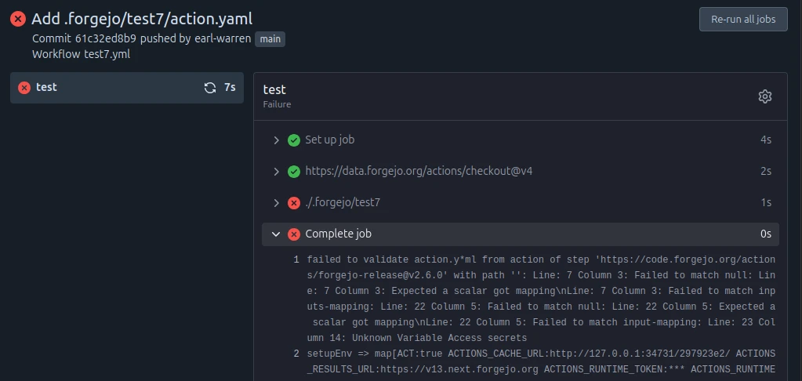

When a workflow or an action fails to run as expected, the following steps may help to figure out where to look for errors.

## Schema validation

As of [Forgejo runner v8.0.0 and above](https://code.forgejo.org/forgejo/runner/releases/tag/v9.0.0) both workflows and actions are validated against a schema and will fail to run if they do not pass. Errors will be displayed:

- When browsing a workflow from the web interface (available in [Forgejo v13.0.0](https://codeberg.org/forgejo/forgejo/milestone/21377) and above).
  
- In the list of actions, when hovering on the warning sign next to a workflow that fails schema validation (available in [Forgejo v13.0.0](https://codeberg.org/forgejo/forgejo/milestone/21377) and above).
  
- In the logs of a workflow run, in the `Set up job` step for an action used by the workflow (available in all Forgejo versions).
  
- In the logs of a workflow run, in the `Complete job` step for an action used by an action (two levels of indirection) used by a workflow (available in all Forgejo versions).
  

It is also possible to verify that the workflows and/or actions found in a repository successfully pass schema validation [using the Forgejo runner CLI](https://code.forgejo.org/forgejo/runner/releases/tag/v9.0.0) (e.g. `forgejo-runner validate --repository https://example.com/my/repo`) (available in the [Forgejo runner v9.0.0](https://code.forgejo.org/forgejo/runner/releases/tag/v9.0.0) and above).

## Forgejo runner logs

If the logs of the action displayed in the web UI are incomplete, it is worth looking into the [logs of the Forgejo runner itself](../../../admin/actions/runner-installation/#configuration).
