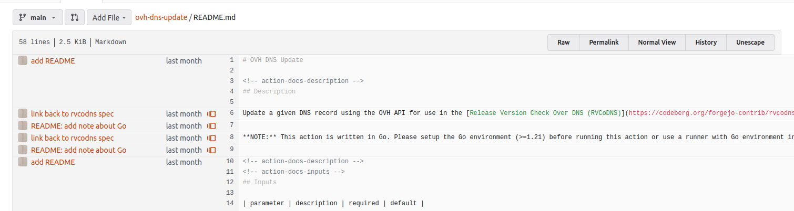

Forgejo supports viewing the line-by-line revision history for a file also known as blame view.
You can also use [`git blame`](https://git-scm.com/docs/git-blame) on the command line to view the revision history of lines within a file.

1. Navigate to and open the file whose line history you want to view.
1. Click the `Blame` button in the file header bar.
1. The new view shows the line-by-line revision history for a file with author and commit information on the left side.
1. To navigate to an older commit, click the icon.

## Ignore commits in the blame view

All revisions specified in the `.git-blame-ignore-revs` file are hidden from the blame view.
This is especially useful to hide reformatting changes and keep the benefits of `git blame`.
Lines that were changed or added by an ignored commit will be blamed on the previous commit that changed that line or nearby lines.
The `.git-blame-ignore-revs` file must be located in the root directory of the repository.
For more information like the file format, see [the `git blame --ignore-revs-file` documentation](https://git-scm.com/docs/git-blame#Documentation/git-blame.txt---ignore-revs-fileltfilegt).

### Bypassing `.git-blame-ignore-revs` in the blame view

If the blame view for a file shows a message about ignored revisions, you can see the normal blame view by appending the url parameter `?bypass-blame-ignore=true`.
