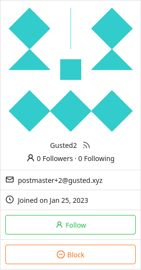
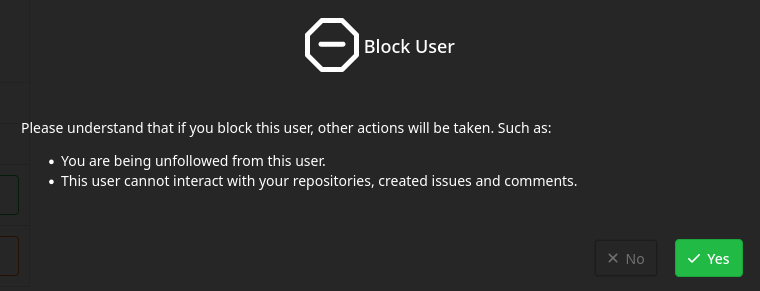
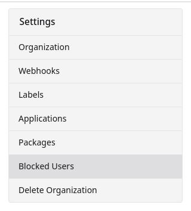
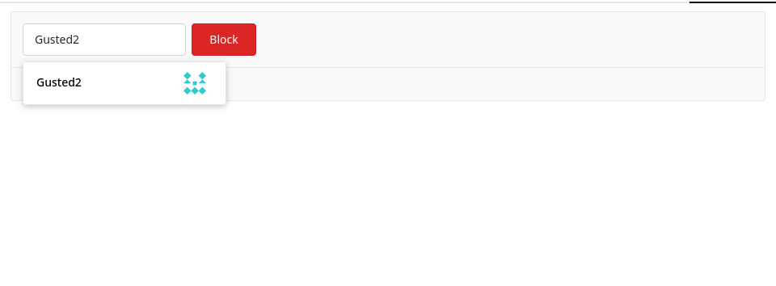
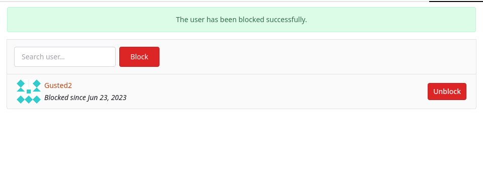
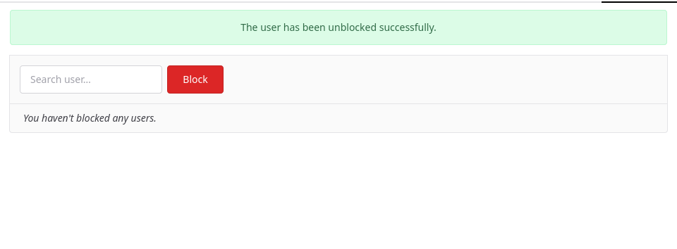

Blocking another user is desirable if they are acting maliciously or are spamming your repository. For such cases, Forgejo provides the functionality to block other users. When you block a user, Forgejo does not explicitly notify them, but they may learn through an interaction with you that is blocked.

## How to block someone

In order to block another user, go to their profile page and click on the "Block" button.

A popup will show; please read carefully what blocking another user implies, and if you accept the implications, click on Yes.

## How to block someone as an organization

It is possible to block a user from an organization, this has the same implications as a normal user blocking another user. To block a user from an organization, you must be on that organization's Owners team.

Navigate to your organization's settings and select the Blocked Users page.

Find the person you want to block in the search bar, select the user and click block.

You will now see the blocked users in the list, along with the date they were blocked.

To unblock that person, you can click the unblock button next to their name.

## Implications of blocking a user

When you block a user:

- You stop following them.
- They stop following you.
- They are removed as collaborators on repositories you own as an individual.

After you've blocked them:

- They cannot cause any notifications for you anymore by mentioning you.
- They cannot open issues or pull requests on repository you own.
- They cannot add reactions to your comments.
- They cannot post comments on issues and pull request you've opened.
