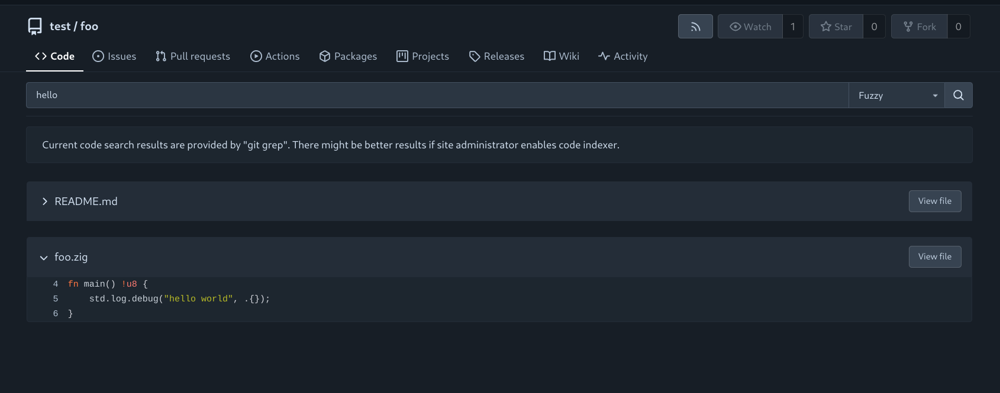
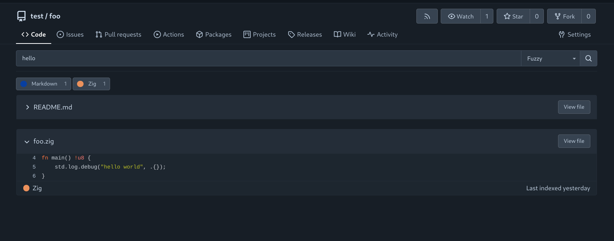

Forgejo supports code search through an indexer and `git-grep` as a fallback when [`REPO_INDEXER_ENABLED`](../../admin/config-cheat-sheet#indexer-indexer) is disabled.

# Basic (git-grep)

When `REPO_INDEXER_ENABLED` is set to `false`, code search is restricted to a single repository, utilizing the [`git-grep`](https://git-scm.com/docs/git-grep) command.

## Supported Options

The following options are currently available for code search while using `git-grep`.

- **Match**: Perform an exact match on the provided expression.
- **Union**: Conduct a union match, returning results that contain atleast one of the specified keywords. For example, a search query containing `hello world` will yeild results with either `hello` or `world`.
- **RegExp**: Utilize the provided regular expression to perform a pettern-based match (matches will not be highlighted).

## Scope

Since `git-grep` is performed on the fly, they can be executed on any valid branch or tag. The currently active branch/tag is displayed as the default value in the dropdown menu above the search bar, allowing users to easily switch between branches and tags.

# Indexer

For complex searches or cross-repository queries across an entire organisation or instance, `REPO_INDEXER_ENABLED` must be set to `true`. This enables code search via the selected indexer ([`REPO_INDEXER_TYPE`](../../admin/config-cheat-sheet#indexer-indexer)).

## Supported Options

The following options are currently available for code search while using an indexer.

- **Match**: Perform an exact match on the provided expression.
- **Fuzzy**: Conduct a fuzzy search, returning results that contain the keyword within a maximum edit-distance of 2. For example, a search query containing `hello` will yeild results with
  - **edit distance of 0**: `hello`
  - **edit distance of 1**: For example, `hllo` (delete), `helloo` (add), `hallo` (modify).

## Scope

Please note that when using the repository indexer, search results are limited to the contents of the HEAD branch of each repository.
