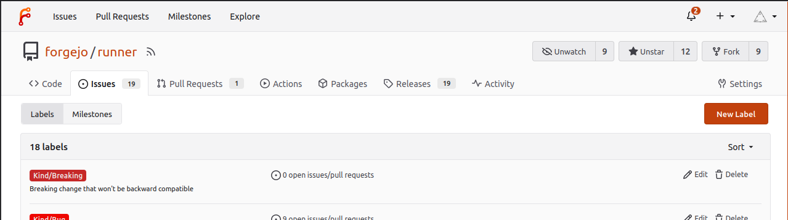
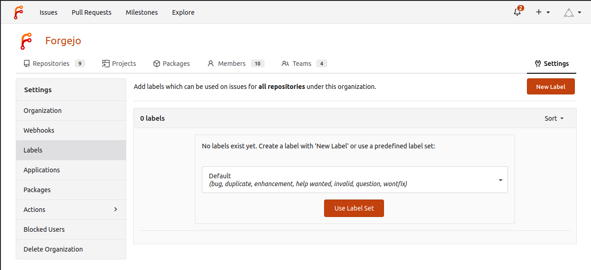
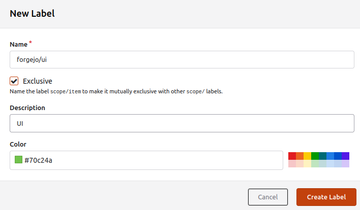
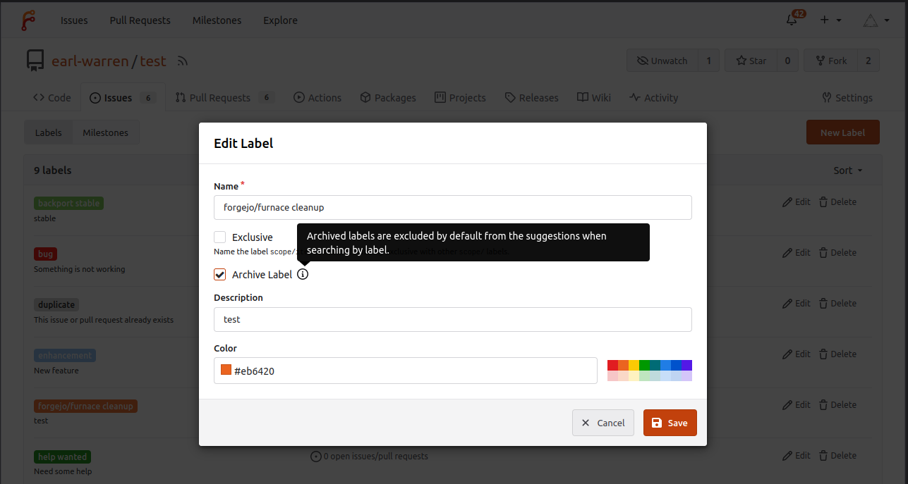
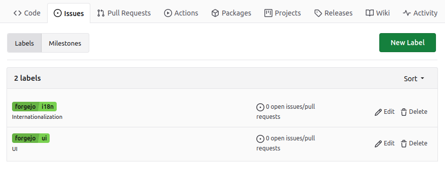
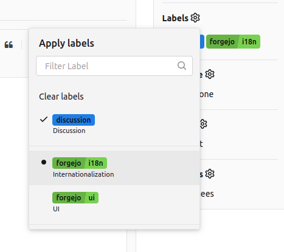

You can use labels to classify issues and pull requests and to improve your overview over them.

Labels can be created by going to the `Issues` page of a repository and clicking on `Labels` to show the labels management page.

For organizations, you can define organization-wide labels that are shared with all organization repositories, including both already-existing repositories as well as newly created ones. Organization-wide labels can be created in the organization `Settings`.

## Creating Labels

From the labels management page, click on the `New Label` button.

Labels have a mandatory name, a mandatory color, an optional description, and must either be exclusive or not (see `Scoped labels` below).

When you create a repository (or an organization), you can ensure certain labels exist by using the `Issue Labels` option. This option lists a number of available label sets that are configured globally on your instance.

## Archiving Labels

When a label is no longer useful but needs to be kept around because
it is still associated with existing pull requests or issues, it can
be archived.

- The label won't show up as a suggestion when you're adding/editing labels.
- The label cannot be assigned to a new issues or pull requests.

To archive a label, edit the label an click the `Archive` checkbox.

## Scoped Labels

Scoped labels are used to ensure at most a single label with the same scope is assigned to an issue or pull request. For example, if labels `kind/bug` and `kind/enhancement` have the Exclusive option set, an issue can only be classified as a bug or an enhancement.

A scoped label must contain `/` in its name (not at either end of the name). The scope of a label is determined based on the **last** `/`, so for example the scope of label `scope/subscope/item` is `scope/subscope`.

## Filtering by Label

Issue and pull request lists can be filtered by label. Selecting multiple labels shows issues and pull requests that have all selected labels assigned.

By holding alt to click the label, issues and pull requests with the chosen label are excluded from the list.

