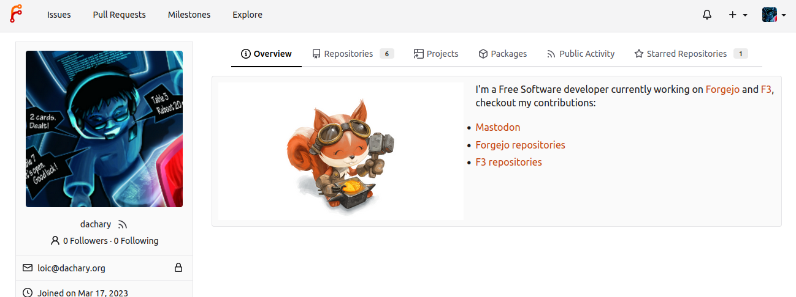
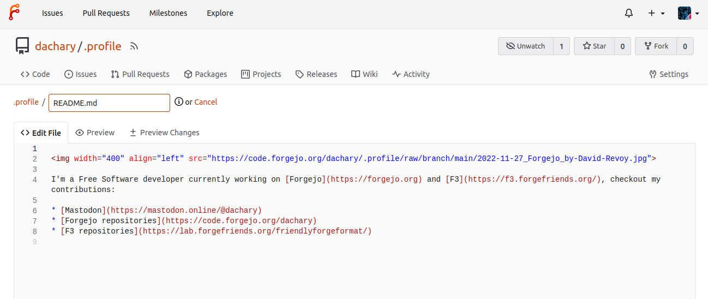

By default the profile page of a user is the list of repositories they
own. It is possible to customize it with a short description that
shows to the left, under their avatar. It can now be fully
personalized with a markdown file that is displayed instead of the
list of repositories.

It uses the `README.md` file from the `.profile` repository of the
user, if it exists.

> **NOTE:** if a the `.profile` repository is private the `README.md` they contain will be displayed publicly. It is **strongly recommended** to verify no such repository exist in a given instance before upgrading.
