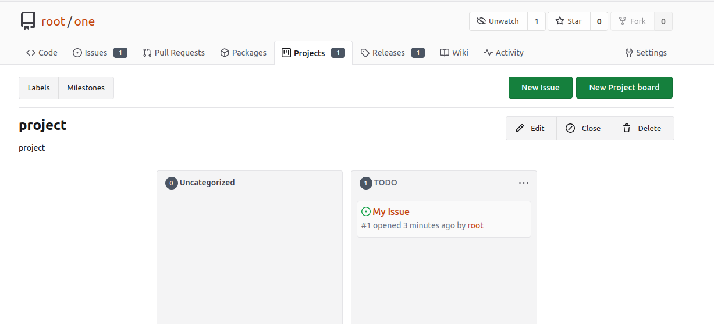
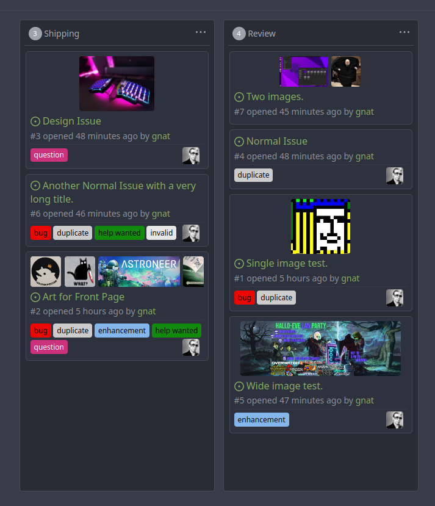

A project is a [kanban board](<https://en.wikipedia.org/wiki/Kanban_(development)>) to organize issues.

## Card previews images

If the card preview in the project is set to **Images and Text**, the card preview displays images found in the corresponding issue. The most recent is displayed first, up to five images.

