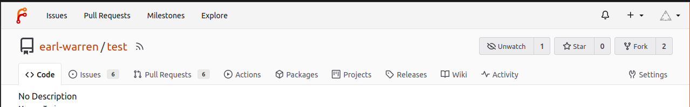
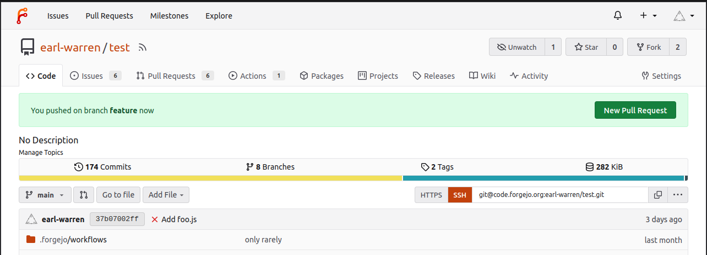
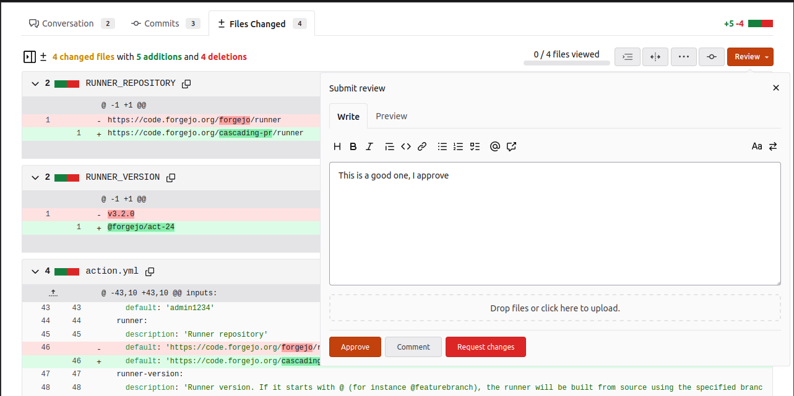
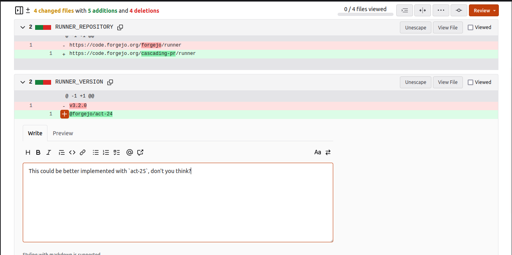
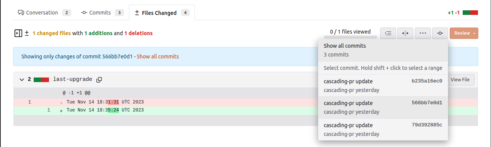

## Benefits of a pull request based workflow

> **_TLDR:_** _Keep an eye on your repository and organization permissions. Don't take sweets from strangers. Use pull requests. Easy to review, easy to manage, and only the project maintainers/owners have permission to merge them._

Although it is perfectly possible to use a Git project on Codeberg just as single shared central repository for individuals and teams, a collaborative workflow based on pull requests provides many benefits:

- The "hot" project repository requires only very few maintainers with full rights to sign off pull requests. Contributors can easily work on forked repositories.
- Each pull request collects the full edit history for a fix or feature branch. Contributors can squash this, or keep it, just as they prefer.

## Create a pull request

Let's say, you would like to contribute to our "examples" project [knut/examples](https://codeberg.org/knut/examples).

First, fork the project you would like to work on, by clicking the `Fork` button in the top-right corner of the project page:



Then, clone it onto your local machine. We assume that [you have set up your SSH keys](/security/ssh-key). This has to be done only once:

```shell
git clone git@codeberg.org:<YOURCODEBERGUSERNAME>/examples.git
```

Now, let's create a feature branch, do some changes, commit, push, edit, commit, push, ..., edit, commit, push:

```shell
git checkout -b feature
# do some changes
git commit -m "first feature"
git push    # here you get asked to set your upstream URL, just confirm
# do more work, edit...
git add new_file.png
git commit -m "second feature introducing a new file"
git push
# ...
git commit -m "more work, tidy-up"
git push
```

Now you can create a pull request by visiting the main repository page and clicking on the `New Pull Request` button.



This button is automatically shown if:

- You are the pusher on a branch that still exists and that is not the default branch
- The push must occurred within the last 6 hours
- There is no open PR for this branch

## Reviews

On the pull request page, the `Files Changed` tab shows a `Review` button that can be used to approve the pull request or request changes.



Next to each changed line, a `plus` button allows to add a comment on that specific line, for instance to suggest a modification.



When a pull request contains multiple commits, the button to the left of the `Review` button can be used to only review a single commit.



## Keep it up-to-date: rebase pull requests to upstream

Sometimes the upstream project repository is evolving while we are working on a feature branch, and we need to rebase and resolve merge conflicts for upstream changes into our feature branch. This is not hard:

In order to track the `upstream` repository, we'll add a second remote that is pointing to the original project. This has to be done only once:

```shell
git remote add upstream git@codeberg.org:knut/examples.git
```

You can also use the SSH variant here for public projects, if you want to be
able to pull without specifying your credentials.

Now, let's pull from `upstream`, and rebase our local branch against the latest `HEAD` of the upstream project repository (e.g. the `main` branch):

```shell
git pull --rebase upstream main
git pull
```

That's it. You can now push your changes, and create the pull request as usual by clicking on the "New Pull Request" button.

## A friendly note on owner rights, and force push permissions

Please keep in mind that project owners can do _everything_, including editing and rewriting the history using `force-push`. In some cases, this is a useful feature
(for example to undo accidental commits or clean up PRs),
but in most cases a transparent history based on a pull request based workflow is surely preferable,
especially for the default branches of your project where other people rely on intact history.

**Warning** If you accidentally leaked sensitive data, say, leaked credentials,
keep in mind that commits stay directly accessible, e.g. from the user
activity tab or a Pull Request feed, for a while.
Please contact us if you really need to remove such data from the public.
