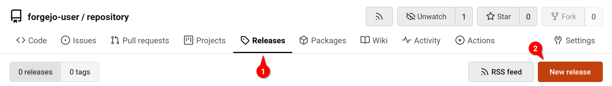
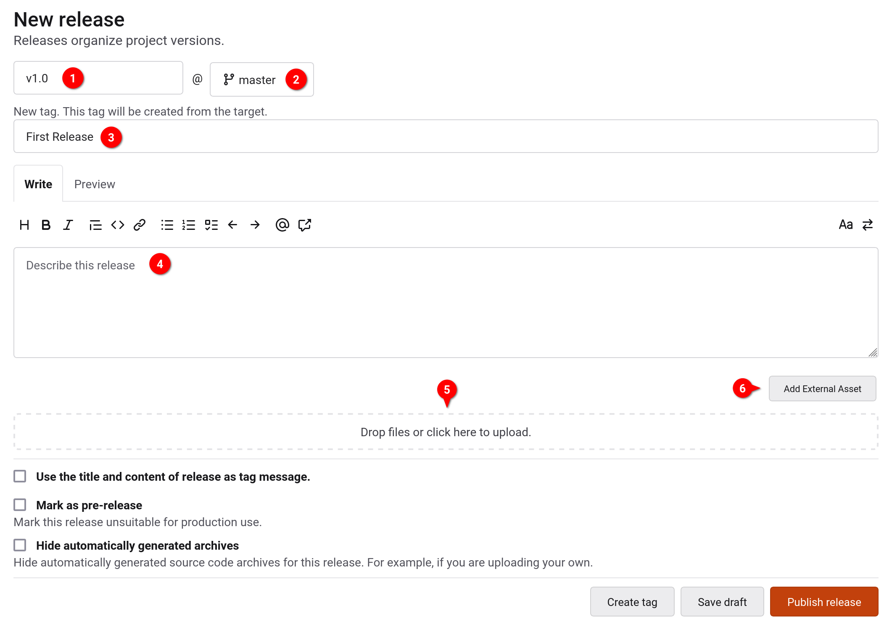
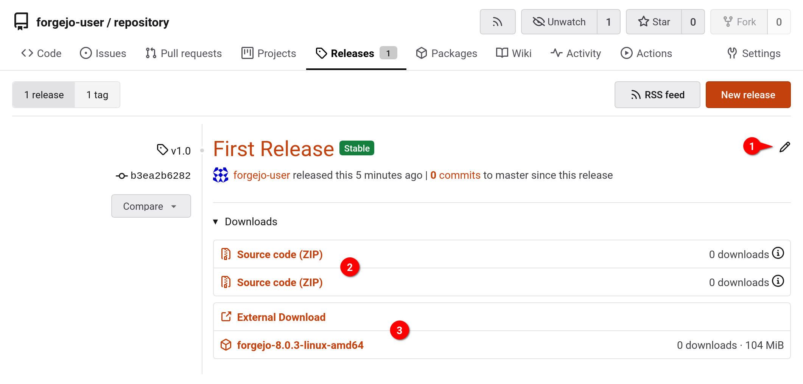

## What are tags?

Tags are a feature in Git that can be used to make a snapshot of a repository
from a point in time. It is generally used to mark releases (e.g. v1.2.4), and
it functions as a shortcut to see what the repo looked like at the time.

## What are releases?

Releases are a feature in Forgejo, independent of Git that allows you to attach
files and release notes along with the source code at the time, and share it in
Forgejo, linking to a Git tag.

### Wait, what is the difference between tags and releases?

They are very similar, the difference being that tags are just the repository
frozen in time and are part of Git (you can make a tag inside of Git), but
releases are tags accompanied with a binary file and are not part of Git (you
need to go to your repository page in the web interface to create a release).

## Creating tags and releases

If you only want to create tags, using Git is recommended. If you want to create
a full release, this is only possible through Forgejo's web interface, or
through it's API.

### Creating a Tag with Git

To create a tag using Git, use the following command in your local repository.

```bash
git tag -a <tag name> -m "<my tag message>"
```

You can omit `"<my tag message>"` to write a longer tag message in an editor
window.

**Tip:** Tags are generally labelled by version numbers. It is good practice to
prefix a version number with a `v` (e.g. `v1.2.3`) and to use the [Semantic
Versioning](https://semver.org/) specification for assigning and incrementing
version numbers.

Tags are not automatically pushed when you run `git push` (compared to commits
or branches). They have to be pushed manually to the remote target, like so:

```bash
git push --tags <remote target, probably "origin">
```

The argument `--tags` pushes all local tags to the remote target. If you want to
push only a specific tag, use:

```bash
git push <remote target, probably "origin"> <tag name, e.g., "v1.2.3">
```

### Creating a Release in the Web Interface

To create a release in the web interface, first go to the `Releases` tab of your
repository `(1)`, and click on `New Release (2)`:



Here, you need to enter a version number for your new release `(1)`, select the
branch that contains the code you want to release `(2)`, and add a title `(3)`.
Optionally, you can also add a description `(4)` or add assets to the release in
the form of attaching files `(5)` or adding external links `(6)`:



You can now either save it as a draft, or publish the release outright.

You are then re-directed to the `Releases` tab of your repository. The newly
created release is now listed there:



Here, you can edit the release if needed `(1)`. You will also see optiuons to
download the source code of the repository at the commit the release was created
at as `.zip` or `.tar.gz` files `(2)`. Finally, if on the previous page you
added assets like an attached file or an external link, they will also show up
here `(3)`.

### Creating a Release through the API

All the operations accessible in the web interface are also available through
the API. You can use the following endpoints to:

- [`/repos/{owner}/{repo}/releases`](https://code.forgejo.org/api/swagger#/repository/repoCreateRelease) \
  Create (or modify) a release
- [`/repos/{owner}/{repo}/releases/{id}/assets`](https://code.forgejo.org/api/swagger#/repository/repoCreateReleaseAttachment) \
  Create (or modify) release assets
