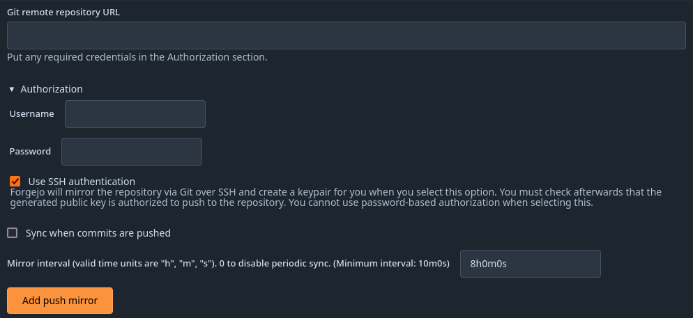
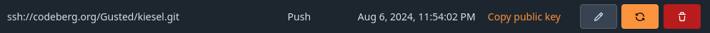

Repository mirroring allows for the mirroring of repositories to and from external sources. You can use it to mirror branches, tags, and commits between repositories.

## Use cases

The following are some possible use cases for repository mirroring:

- You migrated to Forgejo but still need to keep your project in another source. In that case, you can simply set it up to mirror to Forgejo (pull), and all the essential history of commits, tags, and branches are available in your Forgejo instance.
- You have old projects in another source that you don't use actively anymore but don't want to remove for archiving purposes. In that case, you can create a push mirror so that your active Forgejo repository can push its changes to the old location.

## Pulling from a remote repository

For an existing remote repository, you can set up pull mirroring as follows:

1. Select **New Migration** in the **Create...** menu on the top right.
2. Select the remote repository service.
3. Enter a repository URL.
4. If the repository needs authentication, fill in your authentication information.
5. Check the box **This repository will be a mirror**.
6. Select **Migrate repository** to save the configuration.

The repository now gets mirrored periodically from the remote repository. You can force a sync by selecting **Synchronize Now** in the repository settings.

:exclamation::exclamation: **NOTE:** You can only set up pull mirroring for repositories that don't exist yet on your instance. Once the repository is created, you can't convert it into a pull mirror anymore. :exclamation::exclamation:

## Pushing to a remote repository

For an existing repository, you can set up push mirroring as follows:

1. In your repository, go to **Settings** > **Repository**, and then the **Mirror Settings** section.
2. Enter a repository URL.
3. (Optional) Enter a branch filter (comma separated branch names), or leave blank to push all branches.
4. If the repository needs authentication, expand the **Authorization** section and fill in your authentication information. Note that the requested **password** can also be your access token.
5. Select **Add Push Mirror** to save the configuration.

The repository now gets mirrored periodically to the remote repository. You can force a sync by selecting **Synchronize Now**. In case of an error, a message is displayed to help you resolve it.

:exclamation::exclamation: **NOTE:** This will force push to the remote repository. This will overwrite any changes in the remote repository! :exclamation::exclamation:

### Setting up a push mirror from Forgejo to GitHub

To set up a mirror from Forgejo to GitHub, you need to follow these steps:

1. Create a repository on GitHub using any name you wish (the name does not have to match the name of the Forgejo repository). Unlike Forgejo, GitHub does not support creating repositories by pushing to the remote. You can also use an existing remote repo if it has the same commit history as your Forgejo repo.
2. Create a [GitHub fine-grained personal access token](https://docs.github.com/en/authentication/keeping-your-account-and-data-secure/managing-your-personal-access-tokens#creating-a-fine-grained-personal-access-token). While creating the token:
   1. In the **Repository access** section click the **Only select repositories** radio button.
   2. Click the **Select repositories** button, type the name of the repository you created, and click the checkbox next to its name to select it, then close the **Select repositories** drop-down list.
   3. In the **Permissions** box, click **Repositories** and then click the **Add permissions** button.
   4. Click the checkbox next to **Content** in the **Select repository permissions** drop-down list.
   5. If the repository contains (or could contain in the future) Actions workflows in the `.github/workflows` directory, click the checkbox next to **Workflows** in the **Select repository permissions** drop-down list.
3. Click the **Generate token** button, then copy and save the generated token.
4. In the settings of your Forgejo repo, fill in the **Git Remote Repository URL**: `https://github.com/<your_github_group>/<your_github_project>.git`.
5. Fill in the **Authorization** fields with your GitHub username and the personal access token as **Password**.
6. (Optional) Select `Sync when new commits are pushed` so that the mirror will be updated as soon as there are changes. You can also disable the periodic sync if you like.
7. Select **Add Push Mirror** to save the configuration.

The repository pushes shortly thereafter. To force a push, select the **Synchronize Now** button.

### Setting up a push mirror from Forgejo to GitLab

To set up a mirror from Forgejo to GitLab, you need to follow these steps:

1. Create a [GitLab personal access token](https://docs.gitlab.com/ee/user/profile/personal_access_tokens.html) with _write_repository_ scope.
2. Fill in the **Git Remote Repository URL**: `https://<destination host>/<your_gitlab_group_or_name>/<your_gitlab_project>.git`.
3. Fill in the **Authorization** fields with `oauth2` as **Username** and your GitLab personal access token as **Password**.
4. Select **Add Push Mirror** to save the configuration.

The repository pushes shortly thereafter. To force a push, select the **Synchronize Now** button.

### Setting up a push mirror from Forgejo to Bitbucket

To set up a mirror from Forgejo to Bitbucket, you need to follow these steps:

1. Create a [Bitbucket app password](https://support.atlassian.com/bitbucket-cloud/docs/app-passwords/) with the _Repository Write_ box checked.
2. Fill in the **Git Remote Repository URL**: `https://bitbucket.org/<your_bitbucket_group_or_name>/<your_bitbucket_project>.git`.
3. Fill in the **Authorization** fields with your Bitbucket username and the app password as **Password**.
4. Select **Add Push Mirror** to save the configuration.

The repository pushes shortly thereafter. To force a push, select the **Synchronize Now** button.

### Mirror via SSH

Forgejo supports the use of SSH as an authentication method for push mirrors.
You can enable this when adding a new push mirror; existing push mirrors cannot be configured to use SSH.
This feature is only available if Forgejo is able to find the `ssh` executable.
LFS over SSH protocol is not implemented in Forgejo, any LFS objects will not be mirrored.

To use SSH as an authentication method, select the **Use SSH authentication** option in the authorization tab when adding a new push mirror.
Make sure to use SSH-conform URLs for **Git Remote Repository URL**, which is e.g. `git@forgejo.org:<your_forgejo_group>/<your_forgejo_project>.git` for Forgejo (differs from the default authorization approach as mentioned above).
Make sure to not fill in the **Username** or **Password** input.
Forgejo generates an Ed25519 SSH key pair and saves it for you.

After adding the push mirror, you can click the **Copy public key** link to copy the public key to your clipboard.

This public key can then be added as a deploy key on the target repository. How to add one varies by platform, but generally it should be an option in the repository's settings.
After adding the public key as the deploy key, you can go back to Forgejo and click the **Synchronize now** button and see that it works.

### Branch Filter

Forgejo will use `git push --mirror` when there is no Branch Filter specified.
When you enter a Branch Filter only branches matching the comma separated branch names will be pushed.
Branch names can include glob patterns. e.g. `feature/*`.
Spaces around branch names are trimmed.

Example: `main, feature/*` - this would push the `main` branch and `feature/add-foo`, but not `security/fix-alpha`.
