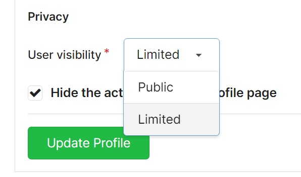

When you invite collaborators to join your repository or when you create teams for your organization, you have to decide what each collaborator/team is allowed to do.

You can assign teams different levels of permission for each unit (e.g. issues, PRs, wiki).

## Profile and Visibility

The visibility of your repositories will depend on the visibility of your profile, as well as whether you have marked a repository as private. Let's break down what this means:

- If your profile's visibility is set to "Limited", _all_ of your non-private repositories will only be visible to logged-in users.
- If your profile's visibility is set to "Public", _all_ of your non-private repositories will be shown to everyone.
- If you do not want anyone (apart from your fellow collaborators) to see your repositories, mark your repository as "Private".

The visibility of your profile can be changed in the `Privacy settings`. Be careful when you set your profile's visibility to "Limited"; Even if a repository is public, users that are _not logged in_ will get a [404 error](https://en.wikipedia.org/wiki/HTTP_404) if they try to access your repository — it will seem as if it does not exist at all!

## Collaborators

There are four permission levels: **Read**, **Write**, **Administrator**, and **Owner**.

By default, the person who creates a repository is an **_Owner_**.

The table below gives an overview of what collaborators are allowed to do when granted each of these permission levels:

| Task                                                                                                                     | Read | Write | Admin | Owner |
| ------------------------------------------------------------------------------------------------------------------------ | ---- | ----- | ----- | ----- |
| View, clone, and pull repository                                                                                         | ✅   | ✅    | ✅    | ✅    |
| Contribute pull requests                                                                                                 | ✅   | ✅    | ✅    | ✅    |
| Push to/update contributed pull requests                                                                                 | ✅   | ✅    | ✅    | ✅    |
| Push directly to repository                                                                                              | ❌   | ✅    | ✅    | ✅    |
| Merge pull requests                                                                                                      | ❌   | ✅    | ✅    | ✅    |
| Moderate/delete issues and comments                                                                                      | ❌   | ✅    | ✅    | ✅    |
| Force-push/rewrite history (if enabled)                                                                                  | ❌   | ✅    | ✅    | ✅    |
| Add/remove collaborators to repository                                                                                   | ❌   | ❌    | ✅    | ✅    |
| Configure branch settings (protect/unprotect, enable force-push)                                                         | ❌   | ❌    | ✅    | ✅    |
| Configure repository settings (enable wiki, issues, PRs, releases, update profile)                                       | ❌   | ❌    | ✅    | ✅    |
| Configure repository settings in the danger zone (transfer ownership, delete wiki data / repository, archive repository) | ❌   | ❌    | ❌    | ✅    |

## Teams

The permissions for teams are quite configurable. You can specify which repositories a team has access to; therefore, you can specify for each unit (Code Access, Issues, Releases) a different permission level.

Each unit is configured to have one of these 3 permission levels:

- No Access: Members cannot view or take any other action on this unit when the repository is private.
- Read: Members can view the unit and perform standard actions for that unit (See the Read column under [Collaborators](#collaborators)).
- Write: Members can view the unit and execute write actions for that unit (See the Write column under [Collaborators](#collaborators)).

> **Note**: all team members with access to a private repository are trusted with viewing partial data related to this repository on all units. For instance if a team is configured with **No Access** to issues, they will not be able to add a comment on an issue but they will be able to see the partial information about the issues when browsing the dashboard of the organization.

When a team is configured to have administrator access, this is specified, and you cannot change units. The team will have admin permissions (See the Admin column under _Collaborators_).

Currently, the following units that can be configured:

- Code: access source code, files, commits, and branches.
- Issues: organize bug reports, tasks, and milestones.
- Pull Requests: access pull requests and code reviews.
- Releases: track the project versions and downloads.
- Wiki: access and write documentation.
- Projects: access and manage issues and pull requests in project boards.
- Packages: access and manage [packages](../packages).
- Actions: access and manage [Forgejo Actions](../actions/overview).

There are also two units which can be toggled:

- External Wiki: access to external wiki.
- External Issues: access to the external issue tracker.

A team can be given the permission to create new repositories. When a member of such a team creates a new repository, they will get administrator access to the repository.
