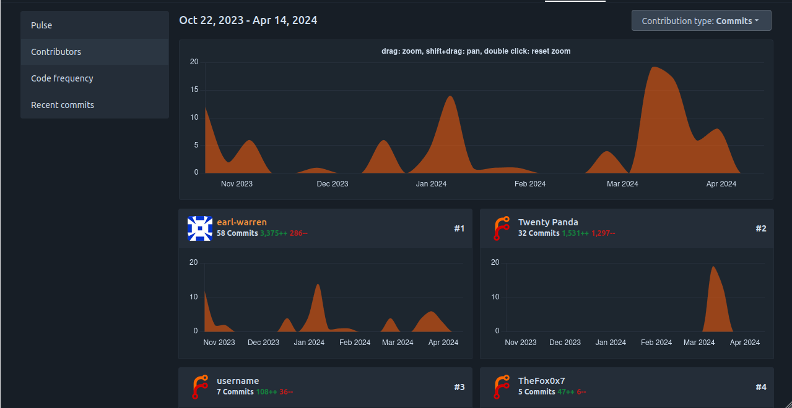
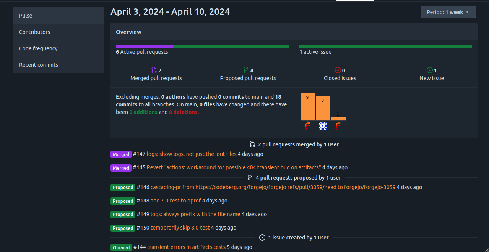
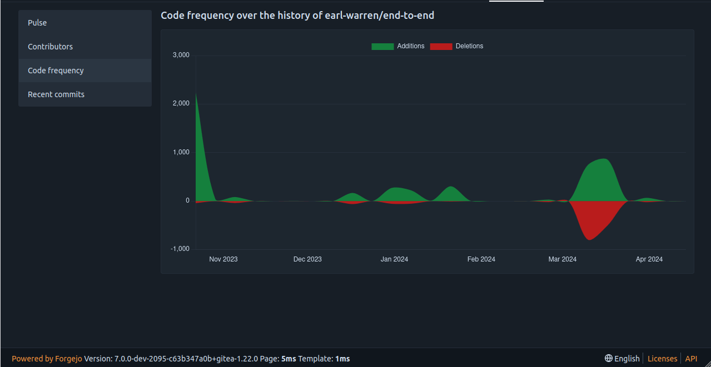
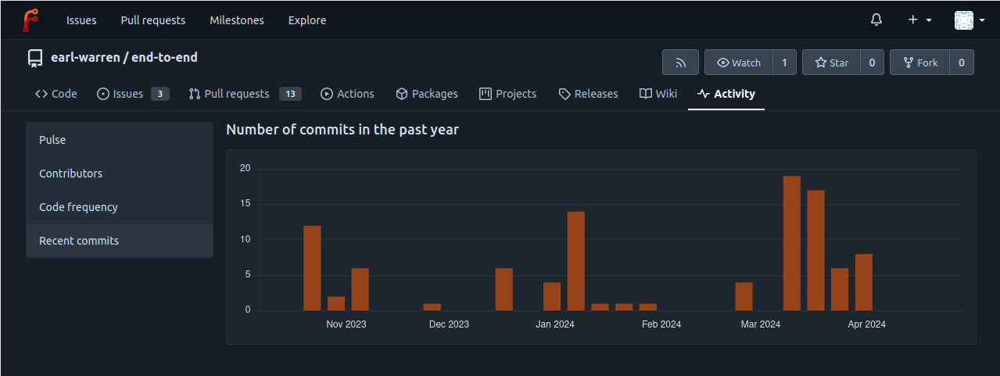

For each repository, the Activity tab displays insights about the recent changes. It helps figure out how lively it is and which contributors are the most active at a given moment in time.

## Contributors

The overall graph shows all commits over time and allows you to select a range of dates to get a more detailed view. The contributors are also displayed with their individual graphs. The contributor with the most commits is shown first.

## Pulse

A high-level view of the most recent commits and pull requests.

## Code frequency

Shows the ratio of added and deleted lines over time.

## Recent commits

The total number of commits over time.
