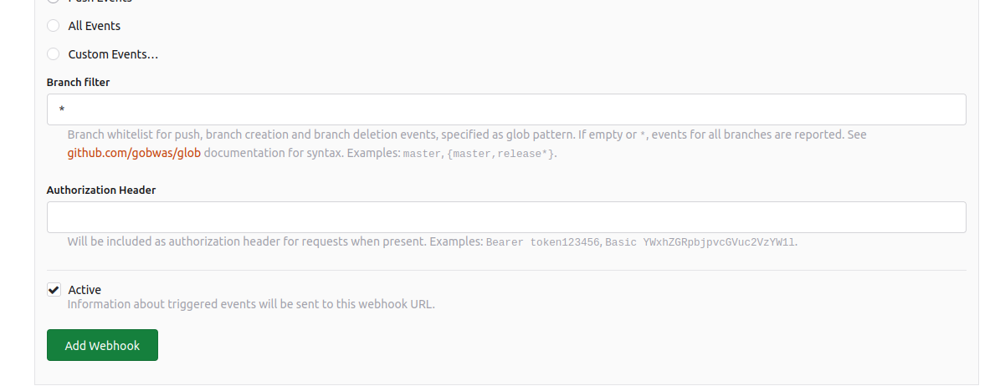

Forgejo supports webhooks for repository events. This can be configured on the settings
page `/:username/:reponame/settings/hooks` by a repository admin. Webhooks can also be configured on a per-organization and whole-system basis (default webhooks on repository creation or instance-wide webhooks).
The currently supported webhook types are:

### Raw event as JSON or FORM payload:

- Forgejo (GET or POST)
- Gitea (GET or POST)
- Gogs (POST)

### Dedicated integration:

- Packagist: ask Packagist to refresh the given package
- SourceHut Builds: submit build manifests (only on push)

### Generic notification messages in chosen channel/chat:

- Matrix
- Slack
- Discord
- Dingtalk
- Telegram
- Microsoft Teams
- Feishu / Lark Suite
- WeCom (Wechat Work)

These channels don't implement all webhook types.
Those types that are implemented have to be manually tested.
Try them and open an [issue](https://codeberg.org/forgejo/forgejo/issues/new/choose) if they do not work for your use case.

### Event information

The following is an example of event information that will be sent by Forgejo to
a Payload URL:

```
X-Forgejo-Delivery: f6266f16-1bf3-46a5-9ea4-602e06ead473
X-Forgejo-Event: push
X-GitHub-Delivery: f6266f16-1bf3-46a5-9ea4-602e06ead473
X-GitHub-Event: push
X-Gogs-Delivery: f6266f16-1bf3-46a5-9ea4-602e06ead473
X-Gogs-Event: push
X-Gitea-Delivery: f6266f16-1bf3-46a5-9ea4-602e06ead473
X-Gitea-Event: push
```

```json
{
  "ref": "refs/heads/develop",
  "before": "28e1879d029cb852e4844d9c718537df08844e03",
  "after": "bffeb74224043ba2feb48d137756c8a9331c449a",
  "compare_url": "http://localhost:3000/forgejo/webhooks/compare/28e1879d029cb852e4844d9c718537df08844e03...bffeb74224043ba2feb48d137756c8a9331c449a",
  "commits": [
    {
      "id": "bffeb74224043ba2feb48d137756c8a9331c449a",
      "message": "Webhooks Yay!",
      "url": "http://localhost:3000/forgejo/webhooks/commit/bffeb74224043ba2feb48d137756c8a9331c449a",
      "author": {
        "name": "Forgejo",
        "email": "someone@forgejo.org",
        "username": "forgejo"
      },
      "committer": {
        "name": "Forgejo",
        "email": "someone@forgejo.org",
        "username": "forgejo"
      },
      "timestamp": "2017-03-13T13:52:11-04:00"
    }
  ],
  "repository": {
    "id": 140,
    "owner": {
      "id": 1,
      "login": "forgejo",
      "full_name": "Forgejo",
      "email": "someone@forgejo.org",
      "avatar_url": "https://localhost:3000/avatars/1",
      "username": "forgejo"
    },
    "name": "webhooks",
    "full_name": "forgejo/webhooks",
    "description": "",
    "private": false,
    "fork": false,
    "html_url": "http://localhost:3000/forgejo/webhooks",
    "ssh_url": "ssh://forgejo@localhost:2222/forgejo/webhooks.git",
    "clone_url": "http://localhost:3000/forgejo/webhooks.git",
    "website": "",
    "stars_count": 0,
    "forks_count": 1,
    "watchers_count": 1,
    "open_issues_count": 7,
    "default_branch": "master",
    "created_at": "2017-02-26T04:29:06-05:00",
    "updated_at": "2017-03-13T13:51:58-04:00"
  },
  "pusher": {
    "id": 1,
    "login": "forgejo",
    "full_name": "Forgejo",
    "email": "someone@forgejo.org",
    "avatar_url": "https://localhost:3000/avatars/1",
    "username": "forgejo"
  },
  "sender": {
    "id": 1,
    "login": "forgejo",
    "full_name": "Forgejo",
    "email": "someone@forgejo.org",
    "avatar_url": "https://localhost:3000/avatars/1",
    "username": "forgejo"
  }
}
```

### Example

This is an example of how to use webhooks to run a PHP script upon push requests to the repository.
In your repository Settings, under Webhooks, set up a Forgejo webhook as follows:

- Target URL: http://example.com/webhook.php
- HTTP Method: POST
- POST Content Type: application/json
- Secret: 123
- Trigger On: Push Events
- Active: Checked

Now, on your server, create the PHP file `webhook.php`.

```
<?php

$secret_key = '123';

// check for POST request
if ($_SERVER['REQUEST_METHOD'] != 'POST') {
    error_log('FAILED - not POST - '. $_SERVER['REQUEST_METHOD']);
    exit();
}

// get content type
$content_type = isset($_SERVER['CONTENT_TYPE']) ? strtolower(trim($_SERVER['CONTENT_TYPE'])) : '';

if ($content_type != 'application/json') {
    error_log('FAILED - not application/json - '. $content_type);
    exit();
}

// get payload
$payload = trim(file_get_contents("php://input"));

if (empty($payload)) {
    error_log('FAILED - no payload');
    exit();
}

// get header signature
$header_signature = isset($_SERVER['HTTP_X_FORGEJO_SIGNATURE']) ? $_SERVER['HTTP_X_FORGEJO_SIGNATURE'] : '';

if (empty($header_signature)) {
    error_log('FAILED - header signature missing');
    exit();
}

// calculate payload signature
$payload_signature = hash_hmac('sha256', $payload, $secret_key, false);

// check payload signature against header signature
if ($header_signature !== $payload_signature) {
    error_log('FAILED - payload signature');
    exit();
}

// convert json to array
$decoded = json_decode($payload, true);

// check for json decode errors
if (json_last_error() !== JSON_ERROR_NONE) {
    error_log('FAILED - json decode - '. json_last_error());
    exit();
}

// success, do something
```

There is a Test Delivery button in the webhook settings that allows testing the configuration as well as a list of the most Recent Deliveries.

### Authorization header

Forgejo webhooks can be configured to send an [authorization header](https://developer.mozilla.org/en-US/docs/Web/HTTP/Headers/Authorization) to the target.



The authentication string is stored encrypted in the database.
