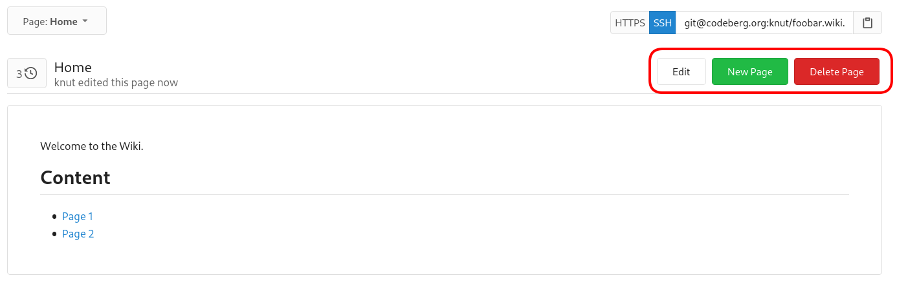
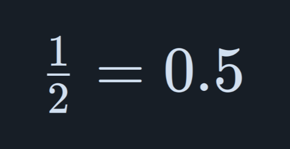

A [wiki](https://en.wikipedia.org/wiki/Wiki) is a collaborative space on the web. It is a common practice to use wikis to collect knowledge and share information.
Codeberg allows you to add a wiki to a repository for additional documentation.

The user in these examples is `knut`, the polar bear, and its repository is `foobar`.

## Activation and Permissions

To enable the wiki for a repository, visit the `Settings` page and activate `Enable repository wiki` in the `Wiki` section under `Units`. It will default to the built-in wiki which is described here, but you can add a URI to an external site the "Wiki" tab should link to.

> **Warning**
> Be aware that the wiki, once enabled, is accessible to _everyone_ who has `read` access to your repository - on public repositories even unauthenticated guests can access the wiki.
> The wiki is _not_ a suitable place for storing private information or secrets (like passwords).
>
> Activating the `Allow anyone to edit the wiki` option in `Settings` will give everyone with an account write access to the wiki.

To edit the wiki, `write` permission to the repository is required, unless the `Allow anyone to edit the wiki` setting is activated on the `Settings` page, in the `Wiki` section under `Units`.

## Wiki structure

The wiki is essentially a separate Git repository in your repository with a predefined name in the form of `<your-repository-name>.wiki.git`.

It consists of [Markdown](https://en.wikipedia.org/wiki/Markdown) files (file extension `.md`) and additional assets like images.
No further stylesheets are needed. The Markdown files are automatically rendered according to the selected Forgejo theme.

## Adding content via web

After you have enabled the wiki, you are prompted to create the initial page `Home.md`.

The web UI in your browser is currently limited to adding, updating, and deleting pages; you can't manage assets like images this way.



Clicking on the "Insert Image" button will make the following text appear in your text editor: ``

## Adding content using a local Git client

You can work with the wiki repository as you would with any other Git repository on Forgejo.

```shell
git clone git@codeberg.org:knut/foobar.wiki.git
cd foobar.wiki
nano Home.md # or your editor of choice
git commit -am "create Home page"
```

Editing locally allows you to use your favorite editor (preferably with Markdown syntax check and highlighting) and manage additional assets like images.

### Adding images using a local Git client

You can add images to the root directory or a specific subfolder (like `assets` or `images`) using your local Git client.

A feasible workflow might look like this:

```shell
# create a subfolder for images
mkdir images
cd images
# copy the image into this folder
git add images/image.png
git commit -m "add image"
git push
```

## Attaching images in Markdown documents

Now, you can reference the image in Markdown, like this:

**File in repository**:

```markdown

```

**External image**:

```markdown

```

When including images from Forgejo repositories, keep in mind that _you should use the raw version of the image._

After saving your changes, the image should be visible.

> In contrast to embedding external images, images in Git are only rendered after saving the wiki or Markdown file changes.

## Adding a sidebar and a footer

To enhance the usability of your wiki, you can add a custom sidebar and a footer that are shown on every page. The sidebar will be displayed to the right of the main content and the footer below.

To enable the sidebar, just add a file named `_Sidebar.md` to your wiki. For a footer, the file must be named `_Footer.md`.
Both file types allow common Markdown syntax to adjust the presentation to your needs.

Very basic example for a sidebar:

```markdown
- [[Home]]

### Content

- [Page 1](./Page-1/)

> knuts wiki
```

> These files starting with `_` are hidden, so in the web UI you need to manually browse for the files. E.g. for our user _knut_ and his _foobar_ repo:
> `https://codeberg.org/knut/foobar/wiki/_Sidebar`

## Embedding LaTeX-style equations

The wiki also supports embedding LaTeX-style equations in Markdown files, using [KaTeX](https://katex.org).

Such equations go between two `$` characters, for example, like this:

```markdown
$ \frac{1}{2} = 0.5 $
```

This will then result in the following properly rendered equation:



It is also possible to have LaTeX render in display mode, using `$$` or `\[` with `\]`:

```markdown
\[ \mathbf{R} = \frac 1M \iiint_Q \rho(\mathbf{r}) \mathbf{r} \mathrm dV \]
$$ (p \implies q) \iff (\neg q \implies \neg p) $$
```

It is however not supported to use either of these syntaxes when the equation spans multiple lines; in that case, a code block with the language `math` should be used, for example:

````markdown
```math
\int_0^\pi\ln(1-2\alpha\cos x+\alpha^2) \mathrm dx =
2\pi\ln|\alpha|
```
````
